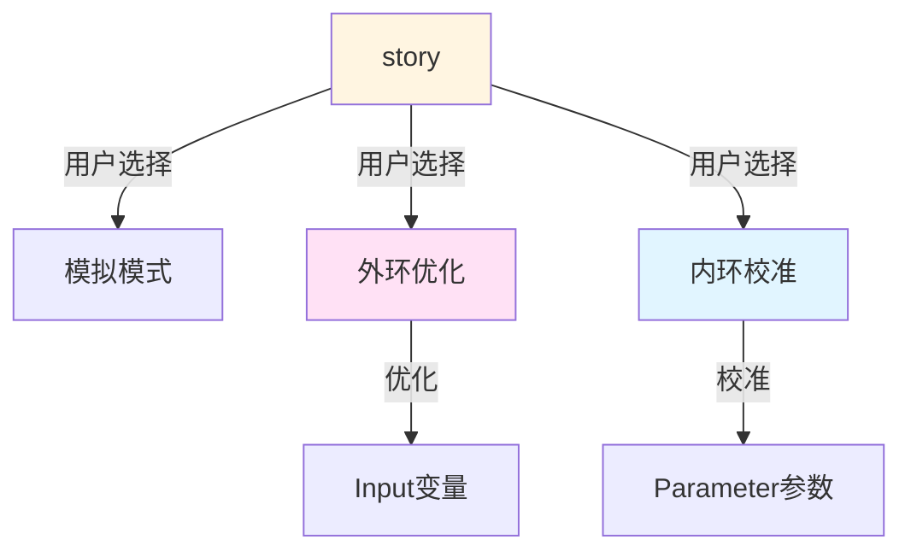

# LifeMatters 架构设计决策文档

**版本**: v2.0  
**日期**: 2025-01-25  
**决策**: 2级架构 (models + stories) + 优化器集成方案

---

## 一、核心架构

### 1.1 整体结构

```
Level 1: models/     (科学模型库 - 能力声明)
Level 2: stories/  (应用场景 - 用途配置)
```

**架构理念**:
- **Models**: 定义"能被怎么用" (能力声明)
- **stories**: 决定"这次怎么用" (用途配置)
- **用户**: 运行时选择执行模式 (模拟/优化/校准)

---

## 二、目录结构

```
lifematters/
│
├─ models/              (科学模型库)
│  ├─ core/             # 核心模型
│  │  ├─ demographics.yaml
│  │  ├─ mortality_base.yaml
│  │  └─ time_system.yaml
│  │
│  ├─ medical/          # 医学模型
│  │  ├─ dynamics/      # 动力学方程
│  │  │  ├─ glucose_metabolism.yaml
│  │  │  ├─ body_temperature.yaml
│  │  │  └─ insulin_secretion.yaml
│  │  │
│  │  └─ statistical/   # 统计模型
│  │     ├─ survival_analysis.yaml
│  │     └─ risk_prediction.yaml
│  │
│  ├─ social/           # 社会学模型
│  │  ├─ poverty_1800s.yaml
│  │  └─ war_trauma.yaml
│  │
│  ├─ historical/       # 历史数据
│  │  ├─ london_1845_climate.yaml
│  │  └─ yangzhou_1645.yaml
│  │
│  └─ community/        # 用户贡献模型
│     ├─ researcher_alice/
│     └─ researcher_bob/
│
└─ stories/           (应用场景)
   ├─ examples/         # 官方示例
   │  ├─ research/
   │  │  ├─ diabetes_basic.yaml
   │  │  ├─ diabetes_comprehensive.yaml
   │  │  └─ minimal_template.yaml
   │  │
   │  └─ game/
   │     ├─ match_girl.yaml
   │     ├─ yangzhou_escape.yaml
   │     └─ survival_template.yaml
   │
   └─ user/             # 用户工作区
      ├─ my_studies/
      └─ my_games/
```

---

## 三、Models 设计规范

### 3.1 Model 基本结构

```yaml
# models/medical/dynamics/glucose_metabolism.yaml
name: "medical.glucose_metabolism"
version: "1.2"

metadata:
  author: "LifeMatters Team"
  description: "葡萄糖代谢动力学模型"
  tags: [diabetes, metabolism, medical]

# 变量定义
variables:
  # 状态变量
  blood_glucose:
    type: state
    value: 90
    unit: "mg/dL"
    bounds: [40, 400]
  
  # 可调输入 (外环可优化)
  meal_carbs:
    type: input
    value: 50
    unit: "g"
    bounds: [0, 300]
    optimizable: true      # 声明可被优化
  
  # 模型参数 (内环可校准)
  glucose_absorption_rate:
    type: parameter
    value: 0.05
    unit: "1/min"
    bounds: [0.01, 0.1]
    optimizable: true      # 声明可被校准
    uncertainty: [0.04, 0.06]  # 95% CI
    source: "Smith et al. 2020"

# 动力学公式
formulas:
  glucose_dynamics:
    condition: true
    dynamics:
      blood_glucose: "blood_glucose + (meal_carbs * glucose_absorption_rate - 0.01 * blood_glucose) * dt"
    priority: 5

# 依赖关系
dependencies:
  required: [core.time_system]
  optional: [medical.insulin_secretion]

# 内环校准元数据 (optional)
calibration_metadata:
  recommended_data: "ADA_2023_meta_analysis"
  tunable_params: [glucose_absorption_rate, insulin_sensitivity]
  validation_metrics: [fasting_glucose, peak_glucose]
```

### 3.2 Model 命名规范

**格式**: `category.subcategory.name` 或 `category.name`

**示例**:
- `medical.glucose_metabolism`
- `medical.dynamics.body_temperature`
- `social.poverty_1800s`
- `community.alice.advanced_insulin_model`

---

## 四、stories 设计规范

### 4.1 story 核心结构

```yaml
# stories/user/my_diabetes_study.yaml
type: story
category: research

metadata:
  name: "2型糖尿病生活方式干预研究"
  author: Fan
  institution: "某大学"
  created_at: 2025-01-25
  description: "评估低碳饮食对血糖控制的影响"

# 使用的模型
models:
  - core.demographics
  - medical.glucose_metabolism
  - medical.insulin_secretion
  - social.diet_intervention

# story 功能声明
capabilities:
  simulation: true          # 支持纯模拟
  input_optimization: true  # 支持外环优化
  param_calibration: false  # 不需要内环校准

# 模拟配置 (用于纯模拟模式)
simulation:
  duration: 365             # 天
  time_step: 60             # 秒
  population_size: 1000
  output_variables:
    - blood_glucose
    - HbA1c
    - body_weight

# 优化配置 (仅在用户选择优化模式时生效)
optimizer:
  # 外环优化: 优化干预策略
  input_optimization:
    variables:
      - meal_carbs
      - meal_protein
      - exercise_time
    
    objectives:
      - minimize: HbA1c_variance
      - minimize: medical_cost
    
    constraints:
      daily_cost: [0, 50]        # CNY
      exercise_time: [0, 120]    # 分钟/天
    
    algorithm:
      method: "NSGA-II"
      population_size: 100
      generations: 200
  
  # 内环校准: 校准模型参数 (本story禁用)
  param_calibration:
    enabled: false

# 参数覆盖 (optional)
overrides:
  medical.glucose_metabolism.baseline_glucose: 110
```

### 4.2 story 分类

#### 研究场景 (category: research)
```yaml
type: story
category: research

capabilities:
  simulation: true
  input_optimization: true   # 通常需要优化
  param_calibration: true    # 可能需要校准

optimizer:
  input_optimization:
    variables: [intervention_dose, timing]
    objectives: [minimize: cost, maximize: efficacy]
```

#### 游戏场景 (category: game)
```yaml
type: story
category: game

metadata:
  theme: "工业革命时期伦敦的贫困与绝望"
  emotional_arc: "希望 → 幻觉 → 平静死亡"

# 游戏场景精简models
models:
  - medical.body_temperature
  - medical.starvation

capabilities:
  simulation: true
  input_optimization: false  # 游戏不需要优化
  param_calibration: false

# 游戏特有字段
player_choices:
  - id: burn_match
    name: "点燃一根火柴"
    cost: {matches: -1}
    effects: {body_temperature: +10, hope: +5}
    cooldown: 300

initial_state:
  age: 7
  body_temperature: 35
  hunger: 70
  matches: 12
```

---

## 五、优化器架构

### 5.1 优化模式分类



**三种运行模式**:
1. **模拟模式**: 使用默认参数运行仿真
2. **外环优化**: 搜索最优干预策略 (优化 `input` 变量)
3. **内环校准**: 用数据校准模型参数 (优化 `parameter` 变量)

### 5.2 外环优化 (Input Optimization)

**目的**: 寻找最优干预策略

**优化对象**: story 的 input 类型变量

**配置示例**:
```yaml
optimizer:
  input_optimization:
    variables:
      - meal_carbs      # type: input in model
      - exercise_time   # type: input in model
    
    objectives:
      - minimize: HbA1c_variance
      - minimize: daily_cost
      - maximize: quality_of_life
    
    constraints:
      daily_cost: [0, 50]
      total_calories: [1500, 2500]
    
    algorithm:
      method: "NSGA-II"    # 多目标遗传算法
      population_size: 100
      generations: 200
      timeout: 3600        # 秒
```

**输出结果**:
- Pareto 前沿解集
- Top-K 最优方案
- 敏感性分析报告

### 5.3 内环校准 (Parameter Calibration)

**目的**: 用实验数据校准不确定的模型参数

**优化对象**: Models 的 parameter 类型变量

**配置示例**:
```yaml
optimizer:
  param_calibration:
    enabled: true
    
    parameters:
      - glucose_absorption_rate  # type: parameter in model
      - insulin_sensitivity      # type: parameter in model
    
    calibration_data:
      source: "clinical_trial_2024.csv"
      target_variables:
        - fasting_glucose: {mean: 90, std: 10}
        - peak_glucose: {mean: 140, std: 20}
    
    algorithm:
      method: "Bayesian_Optimization"
      n_trials: 500
      acquisition: "EI"  # Expected Improvement
```

**输出结果**:
- 校准后的参数值
- 置信区间
- 拟合优度指标 (R², RMSE)
- 校准后的 model YAML

---

## 六、用户交互流程

### 6.1 GUI 工作流

```
1. 加载 story
   ↓
2. 系统检查 capabilities
   ↓
3. 显示可用按钮:
   - [运行模拟]     (capabilities.simulation = true)
   - [优化策略]     (capabilities.input_optimization = true)
   - [校准参数]     (capabilities.param_calibration = true)
   ↓
4. 用户选择模式
   ↓
5. 执行相应操作
```

### 6.2 CLI 命令

```bash
# 纯模拟
lifematters run stories/my_study.yaml

# 外环优化
lifematters optimize stories/my_study.yaml --mode input

# 内环校准
lifematters calibrate stories/my_study.yaml \
  --data patient_data.csv

# 交互式菜单 (自动检测 capabilities)
lifematters run stories/my_study.yaml --interactive
# → 显示: [1]模拟 [2]优化策略 [3]校准参数
```

---

## 七、实现要点

### 7.1 Model 加载与索引

```python
class ModelLoader:
    def __init__(self, models_dir: str):
        self.models_dir = models_dir
        self.model_index = {}  # name -> metadata
    
    def scan_all_models(self):
        """递归扫描所有 models/ 目录,建立索引"""
        patterns = [
            'models/core/**/*.yaml',
            'models/medical/**/*.yaml',
            'models/social/**/*.yaml',
            'models/historical/**/*.yaml',
            'models/community/**/*.yaml',
        ]
        
        for pattern in patterns:
            for yaml_file in glob(pattern):
                model = load_yaml(yaml_file)
                model_name = model['name']
                
                # 检查名称冲突
                if model_name in self.model_index:
                    raise DuplicateModelError(...)
                
                self.model_index[model_name] = {
                    'path': yaml_file,
                    'metadata': model,
                    'optimizable_inputs': self._extract_optimizable(model, 'input'),
                    'optimizable_params': self._extract_optimizable(model, 'parameter'),
                }
    
    def _extract_optimizable(self, model, var_type):
        """提取可优化的变量列表"""
        return [
            name for name, var in model['variables'].items()
            if var['type'] == var_type and var.get('optimizable', False)
        ]
```

### 7.2 story 验证

```python
class storyValidator:
    def validate(self, story: dict):
        """验证 story 配置合法性"""
        
        # 检查 capabilities 一致性
        if story['capabilities']['input_optimization']:
            if 'optimizer' not in story:
                raise ValueError("声称支持优化但缺少 optimizer 配置")
            
            if 'input_optimization' not in story['optimizer']:
                raise ValueError("缺少 input_optimization 配置")
        
        # 检查优化变量在 models 中声明为 optimizable
        if 'input_optimization' in story.get('optimizer', {}):
            for var in story['optimizer']['input_optimization']['variables']:
                model = self._find_model_defining(var, story['models'])
                
                if not model:
                    raise ValueError(f"变量 {var} 未在任何 model 中定义")
                
                if not model['variables'][var].get('optimizable', False):
                    raise ValueError(
                        f"变量 {var} 在 model 中未声明 optimizable=true"
                    )
```

### 7.3 优化引擎集成

```python
class OptimizationEngine:
    def run(self, story: dict, mode: str):
        """执行优化任务"""
        
        if mode == 'input_optimization':
            return self._optimize_inputs(story)
        elif mode == 'param_calibration':
            return self._calibrate_params(story)
        else:
            raise ValueError(f"不支持的优化模式: {mode}")
    
    def _optimize_inputs(self, story):
        """外环优化"""
        config = story['optimizer']['input_optimization']
        
        # 定义目标函数
        def objective(input_values):
            # 运行仿真
            result = self.simulator.run(story, inputs=input_values)
            # 计算多目标值
            return [
                self._evaluate_objective(obj, result)
                for obj in config['objectives']
            ]
        
        # 调用多目标优化算法
        optimizer = NSGA2(
            n_var=len(config['variables']),
            n_obj=len(config['objectives']),
            bounds=self._get_bounds(config['variables'])
        )
        
        result = optimizer.minimize(objective)
        
        return {
            'pareto_front': result.F,
            'solutions': result.X,
            'top_k': self._select_top_k(result, k=10)
        }
```

---

## 八、模板示例

### 8.1 纯模拟 story 模板

```yaml
# stories/templates/simulation_only.yaml
type: story
category: research

metadata:
  name: "[填写研究名称]"
  author: "[填写作者]"

models:
  - [选择 models]

capabilities:
  simulation: true
  input_optimization: false
  param_calibration: false

simulation:
  duration: 365
  time_step: 60
  output_variables:
    - [选择输出变量]
```

### 8.2 优化研究 story 模板

```yaml
# stories/templates/optimization_study.yaml
type: story
category: research

metadata:
  name: "[填写研究名称]"
  research_question: "[填写研究问题]"

models:
  - [选择 models]

capabilities:
  simulation: true
  input_optimization: true
  param_calibration: false

optimizer:
  input_optimization:
    variables:
      - [填写要优化的 input 变量]
    
    objectives:
      - minimize: [目标1]
      - maximize: [目标2]
    
    constraints:
      [变量名]: [最小值, 最大值]
    
    algorithm:
      method: "NSGA-II"
      population_size: 100
      generations: 200
```

### 8.3 校准研究 story 模板

```yaml
# stories/templates/calibration_study.yaml
type: story
category: research

metadata:
  name: "[模型校准研究]"

models:
  - [选择要校准的 model]

capabilities:
  simulation: true
  input_optimization: false
  param_calibration: true

optimizer:
  param_calibration:
    enabled: true
    
    parameters:
      - [填写要校准的 parameter]
    
    calibration_data:
      source: "[数据文件路径]"
      target_variables:
        [变量名]: {mean: [值], std: [值]}
    
    algorithm:
      method: "Bayesian_Optimization"
      n_trials: 500
```

---

## 九、开发优先级

### Phase 1: MVP (前6个月)
- ✅ Models 加载与索引系统
- ✅ stories 基本结构
- ✅ 纯模拟模式
- ⏸️ 优化功能暂缓 (手动调参验证)

### Phase 2: 框架完善 (6-12个月)
- ✅ 外环优化 (input_optimization)
- ✅ 内环校准 (param_calibration)
- ✅ GUI 模式选择界面
- ✅ 集成 Optuna + NSGA-II

### Phase 3: 高级功能 (12个月后)
- ✅ 敏感性分析
- ✅ 不确定性量化
- ✅ 在线学习与自适应优化

---

## 十、关键决策记录

### 决策1: 不采用独立 `optimizers/` 目录
**原因**:
- 优化配置与 story 强绑定
- 一个 story 通常对应一个研究问题
- 独立目录增加复杂度但价值有限

**结论**: 优化配置作为 story 的一部分

---

### 决策2: Models 声明 `optimizable` 标记
**原因**:
- Model 定义"能力",不强制用途
- story 选择是否启用优化
- 允许灵活组合

**结论**: `optimizable: true` 作为可选字段

---

### 决策3: story 多功能设计
**原因**:
- 研究场景天然需要"模拟→优化→验证"循环
- 用户工作流更自然
- 减少配置文件数量

**结论**: story 通过 `capabilities` 声明支持的功能

---

## 附录: 完整示例

### A. 综合研究 story

```yaml
# stories/user/comprehensive_diabetes_study.yaml
type: story
category: research

metadata:
  name: "糖尿病综合管理优化研究"
  author: Fan
  institution: "某医学院"
  research_question: "如何在预算约束下最大化患者生活质量?"

models:
  - core.demographics
  - medical.glucose_metabolism
  - medical.insulin_system
  - social.lifestyle_interventions
  - social.healthcare_cost

capabilities:
  simulation: true
  input_optimization: true
  param_calibration: true

simulation:
  duration: 730  # 2年
  time_step: 3600  # 1小时
  population_size: 5000

optimizer:
  # 外环: 优化干预策略
  input_optimization:
    variables:
      - daily_carbs
      - exercise_minutes
      - medication_dose
    
    objectives:
      - minimize: medical_cost
      - minimize: HbA1c_variance
      - maximize: quality_of_life
    
    constraints:
      daily_cost: [0, 50]
      exercise_minutes: [0, 120]
      medication_dose: [0, 100]
    
    algorithm:
      method: "NSGA-II"
      population_size: 200
      generations: 300
      timeout: 7200  # 2小时
  
  # 内环: 校准患者群体参数
  param_calibration:
    enabled: true
    
    parameters:
      - insulin_sensitivity
      - beta_cell_function
      - glucose_absorption_rate
    
    calibration_data:
      source: "patient_cohort_2024.csv"
      target_variables:
        fasting_glucose: {mean: 110, std: 15}
        peak_glucose: {mean: 180, std: 25}
        HbA1c: {mean: 7.5, std: 1.0}
    
    algorithm:
      method: "Bayesian_Optimization"
      n_trials: 1000
      prior: "normal"

overrides:
  medical.glucose_metabolism.baseline_glucose: 110
  social.healthcare_cost.insurance_coverage: 0.8
```

---

**文档结束**

**下一步行动**:
1. 实施 Phase 1 (Models + stories 基础)
2. 开发优化引擎原型
3. 编写单元测试
4. 准备框架论文

---

**版本历史**:
- v1.0 (2025-01-24): 初始架构决策
- v2.0 (2025-01-25): 整合优化器架构,简化为结论文档
