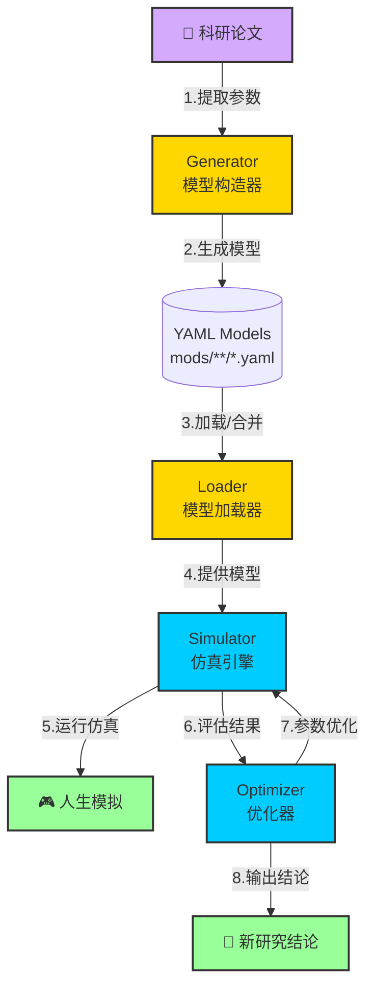

# LifeMatters: 医学与社会学仿真建模框架

## 项目简介
LifeMatters 是一个模块化的仿真建模框架，面向医学与社会学研究，旨在从科研论文生成动力学模型，通过仿真验证和优化得出新结论，同时为普通用户提供交互式人生模拟体验。框架采用类游戏的 Modding 机制，支持通过 YAML 配置文件定义、优化和运行复杂模型，无需编程技能。它支持多语言（英文、中文等）和子文件夹模型加载，适用于学术研究、教育和科普。

LifeMatters 采用混合架构，包含离线工具（Generator、Optimizer、Loader）和运行时服务（Simulator），通过共享模型库实现高效协作。**架构分工明确：GUI/Web 界面负责实时控制和复杂交互，CLI 专注于自动化批处理和文件驱动的脚本化任务。**

### 目标用户
- **学术研究人员**：验证和优化理论模型
- **教育工作者**：教授复杂系统概念  
- **普通用户**：体验直观的人生模拟

## 特性
- **科研与科普双定位**：支持研究人员验证模型，同时为非技术用户提供直观体验
- **零编程门槛**：通过 YAML 配置文件驱动仿真，无需编码
- **小核心 + 插件模式**：模块化设计，易于扩展和维护
- **混合架构与职责分离**：
  - 离线 CLI 工具（Loader/Generator/Optimizer）：高效简洁，专注于**自动化批处理和脚本化**
  - 运行时服务（Simulator）配合 GUI：支持**动态控制和复杂实时交互**
  - CLI 与 GUI 共享核心逻辑（通过 Python 接口调用 `*_engine.py`）
- **多语言支持**：支持英文、中文等多种语言，CLI 和 GUI 输出可动态切换
- **灵活扩展**：支持动态加载新模型和子文件夹模型（如 `mods/physiology/`）
- **跨领域应用**：适用于医疗研究（如疾病传播）、社会学分析（如政策影响）和教育培训

## 快速开始

### 1. 获取项目
```bash
git clone https://github.com/shenfan19/life-matters.git
cd life-matters
```

### 2. 安装依赖
确保已安装 Python 3.8+，然后运行：
```bash
# 核心依赖
pip install PyYAML==5.4.1 numpy>=1.21.0 asteval babel

# GUI 依赖（可选）
pip install flet>=0.22.0  # 图形化 CLI 界面
npm install                # React Web 界面（前端）

# 优化模块额外依赖（可选）
pip install pymoo scipy    # 多目标优化和科学计算
```

### 3. 运行示例

#### CLI 模式（推荐用于批处理）
```bash
# 列出可用模型
python sim_cli/loader_cli.py --list --folder physiology --lang zhhans

# 运行仿真
python sim_cli/simulator_cli.py --file physiology/obesity_diabetes --time 8760 --output results/simulation.csv

# 参数优化
python sim_cli/optimizer_cli.py --file physiology/physiology --mode input --target state --method grid
```

#### Web 界面（推荐用于交互式操作）
```bash
# 启动后端服务
python app.py

# 启动前端（另开终端）
cd frontend
npm run dev

# 访问 http://localhost:5173
```

### 4. 自定义仿真
编辑 `mods` 目录中的 YAML 文件，例如：
```yaml
# mods/physiology/custom_model.yaml
metadata:
  name: "自定义模型"
  version: "1.0.0"
  author: "研究者"
variables:
  blood_glucose:
    description: "血糖水平"
    value: 100.0
    type: state
    unit: "mg/dL"
    bounds: [70, 180]
formulas:
  glucose_regulation:
    description: "血糖调节"
    dynamics:
      blood_glucose: "blood_glucose - 0.1 * (step_size / HOUR)"
simulator:
  step_size: 3600
  total_time: 86400
  output_variables: ["blood_glucose"]
```

## 核心功能

### 功能对比表

| 模块 | CLI功能（批处理/脚本化） | GUI功能（交互式控制） |
|------|-------------------------|---------------------|
| **Loader** | `--list` 扫描列出模型<br>`--file/--folder` 加载模型<br>`--merge-to` 合并模型<br>`--split-to` 拆分模型 | 自动扫描显示模型树<br>点击查看模型详情<br>拖拽选择多模型合并<br>可视化依赖关系 |
| **Generator** | `--list-templates` 列出模板<br>`--generate` 从模板生成<br>`--param` 指定参数 | 模板下拉选择<br>表单式参数输入<br>实时预览生成结果 |
| **Simulator** | `--time` 设置仿真时长<br>`--step` 设置步长<br>`--input` CSV输入<br>`--output` CSV输出 | 开始/暂停/停止/重置<br>滑杆实时调整变量<br>实时曲线显示<br>数据表格导出 |
| **Optimizer** | `--method` 优化方法<br>`--target` 优化目标<br>`--duration` 优化时长<br>`--mode` input/param模式 | 方法选择界面<br>参数范围设置<br>优化进度显示<br>结果对比分析 |

### 1. Generator 模块（模型构造器）
**功能**：从科研论文或模板生成 YAML 模型，支持多语言字段生成

**CLI 示例**：
```bash
# 列出可用模板
python generator_cli.py --list-templates

# 从模板生成模型
python generator_cli.py --generate risk_increase lung_cancer.yaml \
  --param risk_name=lung_cancer risk_factor=smoking_status increase_rate=0.05
```

**编程接口**：
```python
from generator_engine import GeneratorEngine
engine = GeneratorEngine("mods")
engine.generate_from_template("risk_increase", "lung_cancer.yaml", 
                             {"risk_name": "lung_cancer", "increase_rate": 0.05})
```

### 2. Loader 模块（模型加载器）
**功能**：扫描、加载、合并、拆分 YAML 模型文件，处理 imports 依赖，支持循环检测

**CLI 示例**：
```bash
# 列出指定文件夹的模型
python sim_cli/loader_cli.py --list --lang zhhans --folder physiology

# 合并多个模型
python sim_cli/loader_cli.py --folder physiology --merge-to merged.yaml
python sim_cli/loader_cli.py --file physiology/obesity_diabetes physiology/cancer --merge-to combined.yaml

# 拆分模型为独立模块
python sim_cli/loader_cli.py --file physiology/obesity_diabetes --split-to split_dir
```

**编程接口**：
```python
from loader_engine import LoaderEngine
engine = LoaderEngine("mods", language="zhhans")

# 扫描模型
models = engine.scan_models(["physiology"])

# 加载模型（支持imports）
model = engine.fetch("obesity_diabetes", folder="physiology")

# 合并模型
result = engine.merge_models(
    model_names=["digestive", "diabetes"], 
    folders=["physiology"],
    output_path="mods/merged/combined.yaml"
)
```

### 3. Simulator 模块（仿真器）
**功能**：运行动态仿真，支持暂停、继续、参数调整、CSV输出

**CLI 示例**：
```bash
# 基本仿真
python sim_cli/simulator_cli.py --file digestive --time 8760 --lang zhhans

# 指定输出路径
python sim_cli/simulator_cli.py --file physiology/obesity_diabetes --time 4380 \
  --output results/my_simulation.csv

# 交互式仿真（每100步暂停）
python sim_cli/simulator_cli.py --file digestive --time 8760 --pause-every 100 --interactive

# 使用CSV输入控制
python sim_cli/simulator_cli.py --file digestive --time 8760 \
  --input controls.csv --output result.csv
```

**编程接口**：
```python
from simulator_engine import SimulatorEngine
engine = SimulatorEngine("mods", language="zhhans")

# 运行完整仿真
result = engine.run_simulation("digestive", 100, folder="physiology")

# 逐步仿真（支持暂停/继续）
session = engine.start_session("digestive")
for step in range(100):
    state = engine.step(session)
    if state['monitor_triggered']:
        engine.pause(session)
```

### 4. Optimizer 模块（优化器）
**功能**：优化模型参数，支持 input/param 两种模式，多种优化方法

**支持模式**：
- `input` 模式：优化输入变量（type: input）
- `param` 模式：优化参数变量（type: parameter）

**CLI 示例**：
```bash
# 网格搜索优化
python sim_cli/optimizer_cli.py --file physiology/physiology --mode input \
  --target state --method grid --time 12000

# 使用pymoo多目标优化
python sim_cli/optimizer_cli.py --optimize digestive diabetes --target min_error \
  --duration 60 --method pymoo --lang zhhans --folder physiology

# 带暂停的优化
python sim_cli/optimizer_cli.py --file physiology/physiology --mode param \
  --target state --method grid --pause-every 100
```

**编程接口**：
```python
from optimizer_engine import OptimizerEngine
engine = OptimizerEngine("mods")

engine.load_models(["digestive", "diabetes"])
result = engine.optimize(
    duration=60.0, 
    method="pymoo",
    mode="input",
    target="min_error"
)
```

## 项目结构
```
life-matters/
├── sim_engine/                # 仿真引擎（后端）
│   ├── src/
│   │   ├── loader_engine.py      # Loader 核心
│   │   ├── simulator_engine.py   # Simulator 核心
│   │   ├── generator_engine.py   # Generator 核心
│   │   └── optimizer_engine.py   # Optimizer 核心
│   ├── requirements.txt
│   └── api_server.py             # FastAPI 服务
├── sim_cli/                   # CLI 工具（批处理）
│   ├── loader_cli.py         # Loader CLI
│   ├── simulator_cli.py      # Simulator CLI
│   ├── generator_cli.py      # Generator CLI
│   ├── optimizer_cli.py      # Optimizer CLI
│   └── CLI_README.md
├── sim_gui/                   # GUI 界面（Web 前端）
│   ├── src/
│   └── package.json
│   ├── src/
│   │   ├── App.tsx          # 主应用组件
│   │   ├── components/       # UI组件
│   │   │   ├── Loader.tsx   # Loader界面
│   │   │   ├── Simulator.tsx # Simulator界面
│   │   │   ├── Generator.tsx # Generator界面
│   │   │   └── Optimizer.tsx # Optimizer界面
│   │   └── types.ts         # TypeScript类型定义
│   ├── package.json
│   └── tsconfig.json
├── mods/                     # 模型文件目录
│   ├── physiology/          # 生理学模型
│   │   ├── physiology.yaml  # 根模型（文件夹同名）
│   │   ├── obesity_diabetes.yaml
│   │   └── obesity_diabetes_patch.yaml
│   ├── cancer_models/       # 癌症模型
│   ├── merged/              # 合并后的模型
│   ├── splited/             # 拆分后的模型
│   ├── patch/               # 补丁文件
│   └── output/              # 仿真输出
├── templates/               # 模型模板
│   ├── risk_increase.yaml
│   └── disease_spread.yaml
├── app.py                  # Flask后端服务器
├── requirements.txt        # Python依赖
└── README.md              # 项目文档
```

## 模型结构

### YAML 模型格式
```yaml
metadata:
  name: "模型名称"
  version: "1.0.0"
  author: "作者"
  description: "描述"
  conflicts: []          # 冲突的模型列表
  tags: []              # 标签列表

imports:                # 导入其他模型（支持递归加载）
  - base_physiology     # 相同目录下的模型
  - ../shared/common    # 相对路径
  - physiology/diabetes # 子文件夹路径

variables:             # 变量定义
  blood_glucose:       # 变量名
    description: "血糖水平"
    value: 100.0      # 初始值
    unit: "mg/dL"     # 单位
    type: "state"     # 类型: state/input/parameter
    bounds: [70, 140] # 值范围 [最小值, 最大值]
    
  insulin_rate:
    description: "胰岛素注射速率"
    value: 0.0
    unit: "IU/hour"
    type: "input"     # 可控输入
    bounds: [0, 10]

formulas:             # 公式定义
  glucose_regulation:
    description: "血糖调节"
    condition: "blood_glucose > 100"  # 触发条件（可选）
    priority: 100     # 优先级（越大越先执行）
    dynamics:         # 动态更新
      blood_glucose: "blood_glucose - insulin_rate * 0.5 * (step_size / HOUR)"
    formula: "insulin_effectiveness * 0.8"  # 计算公式（可选）

simulator:            # 仿真配置（Simulator必需）
  dt_unit: "hour"    # 时间单位显示
  step_size: 3600    # 时间步长（秒）
  total_time: 31536000  # 总仿真时间（秒，=1年）
  output_format: "csv"  # 输出格式
  output_variables:   # 输出变量列表
    - blood_glucose
    - plasma_insulin
    - body_water
  monitor_conditions: # 监控条件
    - "blood_glucose < 70"    # 低血糖警告
    - "blood_glucose > 180"   # 高血糖警告
  pause_every: 100   # 每100步暂停（交互式）
  hooks:             # 钩子函数
    - pre_step: "prepare_step"
    - post_step: "record_state"

optimizer:           # 优化配置（Optimizer必需）
  method: "grid"     # 优化方法: grid/random/pymoo
  python_envs:       # 额外Python依赖
    - "pymoo>=0.6.0"
    - "scipy>=1.4.0"
  targets_of_optimization:  # 优化目标
    - "minimize: blood_glucose_variance"
    - "maximize: insulin_efficiency"
  variables_to_optimize:    # 待优化变量（input类型）
    - insulin_rate
    - meal_timing
  parameters_to_optimize:   # 待优化参数（parameter类型）
    - insulin_sensitivity
    - glucose_absorption_rate
  pop_size: 20      # 种群大小（遗传算法）
  n_gen: 50         # 代数（遗传算法）
  duration: 60.0    # 优化时长（秒）
  bounds:           # 参数搜索范围
    - [0.1, 2.0]    # insulin_sensitivity
    - [0.5, 3.0]    # glucose_absorption_rate
```

### 关键字段说明

#### imports（导入机制）
- 支持递归加载其他模型
- 根模型覆盖导入模型的同名字段
- 自动检测循环依赖
- 支持相对路径和子文件夹

#### variables（变量类型）
- **state**: 状态变量，随仿真变化
- **input**: 输入变量，可实时调整
- **parameter**: 参数变量，优化器调整

#### formulas（公式系统）
- **condition**: 触发条件，支持布尔表达式
- **priority**: 执行优先级，决定计算顺序
- **dynamics**: 变量更新规则

#### 时间单位常量
在公式中可使用以下预定义常量：
- `SECOND` = 1
- `MINUTE` = 60
- `HOUR` = 3600
- `DAY` = 86400
- `WEEK` = 604800
- `MONTH` = 2592000
- `YEAR` = 31536000

示例：`glucose_decay: "glucose - 0.01 * (step_size / HOUR)"`

## 架构设计

### 分层结构
```
┌─────────────────────────────────────────────────────────┐
│                    用户接口层                              │
├──────────────────────┬──────────────────────────────────┤
│     CLI 工具          │        GUI/Web 界面               │
│  (批处理/脚本化)       │      (实时交互/控制)              │
├──────────────────────┴──────────────────────────────────┤
│                   核心引擎层                              │
│    loader_engine.py   simulator_engine.py                │
│    generator_engine.py   optimizer_engine.py             │
├──────────────────────────────────────────────────────────┤
│                   模型结构层                              │
│         ModStructure (core.py)                           │
│    Variables | Formulas | Simulator | Optimizer          │
├──────────────────────────────────────────────────────────┤
│                    存储层                                │
│           YAML 文件 (mods/**/*.yaml)                      │
└──────────────────────────────────────────────────────────┘
```

### 核心设计理念
- **小核心 + 插件模式**：核心引擎精简，功能通过模块扩展
- **职责分离**：
  - **CLI 工具**：专用于非交互式的自动化、脚本化批处理任务
  - **GUI/Web 界面**：专用于复杂、实时的交互和控制
  - 两者通过共享核心引擎（`*_engine.py`）确保逻辑一致性
- **单一运行时服务**：仅 Simulator 支持暂停、继续和参数调整
- **模块化调用**：Optimizer 调用 Simulator 仿真引擎进行优化
- **统一数据加载**：所有模块通过 `LoaderEngine.fetch()` 访问 YAML 文件
- **Imports 支持**：支持递归依赖加载，包含循环依赖检测

### 工作流程图


### 模块交互示例
```python
# 典型工作流示例
from generator_engine import GeneratorEngine
from loader_engine import LoaderEngine
from simulator_engine import SimulatorEngine
from optimizer_engine import OptimizerEngine

# 1. 从论文生成模型
gen = GeneratorEngine("mods")
gen.generate_from_paper("paper.pdf", "disease_model.yaml")

# 2. 加载并合并模型
loader = LoaderEngine("mods")
model = loader.fetch("disease_model", folder="generated")
merged = loader.merge_models(["disease_model", "base_physiology"])

# 3. 运行仿真
sim = SimulatorEngine("mods")
result = sim.run_simulation("merged_model", time_hours=8760)

# 4. 优化参数
opt = OptimizerEngine("mods")
opt.load_model("merged_model")
optimal_params = opt.optimize(target="min_error", method="pymoo")
```

## 多语言支持

### 支持的语言
- `en`：英文（默认）
- `zhhans`：简体中文
- `zhhant`：繁体中文
- `fr`：法语（计划中）

### CLI 使用示例
```bash
# 中文输出
python loader_cli.py --list --lang zhhans --folder physiology

# 输出示例：
# 可用模型 (2)：
# 名称         变量  公式  临界条件  版本    钩子  优化器      依赖  状态
# digestive   18   10   2        2.0.0  2    grid      0    消化系统高级模型
# diabetes    20   12   2        2.1.0  0    pymoo     1    糖尿病与肥胖模型
```

### 添加新语言
1. 创建翻译文件：`lang/fr.yaml`（参考 `lang/en.yaml`）
2. 添加到语言管理器配置
3. 使用 `--lang fr` 参数调用

## 文件结构

### 输入输出目录
```
mods/
├── physiology/          # 生理学模型（输入）
├── cancer_models/       # 癌症模型（输入）
├── merged/             # 合并后的模型（输出）
├── splited/            # 拆分后的模型（输出）
├── patch/              # 自动生成的补丁文件
└── output/             # 仿真结果CSV文件
    ├── digestive_simulation.csv
    └── obesity_diabetes_simulation.csv
```

### 自定义输出路径
```bash
# 仿真输出
python simulator_cli.py --file digestive --time 8760 --output custom/path/result.csv

# 合并输出
python loader_cli.py --folder physiology --merge-to custom/merged.yaml

# 拆分输出
python loader_cli.py --file physiology/obesity_diabetes --split-to custom/split_dir
```

## 安装依赖

### 核心依赖
```bash
# Python 3.8+ 必需
pip install -r requirements.txt
```

或手动安装：
```bash
# 基础依赖
pip install PyYAML==5.4.1         # YAML 解析
pip install numpy>=1.21.0         # 数值计算
pip install asteval              # 安全的表达式求值
pip install babel                # 国际化支持

# 优化器额外依赖（按需）
pip install pymoo                # 多目标优化
pip install scipy                # 科学计算
```

### Web 界面依赖（可选）
```bash
# 后端（Flask）
pip install flask flask-cors

# 前端（React + TypeScript）
cd frontend
npm install                      # 安装 package.json 中的依赖
```

### 模型特定依赖
模型文件可通过 `optimizer.python_envs` 字段指定额外依赖：
```yaml
optimizer:
  python_envs:
    - pymoo>=0.6.0
    - scikit-learn>=1.0.0
```

Loader 模块会自动解析并提示安装这些依赖。

## CSV 输出格式

### 仿真结果格式
```csv
step,time,blood_glucose,plasma_insulin,body_water
1,3600,100.5,15.2,42.0
2,7200,98.3,14.8,42.1
3,10800,99.1,15.0,42.0
```

### 字段说明
- **step**：仿真步数（从 1 开始）
- **time**：仿真时间（秒）
- **output_variables**：模型中 `simulator.output_variables` 指定的变量值

## 测试建议

### 单元测试
```python
# 测试时间步长
def test_step_size():
    model = ModStructure()
    model.load_model("test_model.yaml")
    model.step(step_size=3600)  # 1小时
    assert model.time == 3600

# 测试变量边界
def test_bounds():
    model = ModStructure()
    model.variables['glucose'] = Variable(value=100, bounds=[70, 180])
    model.set_variable_value('glucose', 200)
    assert model.variables['glucose'].value == 180
```

### 集成测试
1. **模型加载**：测试 imports 和循环依赖检测
2. **仿真运行**：验证 CSV 输出正确性
3. **参数优化**：确认优化结果改善目标函数
4. **多语言**：验证各语言输出正确显示

## 性能优化

### 大规模仿真
```python
# 增大时间步长减少计算量
sim = SimulatorEngine("mods")
sim.run_simulation("model", time_hours=8760, step_size=7200)  # 2小时步长

# 批量处理
for model in models[:10]:  # 分批处理
    result = sim.run_simulation(model)
    save_result(result)
```

### 内存管理
- 定期清理历史数据：`model.variable_history.clear()`
- 使用生成器处理大数据：`yield` 而非 `return`
- 限制输出变量数量

## 扩展开发

### 添加新优化方法
```python
class CustomOptimizer(BaseOptimizer):
    def optimize(self, model, target, **kwargs):
        # 实现自定义优化算法
        pass

# 注册到优化器引擎
optimizer_engine.register_method("custom", CustomOptimizer)
```

### 自定义事件系统
```python
class SimulationEvent:
    def __init__(self, name, time, effects):
        self.name = name
        self.time = time
        self.effects = effects
    
    def apply(self, model):
        for var, value in self.effects.items():
            model.set_variable_value(var, value)
```

### 扩展验证规则
```python
def validate_custom_rule(model):
    # 添加自定义验证逻辑
    if model.metadata.name.startswith("test_"):
        raise ValueError("测试模型不能用于生产")
```

## 故障排除

### 常见问题

| 问题 | 原因 | 解决方案 |
|------|------|----------|
| 模型加载失败 | YAML 格式错误 | 检查缩进和语法，确保 UTF-8 编码 |
| 循环依赖错误 | imports 循环引用 | 重构模型结构，避免相互导入 |
| 仿真结果异常 | 时间步长过大 | 减小 step_size 值 |
| 优化无进展 | 参数范围不当 | 调整 bounds 范围 |
| 内存溢出 | 历史数据过多 | 增加清理频率，减少输出变量 |

### 调试技巧
```bash
# 启用详细日志
export LOG_LEVEL=DEBUG
python simulator_cli.py --file model --debug

# 验证模型结构
python loader_cli.py --file model --validate

# 测试单步仿真
python simulator_cli.py --file model --time 1 --step 1
```

## 最佳实践

### 模型设计
1. **模块化**：将大模型拆分为小模块，使用 imports 组合
2. **文档化**：为每个变量和公式添加清晰的描述
3. **验证**：设置合理的 bounds 和 monitor_conditions
4. **版本控制**：使用语义化版本号（如 1.2.3）

### 仿真配置
1. **步长选择**：平衡精度和性能（通常 3600 秒适合大部分场景）
2. **输出控制**：只输出必要的变量，避免数据过多
3. **监控设置**：添加关键指标的监控条件

### 优化策略
1. **分阶段优化**：先粗搜索（grid），后精细化（pymoo）
2. **约束设置**：合理设置变量范围，避免无效搜索
3. **多目标平衡**：使用权重或 Pareto 前沿处理多目标

## 贡献指南

### 提交代码
1. Fork 项目并创建特性分支
2. 编写测试并确保通过
3. 更新文档
4. 提交 Pull Request

### 代码规范
- Python: PEP 8
- TypeScript: ESLint + Prettier
- YAML: 2 空格缩进
- Commit: 语义化提交信息

### 报告问题
通过 GitHub Issues 提交，包含：
- 环境信息（Python 版本、操作系统）
- 复现步骤
- 错误日志
- 相关配置文件

## 许可证
MIT License - 详见 LICENSE 文件

## 致谢
- 科研合作伙伴提供的医学模型
- 开源社区的技术支持
- 早期用户的反馈建议

## 联系方式
- **项目主页**：https://github.com/shenfan19/life-matters
- **问题反馈**：GitHub Issues
- **邮件**：lifematters@example.com
- **文档**：https://lifematters.readthedocs.io

## 引用格式
如果您在研究中使用了 LifeMatters，请引用：
```
LifeMatters Development Team. (2025). LifeMatters: A Modular, Data-Driven 
Simulation Framework for Medical and Social Research. Version 2.0. 
[Software]. Available at: https://github.com/shenfan19/life-matters
```

---
*最后更新：2025年1月*
