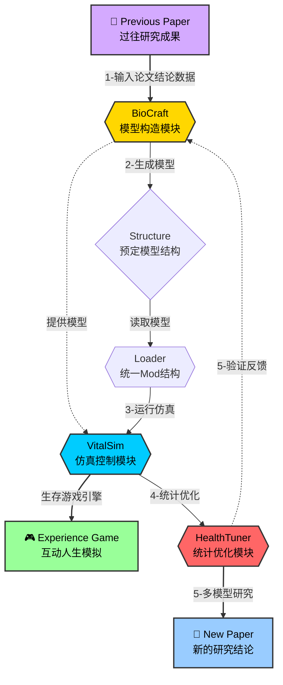

```mermaid
graph TD

    %% 子图：突出三角关系
    B{{BioCraft<br>模型构造模块}}
    V{{VitalSim<br>仿真控制模块}}
    H{{HealthTuner<br>统计优化模块}}
    L{{Loader<br>统一Mod结构}}
    S{Structure<br>预定模型结构}

    P[📜 Previous Paper<br>过往研究成果]
    N[📝 New Paper<br>新的研究结论]
    G[🎮 Experience Game<br>互动人生模拟]

    %% LINE
    P --> |1-输入论文结论数据| B
    H --> |5-多模型研究| N
    V --> |生存游戏引擎| G

    B -.-> |提供模型| V
    V -->  |4-统计优化| H
    H -.-> |5-验证反馈| B

    B --> |2-生成模型| S --> |读取模型| L
    L --> |3-运行仿真| V

    %% 样式优化
    style B fill:#ffd700,stroke:#333,stroke-width:2px,color:#000
    style V fill:#00ccff,stroke:#333,stroke-width:2px,color:#000
    style H fill:#ff6666,stroke:#333,stroke-width:2px,color:#000

    style P fill:#d4aaff,stroke:#333,stroke-width:2px,color:#000
    style N fill:#99ccff,stroke:#333,stroke-width:2px,color:#000
    style G fill:#99ff99,stroke:#333,stroke-width:2px,color:#000
    
    linkStyle 0,1,2 stroke:#333,stroke-width:2px
```
