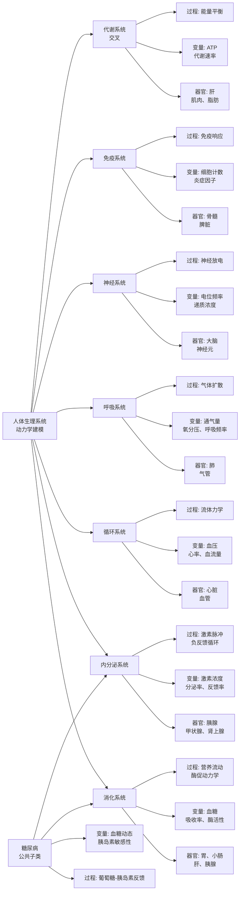

```mermaid
graph LR
    A[人体生理系统<br>动力学建模] --> B[消化系统]
    A --> C[内分泌系统]
    A --> D[循环系统]
    A --> E[呼吸系统]
    A --> F[神经系统]
    A --> G[免疫系统]
    A --> H[代谢系统<br>交叉]

    B --> B1[器官: 胃、小肠<br>肝、胰腺]
    B --> B2[变量: 血糖<br>吸收率、酶活性]
    B --> B3[过程: 营养流动<br>酶促动力学]

    C --> C1[器官: 胰腺<br>甲状腺、肾上腺]
    C --> C2[变量: 激素浓度<br>分泌率、反馈率]
    C --> C3[过程: 激素脉冲<br>负反馈循环]

    D --> D1[器官: 心脏<br>血管]
    D --> D2[变量: 血压<br>心率、血流量]
    D --> D3[过程: 流体力学]

    E --> E1[器官: 肺<br>气管]
    E --> E2[变量: 通气量<br>氧分压、呼吸频率]
    E --> E3[过程: 气体扩散]

    F --> F1[器官: 大脑<br>神经元]
    F --> F2[变量: 电位频率<br>递质浓度]
    F --> F3[过程: 神经放电]

    G --> G1[器官: 骨髓<br>脾脏]
    G --> G2[变量: 细胞计数<br>炎症因子]
    G --> G3[过程: 免疫响应]

    H --> H1[器官: 肝<br>肌肉、脂肪]
    H --> H2[变量: ATP<br>代谢速率]
    H --> H3[过程: 能量平衡]

    I[糖尿病<br>公共子类] --> B
    I --> C
    I --> I1[变量: 血糖动态<br>胰岛素敏感性]
    I --> I2[过程: 葡萄糖-胰岛素反馈]
```
