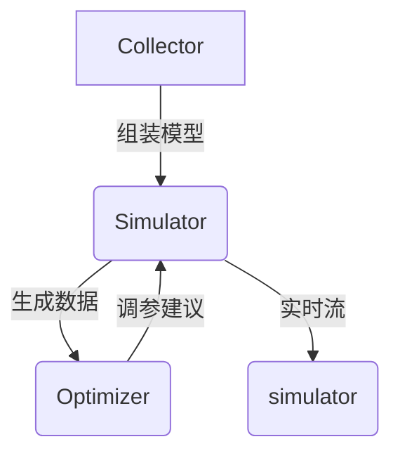
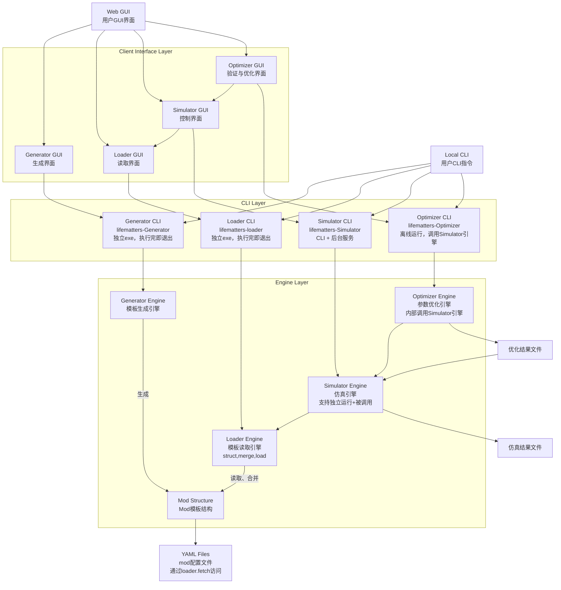

>[!question]+ Task
>```dataviewjs
>const {fan_task} = await cJS();
>fan_task.fn_single_page(dv, 0);
>```
# 系统架构概览
本文档描述了 `LifeMatters` 的整体系统架构，包括其主要组件、模块及其之间的交互。

## 设计原则
1. 极致简单
    1. 科研用户可能不会电脑，要让他们易于将科研成果做成mod包
        - 需要做一个模块来自动化验证常规地科研结论。
    2. 体验用户可能不会电脑，要让他们启动游戏一样地感受过程
        - 可以极客化脚本输入，正常运行时，输入变量保持不变，会有外部变量影响模型，比如魂斗罗走过来的敌人
        - 可以控制输入变量，比如运行时敌人在靠近，我可以攻击或者远离
        - 变量的输入方法有多种，设置开关可以选择切换：
            - 为专家：可以数据文件输入，设定好一份数据文件进行自动读取作为输入更新
            - 为用户：可以GUI输入，比如flet上面的一个0-100的数据滑块进行输入，或者一个txt对话框输入数值数据
            - 放弃内存port输入，放弃命令行输入，无需像ROS那样开启仿真系统的端口。专业角度是数据文件重要，科普角度是用户便利重要，这两种PC高级功能可以放弃，学者和用户，都不是计算机专家
## 核心模块
## 技术栈
- **编程语言**：Python 3.x
- **主要库**：[列出你的主要库，例如 Pygame, NumPy, Pandas 等]

# 数据流分析
本文档详细描述了 `LifeMatters` 内部主要数据流，包括数据的生成、处理、存储和消费。

- 主要思想：模块化，公用变量有限度更新
- Scenary模块：
    - 输入：读取参数配置
    - 输出：各个模块的参数，mods列表
- Load Mods模块
    - 输入：读取模块表，各个模块数据
    - 输出：组合动力学模型，初始组合变量表
- Generator
- Validator
- simulator模块
    - 输入：组合动力学模型，初始组合变量表，每步更新变量表
    - 输出：组合动力学模型，更新组合变量表
- Optimizer模块
    - 输入：组合动力学模型，初始组合变量表，待优化组合变量表
    - 输出：优化结果变量表，优化结果相关参数

## 核心数据类型

## 数据生命周期示例：资源生成与消耗
1.  初始化：从 `dataenvironmentbiomes.json` 加载生物群落数据。
2.  仿真步进：`srcsystemssimulation_system.py` 根据 `docsdata_specsresource_generation_spec.md` 中的规则计算资源生成量。
3.  用户交互：玩家消耗资源，更新 `SurvivalSimulator_UserDatausers[user_id]game_experiences[save_name]simulator_state.json`。
4.  数据持久化：游戏存档时，相关数据被序列化并存储到 `.sav` 文件中。

# 系统架构
## 🧩 核心模块


## 📦 关键组件
| 模块        | 职责       | 接口文件             |
| --------- | -------- | ---------------- |
| Collector | 模型/参数组合  | src/collector.py |
| Simulator | 运行生命系统仿真 | src/simulator.py |
| Optimizer | 参数自动优化   | src/optimizer.py |



