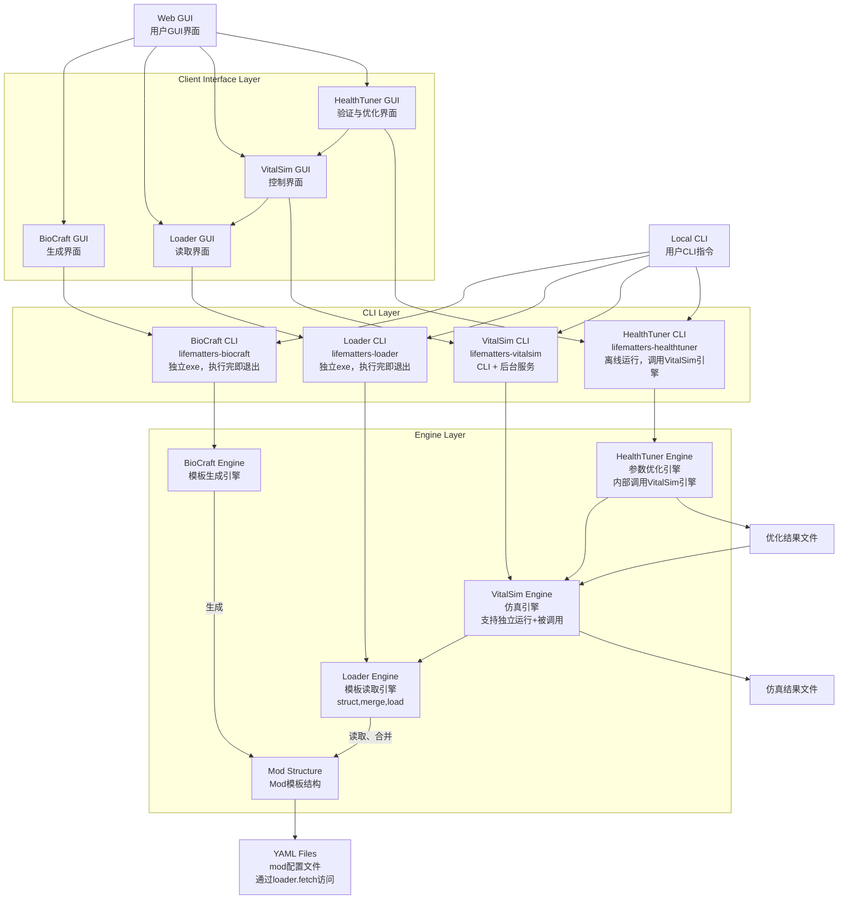

```mermaid
graph TD
    GUI[Web GUI<br/>用户GUI界面]
    CLI[Local CLI<br/>用户CLI指令]

    subgraph "Client Interface Layer"
        GUI_B[BioCraft GUI<br/>生成界面]
        GUI_H[HealthTuner GUI<br/>验证与优化界面]
        GUI_V[VitalSim GUI<br/>控制界面]
        GUI_L[Loader GUI<br/>读取界面]
    end

    subgraph "CLI Layer"
        CLI_L[Loader CLI<br/>lifematters-loader<br/>独立exe，执行完即退出]
        CLI_B[BioCraft CLI<br/>lifematters-biocraft<br/>独立exe，执行完即退出]
        CLI_V[VitalSim CLI<br/>lifematters-vitalsim<br/>CLI + 后台服务]
        CLI_H[HealthTuner CLI<br/>lifematters-healthtuner<br/>离线运行，调用VitalSim引擎]
    end
    
    subgraph "Engine Layer"
        ENG_B[BioCraft Engine<br/>模板生成引擎]
        ENG_H[HealthTuner Engine<br/>参数优化引擎<br/>内部调用VitalSim引擎]
        ENG_V[VitalSim Engine<br/>仿真引擎<br/>支持独立运行+被调用]
        ENG_L[Loader Engine<br/>模板读取引擎<br/>struct,merge,load]
        MOD[Mod Structure<br/>Mod模板结构]
    end

    %% subgraph "Storage Layer"
        FILE_V[仿真结果文件]
        FILE_H[优化结果文件]
        YAML[YAML Files<br/>mod配置文件<br/>通过loader.fetch访问]
    %% end
    
    GUI_H --> GUI_V --> GUI_L
    CLI --> CLI_B
    CLI --> CLI_L
    CLI --> CLI_V
    CLI --> CLI_H

    GUI --> GUI_B --> CLI_B --> ENG_B
    GUI --> GUI_L --> CLI_L --> ENG_L
    GUI --> GUI_V --> CLI_V --> ENG_V
    GUI --> GUI_H --> CLI_H --> ENG_H --> ENG_V

    ENG_B --> |生成| MOD
    ENG_V --> ENG_L
    ENG_L --> |读取、合并| MOD

    MOD --> YAML

    ENG_V --> FILE_V
    ENG_H --> FILE_H
    FILE_H --> ENG_V
    
    %% ENG_H --> PP{{NS论文}} --> CONNECT{{联系国外学者}} --> OUT{{国外工作}}
    %% PP --> GZ{{国自然申请}} --> SYSU{{中大转正}}

    %% %% 样式定义
    classDef CSS_B fill:#0000c9
    classDef CSS_V fill:#00ae00
    classDef CSS_H fill:#d100e9
    classDef CSS_C fill:#b20000
    
    %% %% 应用样式
    %% class GUI_B,CLI_B,ENG_B CSS_B
    %% class GUI_H,CLI_H CSS_H
    %% class GUI_V,CLI_V,ENG_V,GUI_L,CLI_L,ENG_L CSS_V
    %% class ENG_H CSS_C
```
