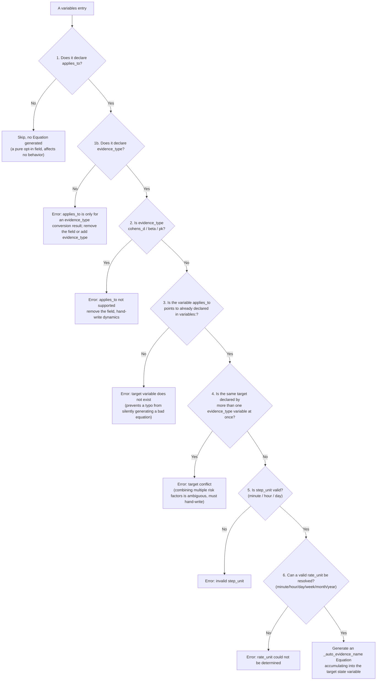

# Evidence's `applies_to`: Automatically Wiring into Dynamics

> Corresponds to the second loop in `_apply_model_data`, in `reference_engine/src/model_structure/loader.py`, independent of the conversion loop (iterating over `variables:` entries, handling the `applies_to` field). For the 8 subtypes' equations that compute the `effective` value itself, see [conversion.md](conversion.md). For how to declare the YAML field, see the "Automatically wiring into dynamics" section of `docs/authoring/variables_and_equations.md` in the `life-matters-models` repository. For the decision background, see `docs/decisions/0040-2026-04-22_sim_medical-evidence-types-and-variable-mapping.md` in the `life-matters-models` repository (the original design of the top-level `evidence:` block) and `docs/decisions/0137-*.md` (the later decision to fold it into `variables:`).
>
> This file assumes you have already read [conversion.md](conversion.md) and understand whether `effective`'s conversion produces a "ratio" (`rr`/`or`) or an "absolute rate" (`hr`/`ard`/`ir`) — this distinction is the root reason why the equation `applies_to` generates differs by subtype. Readers unfamiliar with what these statistics mean should read conversion.md's "walkthrough" section first.

## What problem this solves

Once a `variables:` entry declaring `evidence_type` has computed its `effective` coefficient, that coefficient alone only answers "how large is this thing's effect," not yet "which part of the simulation it should wire into, and how" — specifically, which `state` variable's dynamics equation it should accumulate into, and whether to combine it with the existing risk additively or multiplicatively. For example, after computing the coefficient "smoking makes CVD risk 2.5-fold" ($\text{effective} = 2.5$), someone still needs to write an equation along the lines of "each day, multiply this coefficient by the baseline risk and accumulate it into the smoker's cumulative disease probability" — this equation is exactly what `applies_to` is meant to auto-generate.

For 5 subtypes (`ir`/`ard`/`hr`/`rr`/`or`), there is only one unambiguous way to wire them in — "treat the converted coefficient as a rate, and accumulate it into the target state per step" — because their statistical definition alone already fixes the fact that "this is a rate concerning an occurrence probability," with no second reasonable way to wire it in. So once `applies_to` and related fields are declared, the Loader automatically generates the corresponding `Equation`, and the modeler need not hand-write this boilerplate dynamics.

`cohens_d`/`beta`/`pk` **do not support** `applies_to` (declaring it raises an error directly): for these 3, how to wire it in is itself a modeling judgment call, with no single correct way to write it — for example, the "difference between two group means" that `cohens_d` converts to might be intended as a one-time offset added directly to the target variable, or as a target value approached gradually (e.g. "reaching this improvement gradually after 8 weeks of exercise"); `beta`'s regression structure might be linear or might include an interaction term; `pk`'s compartment-model structure (single- or multi-compartment, first-order or zero-order elimination) is not unique. These "how to wire it in" questions have no mathematically unique correct answer, and the Loader will not make this choice on the modeler's behalf — dynamics must be hand-written.

## Trigger conditions and validation order

For each `variables:` entry, the `applies_to` loop checks in the following order (any step failing raises immediately, with no silent skip):

The reason for each step:

1. **`applies_to` not declared: skip this entry, affecting no behavior** (a pure opt-in field). This design lets a model that doesn't need auto-wiring never have to touch this field at all; declaring it or not does not interfere either way.
2. **`applies_to` declared but `evidence_type` not declared: error**. Once `applies_to` was folded into `variables:`, in principle any `state`/`input`/`parameter` entry could write this field, but its meaning only holds for the one purpose of "wiring an evidence conversion result into some state variable's dynamics" — an ordinary parameter declaring `applies_to` is very likely a typo or a misunderstanding of the field's meaning, and the Loader actively rejecting it is safer than silently ignoring it.
3. **`evidence_type` is `cohens_d`/`beta`/`pk`: error, requiring `applies_to` to be removed and dynamics hand-written**. The reason is in the previous section — how to wire these 3 in is a modeling judgment call, and the Loader actively erroring is safer than "silently wiring it in some default way, when the modeler actually wanted a different way": a wrong auto-wiring would produce a model that appears to run but has the wrong semantics, and this is not easy to notice.
4. **The variable name `applies_to` points to must already be declared in `variables:`, otherwise error**. This prevents a typo from causing the Loader to generate an equation pointing at a nonexistent variable — if this weren't checked here, the error would be deferred until the equation-evaluation stage, at which point it is much harder to pin down which evidence entry's `applies_to` was wrong.
5. **The same `applies_to` target cannot be declared by more than one evidence_type variable at once, otherwise error**. **Reason**: how to combine multiple risk factors (multiplicatively, the proportional-hazards assumption, or additively, a competing-risks model) is a disputed question of epidemiological methodology, and the Loader will not choose on the modeler's behalf. For example: if both smoking ($RR=2.5$) and obesity ($OR=1.65$, converting to about $1.53$) want to wire into the same `cvd_risk` state variable, when both act at once, should the final risk be "baseline times 2.5 times 1.53" (assuming the two risk factors' effects multiply independently), or some weighted sum — the medical literature itself has no unified answer to this. This judgment must be made by the modeler hand-writing dynamics; the Loader will only refuse this kind of ambiguous auto-wiring request, and will not pick a default combination method for you.
6. **`step_unit` must be one of `minute`/`hour`/`day` (the same constraint as `equations.step_unit`), otherwise error**. This guarantees the generated equation uses a time granularity the engine understands, keeping it consistent with the constraint on hand-written `equations`, so an "auto-generated equation" and a "hand-written equation" never follow different rules.
7. **Resolving `rate_unit` by subtype (below), which must be found in `TIME_UNIT_SECONDS` (`minute`/`hour`/`day`/`week`/`month`/`year`), otherwise error**. Generating the expression needs the ratio of `rate_unit` to `step_unit` to compute the time-conversion coefficient `factor` (see below); if `rate_unit` is invalid (e.g. misspelled, or pointing to an entry that never declared this field at all), the subsequent conversion coefficient would be meaningless, and this must be blocked here.

## The generated expression

The time-unit conversion coefficient:

$$
\text{factor} = \frac{\text{TIME\_UNIT\_SECONDS}[\text{step\_unit}]}{\text{TIME\_UNIT\_SECONDS}[\text{rate\_unit}]}

$$

(`step_unit` is the step-size unit the generated equation actually uses; `rate_unit` is this rate's own "natural" time unit, and the two can differ, e.g. an annual incidence with `rate_unit: year` wired into an equation with `step_unit: day`, giving $\text{factor} = 1/365$, converting "how much per year" into "how much per day").

| Subtype       | Where `rate_unit` comes from                    | The generated dynamics expression                                                                                       |
| -------------- | --------------------------------------- | -------------------------------------------------------------------------------------------------------------- |
| `ir` / `ard` | The entry's own declared `rate_unit`             | $\text{applies\_to} \mathrel{+}= \text{ev} \cdot \text{factor} \cdot \text{step}$                            |
| `hr`         | The `rate_unit` of the entry `baseline_ref` points to | $\text{applies\_to} \mathrel{+}= \text{ev} \cdot \text{factor} \cdot \text{step}$                            |
| `rr` / `or`  | The `rate_unit` of the entry `baseline_ref` points to | $\text{applies\_to} \mathrel{+}= \text{baseline\_ref} \cdot \text{ev} \cdot \text{factor} \cdot \text{step}$ |

(`ev` refers to this evidence entry's converted `effective` value; $\mathrel{+}=$ in the table means "new value = old value plus this term on the right," corresponding to the actually generated dynamics string `{applies_to} + ... * step`.)

**Why `hr`'s expression differs from `rr`/`or`'s**: `hr`, at the conversion stage ([conversion.md](conversion.md)), has already computed $\text{effective} = h_0 \cdot HR$ as an absolute rate, so here it only needs multiplying by $\text{factor} \cdot \text{step}$ and accumulating directly; whereas `rr`/`or`'s `effective` at the conversion stage is a **pure ratio** (`rr` as-is, and `or` after conversion is still a ratio), not itself a rate, so the generated expression needs one more multiplication by `baseline_ref` (referencing the converted variable value of the baseline `ir`/`ard` entry) to get a "baseline times ratio" rate.

Requirements on `baseline_ref`: for `rr`/`or`, it must be explicitly declared and point to an already-loaded `ir`/`ard`-type evidence entry within the same YAML file (otherwise an error, via the indirect check on `rate_unit` in validation step 6); `hr`'s `baseline_ref` check is looser — if the entry it points to doesn't exist, `rate_unit` resolves to an empty string, which will still error at step 6 for failing to find a valid `rate_unit`, but the error message will only say "`rate_unit` could not be determined," without directly pointing out that `baseline_ref` was wrong; watch for this when troubleshooting.

The generated `Equation` is stored in `self.equations[f"_auto_evidence_{ev_name}"]`, with `step_unit`/`step_size_sec` filled in per `step_unit` in the table above, and `description` auto-generated as `"Auto-generated: evidence '{ev_name}' wired into '{applies_to}' (applies_to)"`.

### A fully worked example with numbers (`rr` vs `hr`)

Using the two fixtures for which `effective` was already computed in [conversion.md](conversion.md), substituting concrete numbers into each step of the generated expression, directly comparing the "ratio-type" (`rr`) and "absolute-rate-type" (`hr`) paths.

**The `rr` path** (`smoking_cvd_rr` in `test_valid_evidence_rr.yaml`):

- Conversion result (see conversion.md): $\text{effective} = RR = 2.5$ (a dimensionless ratio).
- `applies_to: smoker_cvd_risk_auto`, `baseline_ref: baseline_cvd_ir` (this entry has `rate_unit: year`), `step_unit: day`.
- $\text{factor} = \dfrac{\text{TIME\_UNIT\_SECONDS[day]}}{\text{TIME\_UNIT\_SECONDS[year]}} = \dfrac{1}{365}$.
- The generated expression: $\text{smoker\_cvd\_risk\_auto} \mathrel{+}= \text{baseline\_cvd\_ir} \times \text{smoking\_cvd\_rr} \times \text{factor} \times \text{step}$.
- Substituting numbers ($\text{baseline\_cvd\_ir} = 0.012$, $\text{step} = 1$):

$$
0.012 \times 2.5 \times \frac{1}{365} \times 1 \approx 0.0000822 \ /\text{day}

$$

That is, about 0.0000822 of risk is accumulated into `smoker_cvd_risk_auto` each day.

**The `hr` path** (`statin_cvd_hr` in `test_valid_evidence_hr.yaml`):

- Conversion result (see conversion.md): $\text{effective} = h_0 \times HR = 0.012 \times 0.75 = 0.009$ (already an absolute rate, in prob/year).
- `applies_to: statin_protected_risk_auto`, `baseline_ref: baseline_cvd_ir` (`rate_unit: year`), `step_unit: day`.
- $\text{factor} = 1/365$ (the same as the example above, since the `rate_unit`/`step_unit` combination is the same).
- The generated expression: $\text{statin\_protected\_risk\_auto} \mathrel{+}= \text{statin\_cvd\_hr} \times \text{factor} \times \text{step}$ (**no longer multiplied by `baseline_ref`**, because `statin_cvd_hr` is already an absolute rate, and multiplying by the baseline again would double-count it).
- Substituting numbers:

$$
0.009 \times \frac{1}{365} \times 1 \approx 0.0000247 \ /\text{day}

$$

The two examples' `factor` happen to be identical (both $1/365$), and the difference comes entirely from the expression's own structure — `rr` is a "ratio," so it needs one more multiplication by the baseline to become a rate; `hr` is "already a computed rate," so no further multiplication is needed. This is exactly why the `rr`/`or` row in the table above has the extra `baseline_ref x` term that the `hr`/`ir`/`ard` row does not.

## A note on execution order

`applies_to` handling is a **second loop** independent of the evidence conversion (not folded into the conversion loop), ensuring that regardless of the declaration order of `variables:` entries in the YAML, the entry `baseline_ref` points to has already been processed by the conversion loop and exists in `self.variables`/`variables_data` before this loop begins.
