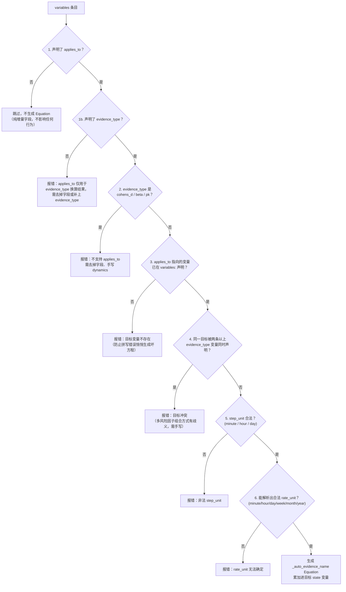

# Evidence 的 `applies_to`：自动接入 dynamics

> 对应 `reference_engine/src/model_structure/loader.py` 中 `_apply_model_data` 里独立于换算循环的第二个循环（遍历 `variables:` 条目，处理 `applies_to` 字段）。换算出 `effective` 值本身的 8 种子类型方程见 [conversion.md](conversion.md)。YAML 字段声明方式见 `life-matters-models` 仓库 `docs/authoring/variables_and_equations.md`「自动接入 dynamics」一节。决策背景见 `life-matters-models` 仓库 `docs/decisions/0040-2026-04-22_sim_医学证据类型与变量映射.md`（顶层 `evidence:` 节的原始设计）与 `docs/decisions/0137-*.md`（并入 `variables:` 的后续决策）。
>
> 本文件假设你已经读过 [conversion.md](conversion.md)，理解了 `effective` 换算出来的到底是"比例"（`rr`/`or`）还是"绝对速率"（`hr`/`ard`/`ir`）——`applies_to` 生成的方程为什么因子类型而异，根源就在这个区别。不熟悉这些统计量含义的读者请先看 conversion.md 的「逐一详解」。

## 解决什么问题

声明了 `evidence_type` 的 `variables:` 条目换算出 `effective` 系数后，这个系数本身只回答了"这件事的效应有多大"，还没有回答"要把它接到仿真的哪个部分、怎么接"——具体说，就是要把它累加进哪个 `state` 变量的动力学方程，用加法还是乘法组合进已有的风险。举例：换算出"吸烟使 CVD 风险变成 2.5 倍"这个系数（$\text{effective} = 2.5$）之后，还需要有人写一句类似"每天把这个系数乘以基线风险，累加进吸烟者的累积患病概率"的方程——这句方程就是 `applies_to` 要自动生成的东西。

5 种子类型（`ir`/`ard`/`hr`/`rr`/`or`）的接入方式只有一种没有歧义的写法——"以换算后的系数为速率，按步长累加进目标状态"——因为它们的统计定义本身就已经确定了"这是一个关于发生概率的速率"这件事，不存在第二种合理的接入方式。因此声明 `applies_to` 等字段后，Loader 会自动生成对应的 `Equation`，不需要建模者手写这段样板 dynamics。

`cohens_d`/`beta`/`pk` **不支持** `applies_to`（声明会直接报错）：这 3 种的接入方式本身是建模判断，不存在唯一写法——例如 `cohens_d` 换算出的"两组均值差"，你可能想让它作为一次性偏移量直接加到目标变量上，也可能想让它作为渐进逼近的目标值（比如"运动 8 周后逐步达到这个提升"）；`beta` 的回归结构可能是线性也可能带交互项；`pk` 的房室模型结构（单室/多室、一级/零级消除）不唯一。这些"怎么接入"的问题没有数学上唯一正确的答案，Loader 不会替建模者做出这个选择，必须手写 dynamics。

## 触发条件与校验顺序

对每个 `variables:` 条目，`applies_to` 循环按以下顺序检查（任一步失败即 raise，不静默跳过）：

各步骤的理由：

1. **未声明 `applies_to` → 跳过该条目，不影响任何行为**（纯增量字段）。这样设计是为了让不需要自动接线的模型完全不用碰这个字段，声明与否互不干扰。
2. **声明了 `applies_to` 但未声明 `evidence_type` → 报错**。`applies_to` 并入 `variables:` 之后，理论上任何 `state`/`input`/`parameter` 条目都能写这个字段，但它的意义只在"把 evidence 换算结果接入某个状态变量的动力学"这一件事上成立——普通 parameter 声明 `applies_to` 大概率是笔误或对字段语义的误解，Loader 主动拒绝比静默忽略更安全。
3. **`evidence_type` 是 `cohens_d`/`beta`/`pk` → 报错，要求去掉 `applies_to` 手写 dynamics**。理由见上一节——这 3 种的接入方式是建模判断，Loader 主动报错比"悄悄按某种默认方式接入、但建模者其实想要另一种方式"更安全：错误的自动接入会得到一个看起来能跑、但语义不对的模型，且不容易被发现。
4. **`applies_to` 指向的变量名必须已在 `variables:` 声明 → 否则报错**。防止拼写错误导致 Loader 生成一个指向不存在变量的方程——如果不在这里检查，错误会推迟到方程求值阶段才暴露，那时候更难定位到底是哪个 evidence 条目的 `applies_to` 写错了。
5. **同一个 `applies_to` 目标不能被两条以上 evidence_type 变量同时声明 → 否则报错**。**原因**：多个风险因子的组合方式（相乘=比例风险假设，还是相加=竞争风险模型）是有争议的流行病学方法论问题，Loader 不代为选择。举例：如果吸烟（$RR=2.5$）和肥胖（$OR=1.65$，换算后 $\approx 1.53$）都想接入同一个 `cvd_risk` 状态变量，二者同时起作用时，最终风险应该是"基线 $\times 2.5 \times 1.53$"（假设两个风险因子的效应独立相乘），还是某种加权相加，医学文献本身对此没有统一答案——这个判断必须由建模者手写 dynamics 做出，Loader 只会拒绝这种有歧义的自动接线请求，不会替你选一个默认组合方式。
6. **`step_unit` 必须是 `minute`/`hour`/`day` 之一（与 `equations.step_unit` 同一约束）→ 否则报错**。这保证生成的方程使用引擎认识的时间粒度，和手写 `equations` 的约束保持一致，不会出现"自动生成的方程"和"手写的方程"遵循不同规则的情况。
7. **按子类型解析 `rate_unit`（见下）→ 必须能在 `TIME_UNIT_SECONDS` 中找到（`minute`/`hour`/`day`/`week`/`month`/`year`）→ 否则报错**。生成表达式需要用 `rate_unit` 和 `step_unit` 的比值算出时间换算系数 `factor`（见下节）；如果 `rate_unit` 不合法（比如拼错、或指向的条目根本没声明这个字段），后续的换算系数就没有意义，必须在这里挡住。

## 生成的表达式

时间单位换算系数：

$$
\text{factor} = \frac{\text{TIME\_UNIT\_SECONDS}[\text{step\_unit}]}{\text{TIME\_UNIT\_SECONDS}[\text{rate\_unit}]}

$$

（`step_unit` 是生成方程实际用的步长单位；`rate_unit` 是这条速率本身"自然"的时间单位，二者可以不同，比如 `rate_unit: year` 的年发病率接入 `step_unit: day` 的方程，这时 $\text{factor} = 1/365$，把"每年多少"折算成"每天多少"）。

| 子类型       | `rate_unit` 从哪来                    | 生成的 dynamics 表达式                                                                                       |
| -------------- | --------------------------------------- | -------------------------------------------------------------------------------------------------------------- |
| `ir` / `ard` | 条目自身声明的`rate_unit`             | $\text{applies\_to} \mathrel{+}= \text{ev} \cdot \text{factor} \cdot \text{step}$                            |
| `hr`         | `baseline_ref` 指向条目的 `rate_unit` | $\text{applies\_to} \mathrel{+}= \text{ev} \cdot \text{factor} \cdot \text{step}$                            |
| `rr` / `or`  | `baseline_ref` 指向条目的 `rate_unit` | $\text{applies\_to} \mathrel{+}= \text{baseline\_ref} \cdot \text{ev} \cdot \text{factor} \cdot \text{step}$ |

（`ev` 指该 evidence 条目换算后的 `effective` 值；表中 $\mathrel{+}=$ 表示"新值 = 旧值 + 右边这一项"，对应实际生成的 dynamics 字符串 `{applies_to} + ... * step`。）

**为什么 `hr` 和 `rr`/`or` 的表达式不一样**：`hr` 在换算阶段（[conversion.md](conversion.md)）已经把 $\text{effective} = h_0 \cdot HR$ 算成了一个绝对速率，所以这里直接乘 $\text{factor} \cdot \text{step}$ 累加即可；而 `rr`/`or` 换算阶段的 `effective` 是**纯比例**（`rr` 原样，`or` 转换后也仍是比例），本身不是速率，所以生成表达式里要再乘一次 `baseline_ref`（引用基线 `ir`/`ard` 条目换算后的变量值）才能得到"基线 × 比例"的速率。

`baseline_ref` 的要求：`rr`/`or` 必须显式声明且指向同一 YAML 文件内一个已加载的 `ir`/`ard` 类型 evidence 条目（否则报错，见校验步骤 6 对 `rate_unit` 的间接检查）；`hr` 的 `baseline_ref` 校验较松——若指向的条目不存在，`rate_unit` 会取到空字符串，仍会在步骤 6 因找不到合法 `rate_unit` 而报错，但报错信息只会提示"`rate_unit` 无法确定"，不会直接点出是 `baseline_ref` 写错了，排查时需注意。

生成的 `Equation` 存入 `self.equations[f"_auto_evidence_{ev_name}"]`，`step_unit`/`step_size_sec` 按上表 `step_unit` 填入，`description` 自动生成为 `"自动生成：evidence '{ev_name}' 接入 '{applies_to}'（applies_to）"`。

### 完整代入数字的例子（`rr` vs `hr`）

用 [conversion.md](conversion.md) 里已经算过 `effective` 的两个 fixture，把生成表达式的每一步代入具体数字，直接对比"比例型"（`rr`）和"绝对速率型"（`hr`）两条路径的差异。

**`rr` 路径**（`test_valid_evidence_rr.yaml` 中 `smoking_cvd_rr`）：

- 换算结果（见 conversion.md）：$\text{effective} = RR = 2.5$（无量纲比例）。
- `applies_to: smoker_cvd_risk_auto`，`baseline_ref: baseline_cvd_ir`（该条目 `rate_unit: year`），`step_unit: day`。
- $\text{factor} = \dfrac{\text{TIME\_UNIT\_SECONDS[day]}}{\text{TIME\_UNIT\_SECONDS[year]}} = \dfrac{1}{365}$。
- 生成表达式：$\text{smoker\_cvd\_risk\_auto} \mathrel{+}= \text{baseline\_cvd\_ir} \times \text{smoking\_cvd\_rr} \times \text{factor} \times \text{step}$。
- 代入数字（$\text{baseline\_cvd\_ir} = 0.012$，$\text{step} = 1$）：

$$
0.012 \times 2.5 \times \frac{1}{365} \times 1 \approx 0.0000822 \ /\text{天}

$$

即每天往 `smoker_cvd_risk_auto` 累加约 0.0000822 的风险。

**`hr` 路径**（`test_valid_evidence_hr.yaml` 中 `statin_cvd_hr`）：

- 换算结果（见 conversion.md）：$\text{effective} = h_0 \times HR = 0.012 \times 0.75 = 0.009$（已经是绝对速率，单位 prob/year）。
- `applies_to: statin_protected_risk_auto`，`baseline_ref: baseline_cvd_ir`（`rate_unit: year`），`step_unit: day`。
- $\text{factor} = 1/365$（与上例相同，因为 `rate_unit`/`step_unit` 组合相同）。
- 生成表达式：$\text{statin\_protected\_risk\_auto} \mathrel{+}= \text{statin\_cvd\_hr} \times \text{factor} \times \text{step}$（**不再乘 `baseline_ref`**，因为 `statin_cvd_hr` 本身已经是绝对速率，再乘一次基线会重复计入）。
- 代入数字：

$$
0.009 \times \frac{1}{365} \times 1 \approx 0.0000247 \ /\text{天}

$$

两个例子的 `factor` 恰好相同（都是 $1/365$），差异完全来自表达式结构本身——`rr` 是"比例"所以要再乘一次基线才能变成速率，`hr` 是"已经算好的速率"所以不用再乘。这正是上面表格里 `rr`/`or` 一行比 `hr`/`ir`/`ard` 一行多出 `baseline_ref ×` 这一项的原因。

## 执行顺序说明

`applies_to` 处理是独立于 evidence 换算的**第二个循环**（不并入换算循环），确保无论 YAML 中 `variables:` 条目的声明顺序如何，`baseline_ref` 指向的条目在这个循环开始前都已经在换算循环中处理完毕、存在于 `self.variables`/`variables_data` 中。
