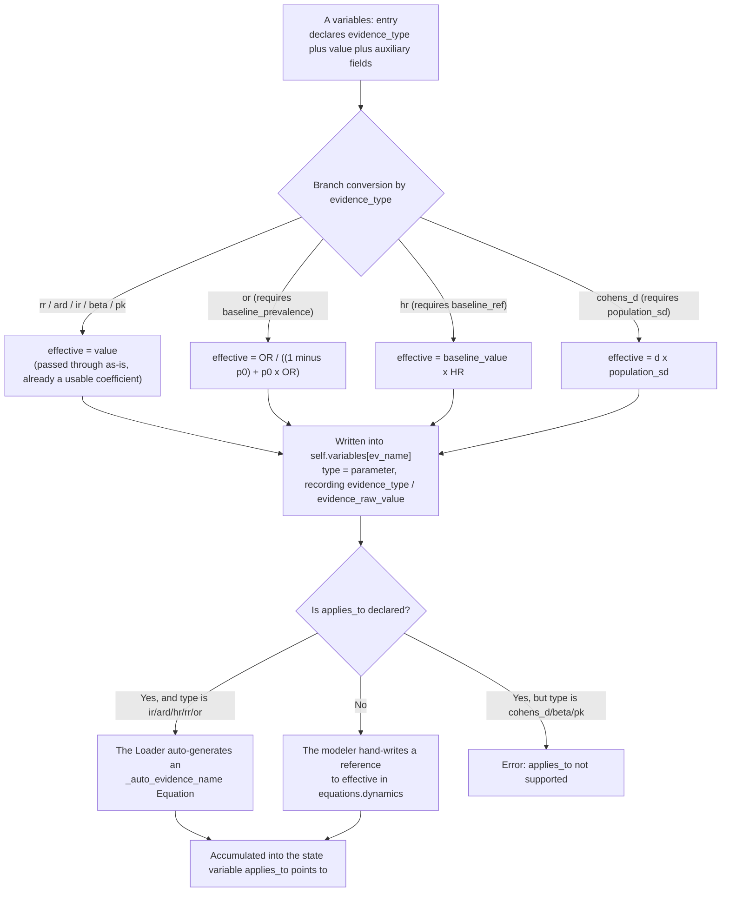
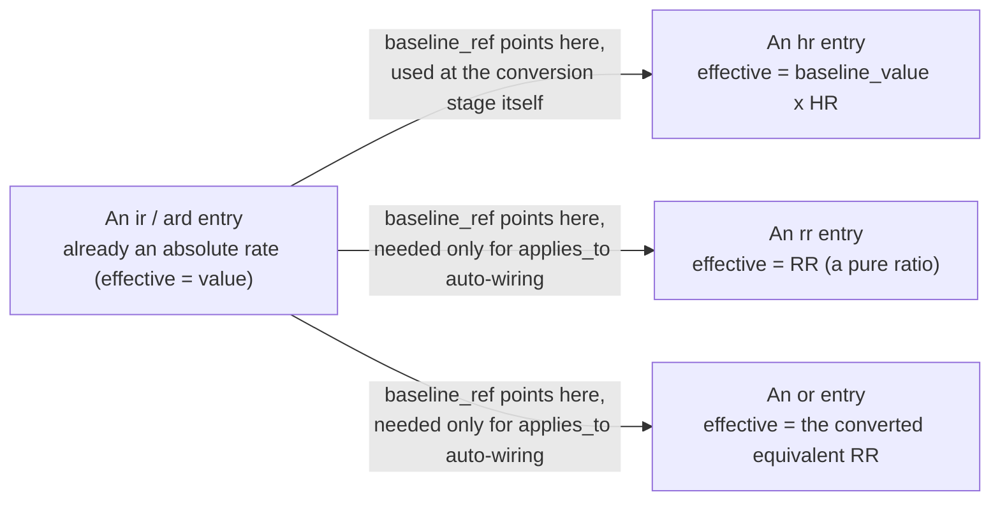

# Evidence Conversion: the 8 Subtypes' Computational Equations

> This file is the **authoritative implementation description** of evidence conversion (corresponding to the part of `_apply_model_data` in `reference_engine/src/model_structure/loader.py` that handles the `evidence_type` field of a `variables:` entry). For how to declare the `evidence_type` field on a `variables:` entry in YAML, and how to choose between `parameter` and an evidence_type, see the "Variable types (3 kinds) plus in-place evidence_type conversion" section of `docs/authoring/variables_and_equations.md` in the `life-matters-models` repository; this file only answers "specifically how the Loader converts a literature effect size into a coefficient usable by an equation." For the mechanism that automatically wires `applies_to` into dynamics, see [applies_to.md](applies_to.md) in the same directory. For the decision background, see `docs/decisions/0040-2026-04-22_sim_medical-evidence-types-and-variable-mapping.md` in the `life-matters-models` repository (the original design of the top-level `evidence:` block) and `docs/decisions/0137-*.md` (the later decision to fold it into `variables:`).
>
> This file is written for two kinds of readers: someone already familiar with epidemiological/biostatistical effect sizes (RR, OR, HR, Cohen's d, etc.) can go straight to the quick-reference table and equations below; someone unfamiliar with these statistics (e.g. an engineering-only modeler, or one familiar with only one other discipline) should start from "What problem the conversion solves" — each subtype comes with an everyday example, the formal equation, and a derivation of "why computing it this way is correct," requiring no prior biostatistics background.

## What problem the conversion solves

The "effect size" a paper reports is not one uniform thing — it might be "the ratio of two probabilities" (RR), "the ratio of two odds" (OR), "the ratio of two instantaneous rates" (HR), "the absolute difference between two groups" (ARD), or "a standardized difference computed using a standard deviation" (Cohen's d). These numbers **all look like an ordinary float** (e.g. 1.65, 0.75, 0.68), but their meaning, units, and whether they can be directly multiplied or added, are completely different from each other.

If these numbers are dropped into a simulation equation without distinguishing them (e.g. taking an OR directly as a "risk multiplier" to multiply a baseline probability), a systematic computational error is introduced — an error that raises no error, just makes the result "look plausible but be numerically wrong." What the evidence-conversion layer does is first ask clearly "what is this number's statistical identity" (the `type` field), then convert it, via the equation corresponding to that identity, into an **effective coefficient** with a unified meaning, a clear unit, and safe for direct use in a dynamics equation. The raw literature value before conversion is not lost — it is kept in `evidence_raw_value`, making it easy to review whether the conversion is correct.

## An overview of the conversion pipeline

From a YAML declaration to finally entering a simulation state variable, a piece of evidence goes through two stages: **conversion** (this file, turning a literature number into a semantically unified effective coefficient) and **wiring** ([applies_to.md](applies_to.md), wiring the effective coefficient into some state variable's dynamics equation).

The left side is the conversion stage this file covers; the right side (after "is applies_to declared") is the wiring stage [applies_to.md](applies_to.md) covers.

## How the conversion result is stored

The Loader iterates over the entries in the YAML's `variables:` that declare `evidence_type`, and once it computes the `effective` value per `evidence_type`, writes it **in place** into `self.variables[var_name]` (overriding under the same name, with `type` staying `parameter`), without adding a separate `VariableType.evidence`. `equations`/`dynamics` reference this name directly, with no need to remember a derived name like `_effective`.

The converted `Variable` carries two additional traceability fields (`reference_engine/src/model_structure/base.py`), for query/debugging only, not participating in simulation computation:

| Field                 | Meaning                                                                                |
| ---------------------- | ------------------------------------------------------------------------------------- |
| `evidence_type`      | The original evidence's `type` (e.g. `rr`/`or`/`hr`); `None` for a parameter not sourced from evidence |
| `evidence_raw_value` | The raw literature value before conversion (e.g. OR=1.65), kept separately from the converted `value` |

## Quick reference: the 8 subtypes' conversion equations

| `type`     | Full name of the effect size                          | Conversion equation                                                | Required auxiliary field                      |
| ------------ | ------------------------------------------------- | --------------------------------------------------------- | ----------------------------------- |
| `rr`       | Relative Risk              | $\text{effective} = RR$                                 | —                                |
| `or`       | Odds Ratio                   | $\text{effective} = \dfrac{OR}{(1-p_0) + p_0 \cdot OR}$ | `baseline_prevalence` (i.e. $p_0$) |
| `hr`       | Hazard Ratio                 | $\text{effective} = h_0 \cdot HR$                       | `baseline_ref` (supplying $h_0$)      |
| `ard`      | Absolute Risk Difference | $\text{effective} = ARD$                                | —                                |
| `cohens_d` | Cohen's d effect size                    | $\text{effective} = d \cdot SD$                         | `population_sd` (i.e. $SD$)        |
| `ir`       | Incidence Rate        | $\text{effective} = IR$                                | —                                |
| `beta`     | Regression Coefficient     | $\text{effective} = \beta$                              | —                                |
| `pk`       | A PK/PD parameter                          | $\text{effective} = \theta$ (the parameter passed through as-is)             | —                                |

An unknown `evidence_type` does not raise an error — it only prints a warning and skips that entry's conversion (the variable never appears in `self.variables`).

Below is a walkthrough of each subtype in turn: what it measures in reality, its formal equation, why the conversion equation looks the way it does (or why no conversion is needed), and a worked example using real fixture numbers.

## The `baseline_ref` structural relationship

The conversion or subsequent wiring of the three types `hr`/`rr`/`or` all need a "baseline" — some `ir`/`ard` entry that is already an absolute rate. This is not three independent fields but one structural relationship reused three times:

`hr` needs `baseline_ref` right at the **conversion stage** (because $h_0$ directly participates in computing effective); `rr`/`or`'s conversion itself doesn't need `baseline_ref` (their effective is just a ratio) — `baseline_ref` only needs declaring when auto-generating dynamics with `applies_to`, because the auto-generated expression needs a baseline rate to turn a "ratio" into a "rate" (see [applies_to.md](applies_to.md)).

## Walkthrough

### `rr`: Relative Risk

**What it is**: the ratio of "event probability" between two populations. For example, dividing the proportion of smokers who develop cardiovascular disease (CVD) by the proportion of non-smokers who develop CVD; if the result is 2.5, that means a smoker's probability of developing the disease is 2.5 times a non-smoker's.

Formal definition:

$$
RR = \frac{p_1}{p_0}

$$

where $p_1$ is the event probability in the exposed group (e.g. smokers), and $p_0$ is the event probability in the control group (e.g. non-smokers).

**Conversion equation**:

$$
\text{effective} = RR

$$

**Why no conversion is needed**: RR's definition is itself already a "normalized ratio" — dividing the two groups' absolute probabilities gives a pure multiplier, usable directly as a "risk multiplier" with no additional information needed. So the Loader does no mathematical transformation on it at all; the number read in is the conversion result.

**But note**: RR is only a "multiplier," not an absolute rate like "how much probability is added per day/year." To turn it into a risk increment the simulation can actually accumulate, it still needs multiplying by a baseline rate — this step is not done at the conversion stage, but in the modeler's hand-written dynamics, or in the dynamics `applies_to` auto-generates (see [applies_to.md](applies_to.md)).

**A worked example** (`test_valid_evidence_rr.yaml`): $RR = 2.5 \Rightarrow \text{effective} = 2.5$ (passed through as-is). In hand-written dynamics, this 2.5 is multiplied by the baseline daily risk `baseline_cvd_daily_risk = 0.000033/day`, giving a smoker's daily risk increment of $0.000033 \times 2.5 = 0.0000825$/day, accumulating to about 0.00248 over 30 days.

**Required fields**: none. Optionally `baseline_ref` plus `applies_to` (if the Loader is to auto-generate dynamics, `baseline_ref` needs to point to an `ir`/`ard` entry).

### `or`: Odds Ratio

**What it is**: similar to RR, but comparing not "probability" but "odds" (the ratio of occurring to not occurring, $\text{odds} = p/(1-p)$). For example, the odds of CVD in an obese population are 1.65 times the odds in a normal-weight population, $OR = 1.65$. OR is common in case-control studies, because that study design cannot compute RR directly — only OR is obtainable.

Formal definition:

$$
OR = \frac{p_1/(1-p_1)}{p_0/(1-p_0)}

$$

**Conversion equation**:

$$
\text{effective} = \frac{OR}{(1-p_0) + p_0 \cdot OR}

$$

**Why conversion is needed (this is the one subtype, of the 8, whose literature number cannot be used directly as a ratio)**: odds and probability are not the same thing. When the disease rate is low (e.g. under 10%), $\text{odds} \approx p$, and OR and RR are numerically close, so using OR directly as RR introduces little error; but the higher the disease rate, the larger the gap between odds and probability, and OR is systematically "more extreme" than RR (further from 1). Multiplying a baseline probability rate by OR directly without conversion introduces a bias that grows with disease rate. So the Loader requires the population's disease rate `baseline_prevalence` ($p_0$) to be declared separately, first converting OR into an equivalent RR, only after which it can be safely used as a ratio like `rr`.

**Deriving the conversion equation (why it is correct)**: let the population's baseline disease rate be $p_0$ and the exposed group's disease rate be $p_1$; substituting into OR's definition and solving for $p_1$:

$$
OR = \frac{p_1/(1-p_1)}{p_0/(1-p_0)}
\quad\Longrightarrow\quad
p_1 = \frac{p_0 \cdot OR}{(1-p_0) + p_0 \cdot OR}

$$

Substituting into $RR = p_1 / p_0$:

$$
RR = \frac{p_1}{p_0} = \frac{OR}{(1-p_0) + p_0 \cdot OR}

$$

This is the standard OR-to-RR conversion equation found in epidemiology textbooks, and the Loader's `effective` computes exactly this $RR$. It relies on one premise: the `baseline_prevalence` you supply must genuinely reflect this study population's disease rate; if $p_0$ is chosen wrongly (e.g. using another country's/age group's disease rate), the conversion result will be wrong along with it — this is the modeler's input responsibility, and the Loader does not validate whether $p_0$ itself is reasonable.

**A worked example** (`test_valid_evidence_or.yaml`): $OR = 1.65$, $p_0 = 0.12$:

$$
\text{effective} = \frac{1.65}{(1-0.12) + 0.12 \times 1.65} = \frac{1.65}{0.88 + 0.198} = \frac{1.65}{1.078} \approx 1.5306

$$

You can see the effect size has "shrunk" from 1.65 to 1.5306 — this is exactly OR's natural tendency to be more extreme than RR: the OR computed from the same data is always further from 1 than the RR.

**Required field**: `baseline_prevalence` ($p_0$, the population's disease rate, which must match the study design).

### `hr`: Hazard Ratio

**What it is**: common in survival analysis/cohort studies, measuring the ratio of "the instantaneous rate (hazard) at which an event occurs per unit time," not the ratio of cumulative probability at some point in time. For example, a statin lowers CVD hazard to 0.75 times the control group's, $HR = 0.75$.

Formal definition:

$$
HR = \frac{h_1(t)}{h_0(t)}

$$

where $h_0(t)$ is the control group's instantaneous rate, and $h_1(t)$ is the exposed group's instantaneous rate.

**Conversion equation**:

$$
\text{effective} = h_0 \cdot HR

$$

where $h_0$ is taken from the raw value of the `ir` entry `baseline_ref` points to.

**Why computing it this way is correct**: HR is by definition the ratio of two instantaneous rates, so knowing the control group's rate $h_0$, multiplying by HR directly gives the exposed group's rate $h_1$ — this product is itself already an **absolute rate** (with units, such as prob/year), not a dimensionless ratio like `rr`/`or`. This is also why the number `hr` converts to (0.009, in prob/year) differs in nature from what `rr`/`or` convert to (2.5, 1.5306, dimensionless), and why the two are handled differently at the `applies_to` auto-wiring stage (see [applies_to.md](applies_to.md)).

**A worked example** (`test_valid_evidence_hr.yaml`): $h_0 = 0.012$ (prob/year), $HR = 0.75$:

$$
\text{effective} = 0.012 \times 0.75 = 0.009 \ \text{(prob/year)}

$$

Accumulating over 30 days gives about $0.009/365 \times 30 \approx 0.00074$.

**Required field**: `baseline_ref` (the name of another `variables:` entry in the same YAML that declares `evidence_type`, taking its **raw value** — note the important limitation in "Known implementation detail" below).

### `ard`: Absolute Risk Difference

**What it is**: a direct subtraction between two groups' event rates, not a ratio. For example, taking aspirin lowers the annual stroke risk by an absolute 0.8 percentage points, $ARD = 0.008$ (prob/year) — note this is a completely different statement from "lowered by X-fold" (relative risk); 0.008 is an absolute value, not a ratio.

Formal definition:

$$
ARD = p_1 - p_0

$$

**Conversion equation**:

$$
\text{effective} = ARD

$$

**Why no conversion is needed**: ARD is by definition the difference "the exposed group's absolute rate minus the control group's absolute rate"; the number the literature reports is already an absolute rate with units, directly usable as an accumulation rate in dynamics, needing no conversion. (By contrast, `rr`/`or` report a ratio, a relative quantity, requiring an extra step to become an absolute rate.)

**A worked example** (`test_valid_evidence_ard.yaml`): $ARD = 0.008$ (prob/year) gives $\text{effective} = 0.008$. Accumulating over 30 days gives about $0.008/365 \times 30 \approx 0.000658$.

**Required fields**: none.

### `cohens_d`: the Cohen's d effect size

**What it is**: a "standardized mean difference" commonly used in psychology/behavioral science and some medical research, measuring how many standard deviations apart two groups' averages are, rather than how many raw units apart. For example, an exercise intervention raises maximal oxygen uptake (VO2max) by 0.68 standard deviations, $d = 0.68$. Using a standard deviation as the unit lets effect sizes be compared across different scales and studies; the downside is that it is itself "unitless" and cannot directly represent a real-world value like mL/kg/min or mmHg.

Formal definition:

$$
d = \frac{\mu_1 - \mu_0}{SD}

$$

where $\mu_1$ and $\mu_0$ are the two groups' means, and $SD$ is the (pooled) population standard deviation.

**Conversion equation**:

$$
\text{effective} = d \cdot SD

$$

**Why computing it this way is correct**: this step is the inverse of Cohen's d's definition — multiplying both sides of the definition by $SD$ directly solves for the mean difference in raw units, $\mu_1 - \mu_0$:

$$
\mu_1 - \mu_0 = d \cdot SD

$$

To use $d$ in dynamics to change a variable with real units (e.g. VO2max, in mL/kg/min), this "restoring" step must be done first.

**A worked example** (`test_valid_evidence_cohens_d.yaml`): $d = 0.68$, $SD = 6.0$ (mL/kg/min):

$$
\text{effective} = 0.68 \times 6.0 = 4.08 \ \text{(mL/kg/min)}

$$

**Required field**: `population_sd` (must come from a population matching the target variable — using the wrong population's standard deviation distorts the restored number; this is the modeler's input responsibility, and the Loader does not validate whether the SD itself is reasonable).

### `ir`: Incidence Rate

**What it is**: the fraction of a population that develops a new case (or dies) per unit time, e.g. "an annual incidence of 1.2%." This is the most "natural" of the 8 subtypes — the number the literature reports is already "the probability of this happening per year/day," usable directly as a rate with no mathematical transformation needed.

Formal definition ($N$ is the population size at the start of the period, $C$ is the number of new cases during the observation period):

$$
IR = \frac{C}{N \cdot \Delta t}

$$

**Conversion equation**:

$$
\text{effective} = IR

$$

**Why no conversion is needed**: the definition itself is already an absolute rate, and the Loader passes it through as-is. `ir` is often referenced by `hr`/`rr`/`or` via `baseline_ref` as a "baseline," because it is already a ready-made absolute rate, directly usable as "the default rate with no exposure factor."

**A worked example** (`test_valid_evidence_ir.yaml`): $IR = 0.012$ (prob/year) gives $\text{effective} = 0.012$. Accumulating over 30 days gives about $0.012/365 \times 30 \approx 0.000986$.

**Required fields**: none (when serving as a referenced baseline, it typically needs `rate_unit` declared, used for time-unit conversion during `applies_to` auto-wiring, see [applies_to.md](applies_to.md)).

### `beta`: Regression Coefficient

**What it is**: a slope from a statistical regression model (such as linear regression), measuring "how much the dependent variable changes on average per 1-unit change in the independent variable." For example, systolic blood pressure (SBP) rises by an average of 0.45 mmHg per additional year of age, $\beta = 0.45$ (mmHg/year).

Formal definition (using simple linear regression as an example):

$$
y = \beta \cdot x + c

$$

$\beta$ is the average change in the dependent variable $y$ per 1-unit change in the independent variable $x$.

**Conversion equation**:

$$
\text{effective} = \beta

$$

**Why no conversion is needed**: a regression coefficient is reported as "the change in the dependent variable per unit of the independent variable," which is itself already a directly usable slope/rate, needing no conversion. But note its time unit is often "per year"; if the model uses "day" as its step, it must be divided by 365 in dynamics by hand — the Loader does not do this automatically, because `beta` does not support `applies_to` (see below), so dynamics must be hand-written, and converting the time unit is part of that hand-written logic.

**A worked example** (`test_valid_evidence_beta.yaml`): $\beta = 0.45$ (mmHg/year) gives $\text{effective} = 0.45$. The hand-written dynamics is $\text{systolic\_bp} + 0.45/365 \times \text{step}$, rising by about 0.00123 mmHg per day, reaching SBP of about 120.037 after 30 days (starting at 120).

**Required fields**: none. Does not support `applies_to` (the regression structure itself might be linear, nonlinear, or include an interaction term, and the Loader cannot assume how to wire it in on the modeler's behalf).

### `pk`: a PK/PD parameter

**What it is**: a pharmacokinetic/pharmacodynamic parameter, such as the drug-elimination rate constant $k_e$ (describing how fast a drug is cleared from the body). $k_e$'s relationship to the half-life $t_{1/2}$:

$$
t_{1/2} = \frac{\ln 2}{k_e}

$$

For example, $k_e = 0.0347$ (1/hour) corresponds to a half-life of about 20 hours.

**Conversion equation**:

$$
\text{effective} = \theta

$$

($\theta$ refers generally to any PK/PD parameter, such as $k_e$, the apparent volume of distribution $V_d$, an absorption rate constant, etc., passed through as-is.)

**Why no conversion is needed**: a PK parameter is usually already a rate constant or structural parameter directly usable in a model equation, needing no mathematical transformation. But the modeler must ensure the time unit in dynamics matches the parameter's unit (e.g. `1/hour`) — `pk` likewise does not support `applies_to`, and this matching is part of hand-writing dynamics.

**A worked example** (`test_valid_evidence_pk.yaml`): $k_e = 0.0347$ (1/hour) gives $\text{effective} = 0.0347$. In dynamics (`step_unit: hour`), $\text{drug\_conc} \times \text{drug\_ke} \times \text{step}$ is written directly as the elimination term, with no extra time-conversion factor needed, because $k_e$'s unit (1/hour) already matches `step_unit` (hour); if $k_e$'s unit were `1/day` while the simulation advances by the hour, it would need dividing by 24 by hand in dynamics.

**Required fields**: none. Does not support `applies_to` (the PK model structure, single- versus multi-compartment, first- versus zero-order elimination, is not unique, and the Loader cannot choose a structure on the modeler's behalf).

## Runnable examples and validation coverage

Under `models/test_fixtures/valid/` in the `life-matters-models` repository are 8 minimal fixtures, one file per subtype, each containing only "one evidence plus one or two display/accumulation variables," directly loadable/runnable to see the effect, more reliable than pasting an unrunnable YAML into the documentation (it can't happen that the conversion logic changes and no one notices the documentation's example no longer computes that number). Every calculation example in "Walkthrough" above is taken from these fixtures' real values.

| Subtype     | Fixture                             | What it verifies                                                                                                       |
| ------------ | ------------------------------------- | ---------------------------------------------------------------------------------------------------------------- |
| `rr`       | `test_valid_evidence_rr.yaml`       | A hand-written dynamics multiplying an ordinary parameter baseline, compared against `applies_to` auto-wired to an `ir` baseline; the two paths' baselines differ, and the values should not be equal |
| `or`       | `test_valid_evidence_or.yaml`       | The only subtype requiring a nonlinear conversion (`baseline_prevalence`)                                                            |
| `hr`       | `test_valid_evidence_hr.yaml`       | `baseline_ref` referencing an `ir` entry in the same file as the baseline                                                                    |
| `ard`      | `test_valid_evidence_ard.yaml`      | A hand-written dynamics and the `applies_to`-auto-generated dynamics must agree step by step numerically                                              |
| `cohens_d` | `test_valid_evidence_cohens_d.yaml` | The only subtype that must rely on `population_sd` to convert into a dimensioned result                                                           |
| `ir`       | `test_valid_evidence_ir.yaml`       | Often referenced by other subtypes as a baseline, needing separate confirmation the value is stable when acting as "the one being referenced"                                                 |
| `beta`     | `test_valid_evidence_beta.yaml`     | An annualized coefficient converted into a daily rate (divided by 365), driving a continuous state variable                                                                  |
| `pk`       | `test_valid_evidence_pk.yaml`       | Verifies the converted rate constant can be used directly in an hour-level-step equation, with no extra unit conversion needed                                               |

Every file's `metadata.description.result` field states the specific number that should be computed (e.g. "about 0.000658 accumulated after 30 days"), and `simulation.end_date` can be edited directly to test a longer/shorter window. For a comprehensive scenario with all 8 subtypes coexisting, see `test_valid_evidence_types.yaml`; for each file's design intent (why it's tested separately, its relationship to neighboring files), see §1 of `models/test_fixtures/fixture_catalog.md`.

**These fixtures are currently verified only for "can they be correctly loaded/legally rejected"** (`test_verification/errors/test_evidence_errors.py` covers the negative cases — that is, a fixture declaring an error is reliably rejected); **no pytest actually runs a simulation through to assert the specific number written in `description.result`**. This means that if the Loader's conversion logic changes in the future, these "expected results" written in the comments could silently go stale without any test catching it — this is another validation gap in this repository worth filling, not yet addressed.

## A known implementation detail (documented here as-is, not a recommended behavior)

**`hr`'s `baseline_ref` is not validated for its target's type on the base conversion path**: $h_0$ in the `hr` row of the table above is taken directly from `variables[baseline_ref]['value']` (the raw value, not converted through that entry's own type conversion). This has no effect when `baseline_ref` points to an `ir`/`ard` entry (for these two types, $\text{effective} = \text{value}$, so the raw value and the converted value are the same), but if a modeler mistakenly points `baseline_ref` at an `rr`/`or`/`cohens_d` entry, the Loader raises no error and silently uses its raw literature value in the multiplication, producing a semantically wrong result. For example, if `baseline_ref` is mistakenly pointed at an entry with $OR = 1.65$, the Loader will use 1.65 (the raw OR before conversion) directly, rather than the converted $\text{effective} \approx 1.5306$, in the multiplication, giving an `hr` effective that is larger than expected and semantically wrong in its unit (1.65 is a dimensionless ratio, not an absolute rate usable as a "baseline rate"). The `applies_to` path (see [applies_to.md](applies_to.md)) has a stricter check on `baseline_ref` (forcing it to point to `ir`/`ard`), but this base conversion path does not — meaning that without using `applies_to`, `baseline_ref` pointing to a non-`ir`/`ard` entry is not blocked. When modeling, `hr`/`rr`/`or`'s `baseline_ref` should always point to an `ir`/`ard` entry.
