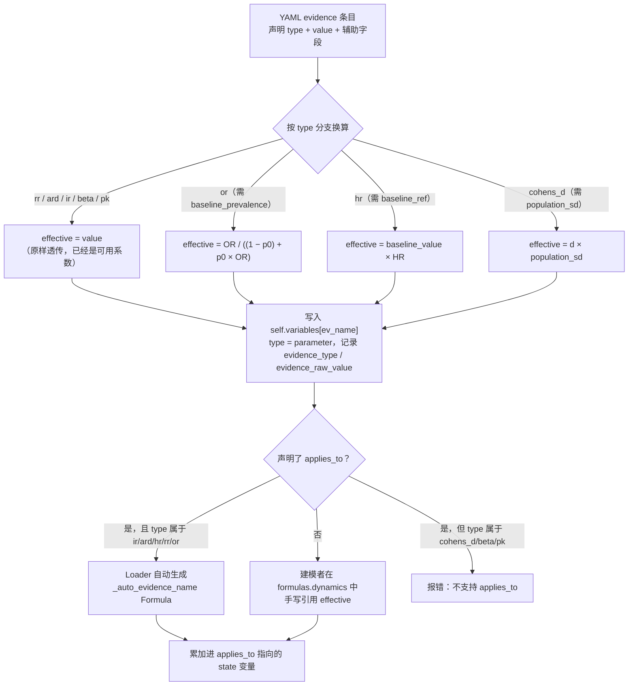
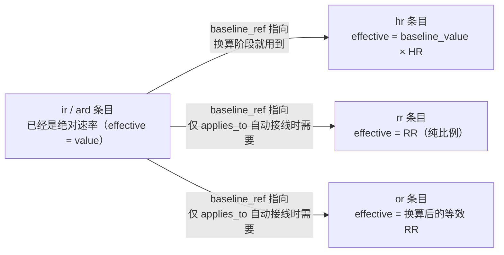

# Evidence 换算：8 种子类型的计算公式

> 本文件是 evidence 换算的**权威实现描述**（对应 `reference_engine/src/model_structure/loader.py` 中 `ModelStructure.load()` 处理 `evidence:` 节的那部分代码）。YAML 里怎么声明 `evidence:` 字段、`parameter` 和 `evidence` 该怎么选，见 `b_lm_model` 仓库 `docs/model.md`「变量类型（3 种）+ evidence 顶层换算」一节；本文件只回答"Loader 具体怎么把文献效应量算成公式能用的系数"。`applies_to` 自动接入 dynamics 的机制见同目录 [applies_to.md](applies_to.md)。决策背景见 `b_lm_model` 仓库 `docs/decisions/0040-2026-04-22_sim_医学证据类型与变量映射.md`。
>
> 本文件面向两类读者：已经熟悉流行病学/生物统计效应量（RR、OR、HR、Cohen's d 等）的人，可以直接看下面的速查表和公式；不熟悉这些统计量的人（比如只懂工程、只懂某一个学科的建模者），请从「换算解决的问题」开始看——每种子类型都配了生活化的例子、正式公式和"为什么这样算是对的"的推导，不要求先有生物统计背景。

## 换算解决的问题

一篇论文报出来的"效应量"（effect size）不是一种统一的东西——它可能是"两个概率的比值"（RR），可能是"两个 odds 的比值"（OR），可能是"两个瞬时速率的比值"（HR），可能是"两组的绝对差"（ARD），也可能是"用标准差算出来的标准化差异"（Cohen's d）。这些数字**长得都像一个普通浮点数**（比如 1.65、0.75、0.68），但它们各自的含义、单位、能不能直接相乘相加，是完全不同的。

如果把这些数字不做区分地直接塞进仿真公式（比如直接拿 OR 当作"风险倍数"去乘一个基线概率），会引入系统性的计算错误——错误不会报错，只会让结果"看起来合理但数值不对"。Evidence 换算这一层要做的事，就是先问清楚"这个数字的统计学身份是什么"（`type` 字段），再按该身份对应的公式，把它转换成一个语义统一、单位明确、可以放心在 dynamics 公式里直接使用的**有效系数**（effective）。换算前的原始文献数值不会丢失，会保留在 `evidence_raw_value` 里，方便审查换算是否正确。

## 换算流程总览

从 YAML 声明到最终进入仿真状态变量，一条 evidence 会经过两个阶段：**换算**（本文件，把文献数字变成语义统一的 effective 系数）和**接入**（[applies_to.md](applies_to.md)，把 effective 系数接到某个状态变量的动力学方程上）。

左边是本文件覆盖的换算阶段，右边（`是否声明 applies_to`之后）是 [applies_to.md](applies_to.md) 覆盖的接入阶段。

## 换算结果如何存放

Loader 遍历 YAML `evidence:` 节，按 `type` 换算出 `effective` 值后，**以 evidence 同名**写入 `self.variables[ev_name]`，类型为 `parameter`，不新增独立的 `VariableType.evidence`。`formulas`/`dynamics` 直接引用这个名字即可，不需要记 `_effective` 之类的衍生名。

换算后的 `Variable` 额外带两个溯源字段（`reference_engine/src/model_structure/base.py`），仅供查询/调试，不参与仿真计算：

| 字段                 | 含义                                                                                |
| ---------------------- | ------------------------------------------------------------------------------------- |
| `evidence_type`      | 原始 evidence 的`type`（如 `rr`/`or`/`hr`），非 evidence 来源的 parameter 为 `None` |
| `evidence_raw_value` | 换算前的原始文献数值（如 OR=1.65），与换算后的`value` 分开保留                      |

## 速查表：8 种子类型换算公式

| `type`     | 效应量全称                          | 换算公式                                                | 必填辅助字段                      |
| ------------ | ------------------------------------- | --------------------------------------------------------- | ----------------------------------- |
| `rr`       | 相对风险 Relative Risk              | $\text{effective} = RR$                                 | —                                |
| `or`       | 比值比 Odds Ratio                   | $\text{effective} = \dfrac{OR}{(1-p_0) + p_0 \cdot OR}$ | `baseline_prevalence`（即 $p_0$） |
| `hr`       | 风险比 Hazard Ratio                 | $\text{effective} = h_0 \cdot HR$                       | `baseline_ref`（提供 $h_0$）      |
| `ard`      | 绝对风险差 Absolute Risk Difference | $\text{effective} = ARD$                                | —                                |
| `cohens_d` | 效应量 Cohen's d                    | $\text{effective} = d \cdot SD$                         | `population_sd`（即 $SD$）        |
| `ir`       | 发病率/死亡率 Incidence Rate        | $\text{effective} = IR$                                 | —                                |
| `beta`     | 回归系数 Regression Coefficient     | $\text{effective} = \beta$                              | —                                |
| `pk`       | PK/PD 参数                          | $\text{effective} = \theta$（参数原样透传）             | —                                |

未知 `type` 不会报错，只会打印一条 warning 并跳过该条目的换算（该 evidence 不会出现在 `self.variables` 中）。

下面逐一详解每种子类型：它在现实中衡量什么、正式公式、为什么换算公式长这样（或者为什么不需要换算）、用真实 fixture 数字过一遍具体计算。

## `baseline_ref` 结构关系

`hr`/`rr`/`or` 三种类型的换算或后续接入都需要一个"基线"——某个已经是绝对速率的 `ir`/`ard` 条目。这不是三个独立的字段，而是同一种结构关系的三次复用：

`hr` 在**换算阶段**就要用到 `baseline_ref`（因为 $h_0$ 直接参与 effective 的计算）；`rr`/`or` 的换算本身不需要 `baseline_ref`（它们的 effective 只是比例），只有想用 `applies_to` 自动生成 dynamics 时才必须声明 `baseline_ref`，因为自动生成的表达式需要一个基线速率把"比例"变成"速率"（见 [applies_to.md](applies_to.md)）。

## 逐一详解

### `rr`：相对风险（Relative Risk）

**是什么**：两组人群中"事件发生概率"的比值。例如吸烟者中出现心血管疾病（CVD）的比例，除以不吸烟者中出现 CVD 的比例，如果结果是 2.5，就是说吸烟者患病的概率是不吸烟者的 2.5 倍。

正式定义：

$$
RR = \frac{p_1}{p_0}

$$

其中 $p_1$ 是暴露组（如吸烟者）的事件概率，$p_0$ 是对照组（如不吸烟者）的事件概率。

**换算公式**：

$$
\text{effective} = RR

$$

**为什么不需要换算**：RR 的定义本身就已经是一个"归一化的比例"——它把两组的绝对概率相除，得到的是一个纯粹的倍数，不依赖任何额外信息就能直接拿来当"风险倍数"用。所以 Loader 不用对它做任何数学变换，读入的数字就是换算结果。

**但要注意**：RR 只是"倍数"，不是"每天/每年增加多少概率"这种绝对速率。要把它变成仿真里真正能累加的风险增量，还需要乘上一个基线速率（baseline）——这一步不在换算阶段做，而是在建模者手写的 dynamics，或 `applies_to` 自动生成的 dynamics 里完成（见 [applies_to.md](applies_to.md)）。

**具体计算**（`test_valid_evidence_rr.yaml`）：$RR = 2.5 \Rightarrow \text{effective} = 2.5$（原样透传）。手写 dynamics 中，这个 2.5 乘上基线日风险 `baseline_cvd_daily_risk = 0.000033/天`，得到吸烟者每日风险增量 $0.000033 \times 2.5 = 0.0000825$/天，30 天累计 ≈ 0.00248。

**必填字段**：无。可选 `baseline_ref` + `applies_to`（若想让 Loader 自动生成 dynamics，`baseline_ref` 需指向一个 `ir`/`ard` 条目）。

### `or`：比值比（Odds Ratio）

**是什么**：和 RR 很像，但比较的不是"概率"而是"odds"（发生 : 不发生的比值，$\text{odds} = p/(1-p)$）。例如肥胖人群患 CVD 的 odds，是正常体重人群 odds 的 1.65 倍，$OR = 1.65$。OR 常见于病例对照研究，因为这类研究设计下 RR 无法直接算出，只有 OR 可以。

正式定义：

$$
OR = \frac{p_1/(1-p_1)}{p_0/(1-p_0)}

$$

**换算公式**：

$$
\text{effective} = \frac{OR}{(1-p_0) + p_0 \cdot OR}

$$

**为什么需要换算（这是 8 种子类型里唯一一个"文献数字不能直接当比例用"的类型）**：odds 和概率不是一回事。当患病率很低时（比如 <10%），$\text{odds} \approx p$，OR 和 RR 数值上很接近，直接把 OR 当 RR 用误差不大；但患病率越高，odds 和概率的差距越大，OR 会系统性地比 RR"更极端"（离 1 更远）。如果不做换算就直接拿 OR 去乘基线概率速率，会引入随患病率增大而增大的偏差。所以 Loader 要求额外声明人群患病率 `baseline_prevalence`（$p_0$），先把 OR 转换成一个等效的 RR，之后才能像 `rr` 一样安全地当比例使用。

**换算公式的推导（为什么是对的）**：设人群基础患病率为 $p_0$，暴露组患病率为 $p_1$，代入 OR 的定义并解出 $p_1$：

$$
OR = \frac{p_1/(1-p_1)}{p_0/(1-p_0)}
\quad\Longrightarrow\quad
p_1 = \frac{p_0 \cdot OR}{(1-p_0) + p_0 \cdot OR}

$$

再代入 $RR = p_1 / p_0$：

$$
RR = \frac{p_1}{p_0} = \frac{OR}{(1-p_0) + p_0 \cdot OR}

$$

这是流行病学教材中标准的 OR→RR 换算公式，Loader 的 `effective` 算的正是这个 $RR$。它依赖一个前提：你填的 `baseline_prevalence` 必须真实反映该研究人群的患病率；如果 $p_0$ 选错（比如用了另一个国家/年龄段的患病率），换算结果会跟着错——这是建模者的输入责任，Loader 不会校验 $p_0$ 本身是否合理。

**具体计算**（`test_valid_evidence_or.yaml`）：$OR = 1.65$，$p_0 = 0.12$：

$$
\text{effective} = \frac{1.65}{(1-0.12) + 0.12 \times 1.65} = \frac{1.65}{0.88 + 0.198} = \frac{1.65}{1.078} \approx 1.5306

$$

可以看到效应量从 1.65"缩水"到了 1.5306——这正是 OR 天然比 RR 更极端的体现：同一份数据算出的 OR 总是比 RR 离 1 更远。

**必填字段**：`baseline_prevalence`（$p_0$，人群患病率，必须与研究设计匹配）。

### `hr`：风险比（Hazard Ratio）

**是什么**：常见于生存分析/队列研究，衡量的是"单位时间内事件发生的瞬时速率（hazard）"之比，而不是某个时间点的累积概率之比。例如他汀类药物使 CVD 的 hazard 降低到对照组的 0.75 倍，$HR = 0.75$。

正式定义：

$$
HR = \frac{h_1(t)}{h_0(t)}

$$

其中 $h_0(t)$ 是对照组的瞬时速率，$h_1(t)$ 是暴露组的瞬时速率。

**换算公式**：

$$
\text{effective} = h_0 \cdot HR

$$

其中 $h_0$ 取自 `baseline_ref` 指向的 `ir` 条目的原始值。

**为什么这样算是对的**：HR 的定义就是两个瞬时速率的比值，只要知道对照组的速率 $h_0$，乘以 HR 就直接得到暴露组的速率 $h_1$——这个乘积本身已经是一个**绝对速率**（有单位，如 prob/year），而不是像 `rr`/`or` 那样只是一个无量纲的比例。这也是为什么 `hr` 换算出来的数（0.009，单位 prob/year）和 `rr`/`or` 换算出来的数（2.5、1.5306，无量纲）性质不同，二者在 `applies_to` 自动接线阶段的处理方式也因此不同（见 [applies_to.md](applies_to.md)）。

**具体计算**（`test_valid_evidence_hr.yaml`）：$h_0 = 0.012$ (prob/year)，$HR = 0.75$：

$$
\text{effective} = 0.012 \times 0.75 = 0.009 \ \text{(prob/year)}

$$

30 天累积 ≈ $0.009/365 \times 30 \approx 0.00074$。

**必填字段**：`baseline_ref`（指向同一份 YAML 内另一个 evidence 条目的名字，取其**原始值**——注意下方「已知实现细节」一节的重要限制）。

### `ard`：绝对风险差（Absolute Risk Difference）

**是什么**：两组事件发生率的直接相减，不是比值。例如服用阿司匹林使中风的年风险绝对降低 0.8 个百分点，$ARD = 0.008$ (prob/year)——注意这和"降低了 X 倍"（相对风险）是完全不同的说法，0.008 是一个绝对数值，不是比例。

正式定义：

$$
ARD = p_1 - p_0

$$

**换算公式**：

$$
\text{effective} = ARD

$$

**为什么不需要换算**：ARD 定义本身就是"暴露组绝对速率 − 对照组绝对速率"这个差值，文献报出来的数字已经是一个有单位的绝对速率，可以直接当作 dynamics 里的累加速率使用，不需要换算。（相对地，`rr`/`or` 报的是比值这种相对量，才需要额外一步才能变成绝对速率。）

**具体计算**（`test_valid_evidence_ard.yaml`）：$ARD = 0.008$ (prob/year) $\Rightarrow \text{effective} = 0.008$。30 天累积 ≈ $0.008/365 \times 30 \approx 0.000658$。

**必填字段**：无。

### `cohens_d`：效应量 Cohen's d

**是什么**：心理学/行为科学、部分医学研究中常用的"标准化均值差"，衡量两组的平均值差了几个标准差，而不是差了几个原始单位。例如一项运动干预项目使最大摄氧量（VO2max）提升了 0.68 个标准差，$d = 0.68$。用标准差做单位的好处是可以跨不同量表、不同研究比较效应大小；坏处是它本身"没有单位"，不能直接代表现实世界里的 mL/kg/min、mmHg 之类具体数值。

正式定义：

$$
d = \frac{\mu_1 - \mu_0}{SD}

$$

其中 $\mu_1$、$\mu_0$ 是两组的均值，$SD$ 是（合并后的）人群标准差。

**换算公式**：

$$
\text{effective} = d \cdot SD

$$

**为什么这样算是对的**：这一步是 Cohen's d 定义的逆运算——把定义式两边同乘 $SD$，直接解出原始单位下的均值差 $\mu_1 - \mu_0$：

$$
\mu_1 - \mu_0 = d \cdot SD

$$

要把 $d$ 用在 dynamics 里去改变一个有真实单位的变量（比如 VO2max，单位 mL/kg/min），必须先做这一步"还原"。

**具体计算**（`test_valid_evidence_cohens_d.yaml`）：$d = 0.68$，$SD = 6.0$ (mL/kg/min)：

$$
\text{effective} = 0.68 \times 6.0 = 4.08 \ \text{(mL/kg/min)}

$$

**必填字段**：`population_sd`（必须来自与目标变量匹配的人群——用错人群的标准差会让还原出的数字失真，这是建模者的输入责任，Loader 不会校验 SD 本身是否合理）。

### `ir`：发病率/死亡率（Incidence Rate）

**是什么**：单位时间内一个人群中新发病例（或死亡）所占的比例，比如"年发病率 1.2%"。这是 8 种子类型里最"天然"的一种——文献报出来的数字本身就是"每年/每天多大概率会发生"，不需要任何数学变换就能当速率用。

正式定义（$N$ 为期初人群数，$C$ 为观察期内新发病例数）：

$$
IR = \frac{C}{N \cdot \Delta t}

$$

**换算公式**：

$$
\text{effective} = IR

$$

**为什么不需要换算**：定义本身即绝对速率，Loader 原样透传。`ir` 常被 `hr`/`rr`/`or` 通过 `baseline_ref` 引用作为"基线"，因为它已经是现成的绝对速率，可以直接作为"没有暴露因素时的默认速率"。

**具体计算**（`test_valid_evidence_ir.yaml`）：$IR = 0.012$ (prob/year) $\Rightarrow \text{effective} = 0.012$。30 天累积 ≈ $0.012/365 \times 30 \approx 0.000986$。

**必填字段**：无（作为被引用的 baseline 时通常需要声明 `rate_unit`，供 `applies_to` 自动接线时换算时间单位用，见 [applies_to.md](applies_to.md)）。

### `beta`：回归系数（Regression Coefficient）

**是什么**：来自统计回归模型（如线性回归）里的斜率，衡量"自变量每变化 1 个单位，因变量平均变化多少"。例如年龄每增长 1 岁，收缩压（SBP）平均上升 0.45 mmHg，$\beta = 0.45$ (mmHg/year)。

正式定义（以简单线性回归为例）：

$$
y = \beta \cdot x + c

$$

$\beta$ 即自变量 $x$ 每变化 1 个单位时，因变量 $y$ 的平均变化量。

**换算公式**：

$$
\text{effective} = \beta

$$

**为什么不需要换算**：回归系数报出来就是"每单位自变量对应的因变量变化量"，本身已经是可以直接使用的斜率/速率，不需要换算。但要注意它的时间单位往往是"每年"，如果模型用"天"作为 step，需要在 dynamics 里自己除以 365——这一步 Loader 不会自动做，因为 `beta` 不支持 `applies_to`（见下），必须手写 dynamics，换算时间单位是手写逻辑的一部分。

**具体计算**（`test_valid_evidence_beta.yaml`）：$\beta = 0.45$ (mmHg/year) $\Rightarrow \text{effective} = 0.45$。手写 dynamics 为 $\text{systolic\_bp} + 0.45/365 \times \text{step}$，每天上升 ≈ 0.00123 mmHg，30 天后 SBP ≈ 120.037（起始 120）。

**必填字段**：无。不支持 `applies_to`（回归结构本身可能是线性、非线性、带交互项，Loader 不能替建模者假设怎么接入）。

### `pk`：PK/PD 参数

**是什么**：药代动力学/药效学参数，例如药物消除速率常数 $k_e$（描述药物在体内被清除的快慢）。$k_e$ 与半衰期 $t_{1/2}$ 的关系：

$$
t_{1/2} = \frac{\ln 2}{k_e}

$$

例如 $k_e = 0.0347$ (1/hour) 对应半衰期约 20 小时。

**换算公式**：

$$
\text{effective} = \theta

$$

（$\theta$ 泛指任意 PK/PD 参数，如 $k_e$、表观分布容积 $V_d$、吸收速率常数等，原样透传。）

**为什么不需要换算**：PK 参数通常已经是模型方程里可以直接使用的速率常数或结构参数，不需要数学变换。但建模者必须自己确保 dynamics 里的时间单位与参数单位（如 `1/hour`）匹配——`pk` 同样不支持 `applies_to`，这个匹配工作是手写 dynamics 的一部分。

**具体计算**（`test_valid_evidence_pk.yaml`）：$k_e = 0.0347$ (1/hour) $\Rightarrow \text{effective} = 0.0347$。dynamics（`step_unit: hour`）里直接写 $\text{drug\_conc} \times \text{drug\_ke} \times \text{step}$ 作为消除项，不需要额外乘时间换算系数，因为 $k_e$ 的单位（1/hour）已经和 `step_unit`（hour）匹配；如果 $k_e$ 单位是 `1/day` 而仿真按小时推进，就需要在 dynamics 里手动除以 24。

**必填字段**：无。不支持 `applies_to`（PK 模型结构——单室/多室、一级/零级消除——不唯一，Loader 不能替建模者选择结构）。

## 可运行示例与验证覆盖

`b_lm_model` 仓库 `models/test_fixtures/valid/` 下有 8 个最小 fixture，一种子类型一个文件，各自只含"一个 evidence + 一两个展示/累积变量"，可以直接加载/仿真跑一遍看效果，比在文档里贴一份不会跑的 YAML 更可靠（不会因为换算逻辑改了而没人发现文档示例已经算不出那个数）。上面「逐一详解」里的所有计算示例都取自这些 fixture 的真实数值。

| 子类型     | fixture                             | 验证的点                                                                                                       |
| ------------ | ------------------------------------- | ---------------------------------------------------------------------------------------------------------------- |
| `rr`       | `test_valid_evidence_rr.yaml`       | 手写 dynamics 乘一个普通 parameter 基线，对比`applies_to` 自动接线到 `ir` 基线，两条路径基线不同、数值不应相等 |
| `or`       | `test_valid_evidence_or.yaml`       | 唯一需要非线性换算（`baseline_prevalence`）的子类型                                                            |
| `hr`       | `test_valid_evidence_hr.yaml`       | `baseline_ref` 引用同文件内 `ir` 条目做基线                                                                    |
| `ard`      | `test_valid_evidence_ard.yaml`      | 手写 dynamics 与`applies_to` 自动生成的 dynamics 逐步数值必须一致                                              |
| `cohens_d` | `test_valid_evidence_cohens_d.yaml` | 唯一必须靠`population_sd` 才能换出有量纲结果的子类型                                                           |
| `ir`       | `test_valid_evidence_ir.yaml`       | 常被其他子类型引用作基线，需要单独确认作为"被引用方"时数值稳定                                                 |
| `beta`     | `test_valid_evidence_beta.yaml`     | 年化系数折算为日速率（÷365）驱动连续状态变量                                                                  |
| `pk`       | `test_valid_evidence_pk.yaml`       | 验证换出的速率常数能在小时级步长公式里直接用，不需要额外单位转换                                               |

每个文件的 `metadata.description.result` 字段都写了具体应该算出的数字（比如"30 天后累计约 0.000658"），可以直接改 `simulation.end_date` 跑更长/更短的区间验证。8 种子类型同时共存的综合场景见 `test_valid_evidence_types.yaml`；每个文件的设计意图（为什么要单独测、和相邻文件的关系）见 `models/test_fixtures/fixture_catalog.md` §1。

**这些 fixture 目前只被验证"能否正确加载/被合法拒绝"**（`test_verification/errors/test_evidence_errors.py` 覆盖的是反例——即声明错误的 fixture 会被可靠拒绝），**没有任何 pytest 真正跑一遍仿真去断言 `description.result` 里写的具体数字**。这意味着如果以后 Loader 的换算逻辑改了，这些写在注释里的"期望结果"可能悄悄过期而不会被任何测试发现——这是本仓库另一处值得补的验证缺口，尚未处理。

## 已知实现细节（写文档时须如实反映，非建议行为）

**`hr` 的 `baseline_ref` 在基础换算路径上不校验目标类型**：上表 `hr` 行的 $h_0$ 直接取 `evidence[baseline_ref]['value']`（原始值，未经该条目自身的类型换算）。这在 `baseline_ref` 指向 `ir`/`ard` 条目时无影响（这两种类型的 $\text{effective} = \text{value}$，原始值与换算值相同），但如果建模者把 `baseline_ref` 误指向一个 `rr`/`or`/`cohens_d` 等条目，Loader 不会报错，会静默用其原始文献值参与乘法，得到语义不对的结果。举例：若误把 `baseline_ref` 指向一个 $OR = 1.65$ 的条目，Loader 会直接用 1.65（换算前的原始 OR）而不是换算后的 $\text{effective} \approx 1.5306$ 去做乘法，得到的 `hr` effective 会比预期偏大且单位含义错误（1.65 是无量纲比值，不是可以当"基线速率"用的绝对速率）。`applies_to` 路径（见 [applies_to.md](applies_to.md)）对 `baseline_ref` 有更严格的校验（强制要求指向 `ir`/`ard`），但这条基础换算路径没有——即不使用 `applies_to` 时，`baseline_ref` 指向非 `ir`/`ard` 条目不会被拦截。建模时应始终让 `hr`/`rr`/`or` 的 `baseline_ref` 指向 `ir`/`ard` 条目。
