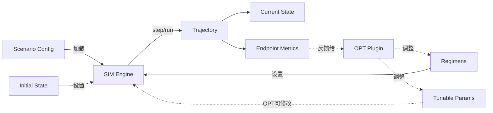
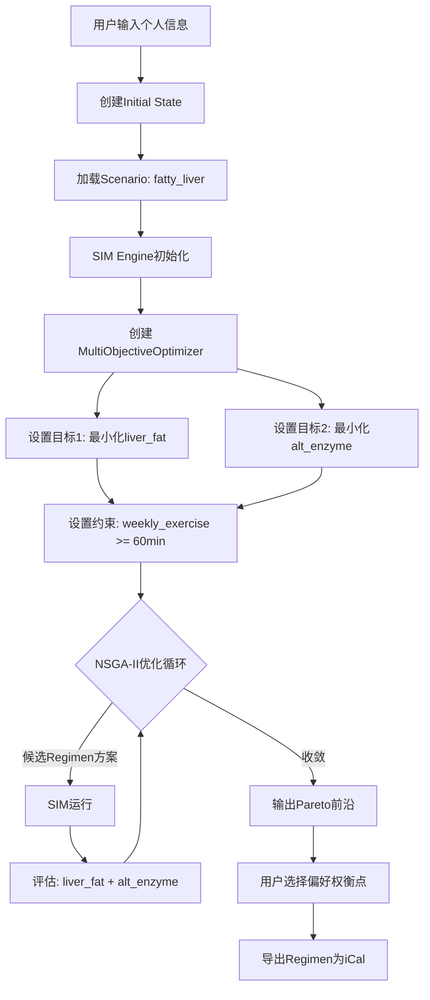
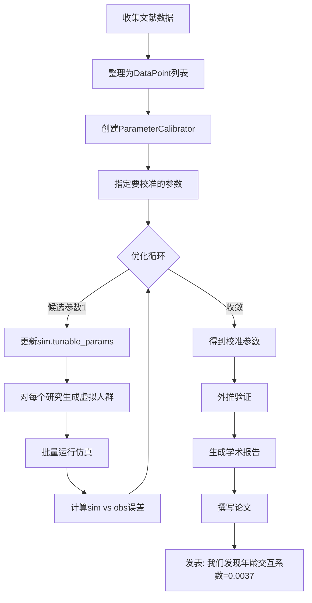

# 实现仿真
## 核心设计原则
每个场景的价值来自**真实存在的约束冲突**——两个或多个目标/输入互相制约，使得"最优解"不是简单叠加，而是需要权衡和折中。

冲突类型分为四种范式：

| 范式 | 核心矛盾 | 优化价值 |
|------|---------|---------|
| **A. 双Input冲突** | 两个干预手段互相抑制 | 高，直接可优化 |
| **B. 多尺度耦合** | 短期最优 ≠ 长期最优 | 中，需跨尺度仿真 |
| **C. 资源约束下的多目标** | 有限资源分配给多个需求 | 高，经典优化问题 |
| **D. 风险-收益权衡** | 高收益伴随高风险 | 高，决策树式优化 |

每个场景附有**现有研究评估**和**抗质疑强度**评级。

> ⚠️ **案例选择原则更新（2026-03-17）**：
> 脂肪肝"休息vs运动"案例已被临床医生指出冲突表述偏弱（运动和休息实际针对不同系统，并不矛盾）。
> 因此重新分级：脂肪肝仅作为**框架验证Demo**（展示多模型能跑通），
> **核心学术案例**改为A4慢性肾病（KDIGO指南自承空白）和A5高血压+痛风（两套真实互相矛盾的指南）。

## 医学场景

### A类：双Input冲突
#### A1. 脂肪肝：运动强度 × 肝酶波动
> - [ ] [scheduled:: 2026-08-01] 预计发表于 **Paper 1**（JOSS 工具论文，撰写中）：框架演示案例，待发表后更新为正式引用。

#### A2. 胃炎/胃溃疡：饮食频率 vs 饮食质量

**冲突**：
- 少食多餐减少单次胃酸刺激，但高频进食加重胰岛素抵抗
- 禁食高纤维护胃，但高纤维对肠道菌群和血糖控制有益
- H.pylori感染时，益生菌可辅助治疗，但部分益生菌刺激胃酸

**模型**：胃酸分泌模型（小时级）× 血糖-胰岛素模型（小时级）× 肠道菌群模型（天-周级）

**优化目标**：最小化溃疡复发风险，同时维持血糖稳定。

**现有研究评估**：⚠️ 各领域有独立建议，跨模型整合是空白。ACG指南各条建议之间存在矛盾，没有整合模型。

**抗质疑强度**：⭐⭐⭐

**难度**：⭐⭐⭐

#### A3. 胆囊切除术后：脂肪摄入 vs 营养均衡

**冲突**：
- 高脂饮食导致腹泻（胆汁持续滴漏）
- 完全低脂导致脂溶性维生素（A/D/E/K）吸收不足
- 长期低脂影响激素合成

**模型**：消化吸收模型（小时级）× 营养素代谢模型（天-月级）× 激素水平模型（月级）

**优化目标**：在腹泻风险约束下最大化营养素吸收，同时维持激素基线。

**现有研究评估**：✅ 有明确指南（前3个月每餐脂肪<10g），LM可验证指南是否最优，并探索最优过渡速率。

**抗质疑强度**：⭐⭐⭐（指南只给静态建议，过渡方案是真实空白）

**难度**：⭐⭐

#### ★ A4. 慢性肾病（CKD）：蛋白质摄入 vs 肌肉保持
> - [ ] [scheduled:: 2026-12-01] 预计发表于 **Paper 2**（JAMIA 框架验证，撰写中）+ **Paper 3**（JBI 优化方法，待撰写）：核心临床验证案例，待发表后更新为正式引用。

#### ★ A5. 高血压合并痛风：降压药 vs 尿酸
> - [ ] [scheduled:: 2026-12-01] 预计发表于 **Paper 2**（JAMIA 框架验证，撰写中）+ **Paper 3**（JBI 优化方法，待撰写）：核心临床验证案例，待发表后更新为正式引用。

#### A6. 工作压力 × 吸烟 × 精神健康
> - [ ] [scheduled:: 2027-06-01] 预计发表于 **Paper 3**（JBI 优化方法，待撰写）：三目标跨域案例，待发表后更新为正式引用。

#### A7. 疫情状态 × 个人健康 × 经济压力

**冲突**：
- 封控降低感染风险，但增加经济压力和心理损害
- 经济压力削弱免疫力，反而提高重症风险
- 复工增加收入但增加暴露
- "疫情疲劳"导致依从性下降，加速传播

**模型**：SEIR模型（天级）× 个人免疫模型（周级）× 经济模型（月级）× 心理健康模型（天-月级）

**优化目标**：最小化感染概率，同时最大化收入维持，约束心理健康不低于临界值。

**Regimen特点**：输入天然是日历结构（哪几天外出、何时接种），与Regimen设计完美契合。

**现有研究评估**：⚠️ 各领域有大量研究，个体级整合动态模型是空白。科普价值极高。

**抗质疑强度**：⭐⭐⭐（整合模型缺失是事实，但SEIR参数来源需说明）

**难度**：⭐⭐⭐

### B类：多尺度耦合
#### B1. 睡眠债务积累

**冲突**：少睡多工作短期产出高，长期认知储备耗尽，债务无法通过单次补觉消除。

**现有研究评估**：✅ Jewett & Kronauer（1999）经典模型，可直接用于LM验证案例。

**抗质疑强度**：⭐⭐⭐⭐（有经典数学模型，LM复现后自带验证）

**难度**：⭐⭐

#### B2. 抗生素耐药性：个人疗效 vs 群体耐药

**冲突**：足剂量对个人最优，但促进耐药菌进化；低剂量减少进化压力但疗效下降。

**现有研究评估**：⚠️ 有PK/PD模型和进化生物学模型，联合优化框架少。政策意义强。

**抗质疑强度**：⭐⭐⭐⭐（个人最优vs群体最优是经典公共卫生困境）

**难度**：⭐⭐⭐

#### B3. 运动适应与过度训练
> - [ ] [scheduled:: 2026-08-01] 预计发表于 **Paper 1**（JOSS 工具论文，撰写中）+ **Paper 2**（JAMIA 框架验证，撰写中）：Banister 数值验证基准案例，待发表后更新为正式引用。

### C类：资源约束多目标
#### ★ C1. 癌症化疗：疗效 vs 副作用
**定位：长期学术目标**

**冲突**：高剂量化疗疗效更强，但骨髓抑制、神经毒性限制剂量；需要在肿瘤控制和生活质量间权衡。

**现有研究评估**：✅ 数学肿瘤学领域有大量ODE化疗模型，工具封闭。LM提供开放可组合框架。

**抗质疑强度**：⭐⭐⭐⭐⭐（医学界自己在用数学优化，LM是开放版本）

**难度**：⭐⭐⭐⭐

#### C2. 糖尿病患者的饮食预算约束

**冲突**：低GI食物控糖好但价格高；有限预算下如何分配食物结构。

**现有研究评估**：❌ 将经济约束显式建模进血糖优化的研究极少，健康不平等领域真实空白。

**抗质疑强度**：⭐⭐⭐（社会意义强，但临床相关性需说明）

**难度**：⭐⭐

## 社会-经济-医疗交叉场景

#### X1. 贫困陷阱：工作时长 × 健康 × 医疗支出

**冲突**：长时间工作维持收入→损害健康→医疗支出增加→更长工作时间，自我强化恶性循环。

**现有研究评估**：⚠️ Marmot社会梯度研究有描述，动态优化模型是空白。历史案例：大萧条、工业革命。

**抗质疑强度**：⭐⭐⭐⭐（贫困陷阱是经济学公认概念，数学化是贡献）

**难度**：⭐⭐⭐

#### X2. 移民决策：安全 × 机会 × 健康代价

**历史案例**：爱尔兰大饥荒移民（1845-1855）、美国黑人大迁徙（1910-1970）、一战后波兰移民潮。

**现有研究评估**：⚠️ "健康移民效应"有大量研究，个体决策优化模型是空白。

**抗质疑强度**：⭐⭐⭐
**难度**：⭐⭐⭐

#### X3. 职业转型：收入断层 × 技能积累 × 健康压力

**冲突**：在职学习挤占睡眠，辞职转行有断粮风险，拖延转型错过市场窗口。

**现有研究评估**：❌ 纯理论空白，高科普价值，贴近当代知识工作者。

**抗质疑强度**：⭐⭐⭐

**难度**：⭐⭐

## 历史生存场景（游戏化优先）

#### D1. 参军：饭碗 vs 生命
> - [ ] [scheduled:: 2027-12-01] 预计发表于 **Paper 4**（CHI/JMIR Sim-to-Game，待撰写）：游戏化优先案例，待发表后更新为正式引用。

#### D2. 黑市交易：物资获取 vs 被捕风险

**历史案例**：二战德国占领区法国/荷兰（1940-1944）、一战德国大后方萝卜冬天（1916-1918）。

**现有研究评估**：⚠️ 历史记录充分，无动态决策优化模型。游戏化价值高。

**抗质疑强度**：⭐⭐⭐

**难度**：⭐⭐

## 五、生成更多场景的Prompt

```
你是LifeMatters项目的场景设计师。LifeMatters是一个基于YAML的多模型动力学仿真与优化平台，
核心价值是处理"多个模型之间真实存在的约束冲突"——即两个或多个干预手段/目标互相制约，
使得最优解需要权衡而非简单叠加。

平台特点：
- 支持多个ODE模型组合运行，每个模型可有不同的时间尺度（小时/天/月/年）
- 输入采用Regimen结构：有日历语义的行为规程（星期几、时间点、有效日期范围）
- 优化器可对Regimen参数进行多目标优化（如同时最小化指标A和最大化指标B）
- 既服务学术研究（参数来自文献，可校准），也服务游戏化科普（历史场景）

请为我设计[N]个符合以下标准的仿真场景：

必须满足的标准：
1. 存在真实的约束冲突——至少两个输入/目标之间有明确的权衡关系（不是虚构的）
2. 有文献数据支持（可引用流行病学、临床、社会学或历史学研究的参数）
3. 冲突的解决需要"优化"而非常识——最优的时间/剂量/策略不是直觉可以得到的
4. 适合用动力学仿真（ODE/差分方程）而非纯统计方法来表达
5. 【新增】冲突必须是临床医生或领域专家也承认"没有简单答案"的——不能是表面矛盾

加分项：
- 与现有指南存在明确的未解问题（最好有指南原文承认空白）
- 涉及多个时间尺度的耦合（如小时级×月级×年级）
- 跨越不同学科（如医学×经济学，或医学×社会学×历史学）
- 有历史具体场景可游戏化（特定时代、地点）

每个场景请提供：
1. 场景名称和背景
2. 核心冲突（两个以上对立需求的具体描述）
3. 为什么领域专家无法用"临床经验"一句话解决这个冲突
4. 涉及的模型列表（每个模型的时间尺度）
5. 优化目标（最大化/最小化什么，约束条件是什么）
6. 现有研究评估（是否已有成熟解答？学术空白在哪里？）
7. 游戏化潜力
8. 实现难度（1-5星）
9. 抗质疑强度（1-5星，说明理由）

特别优先考虑：
"现有指南明确承认无法给出统一建议"的场景，或"两套不同学科指南互相矛盾"的场景。
```


# 实现优化
## 系统概览
```
┌─────────────────────────────────────────────────────────┐
│                      LM System                          │
│                                                         │
│  ┌─────────────┐         ┌──────────────┐             │
│  │   Scenario  │────────>│     SIM      │             │
│  │   Config    │         │    Engine    │             │
│  └─────────────┘         └──────┬───────┘             │
│                                  │                      │
│                                  │ I/O Interface       │
│                                  │                      │
│                         ┌────────┴────────┐            │
│                         │                 │            │
│                    ┌────▼─────┐    ┌─────▼────┐       │
│                    │  OPT     │    │  OPT     │       │
│                    │ Plugin 1 │    │ Plugin 2 │  ...  │
│                    └──────────┘    └──────────┘       │
│                                                         │
└─────────────────────────────────────────────────────────┘
```

**核心原则**：

- SIM是黑盒状态机，不知道OPT存在
- OPT通过标准I/O操纵SIM
- 一切通过"观测-调整-再观测"的闭环

## SIM核心模块

### 功能定位

```
SIM = 确定性的状态转移函数

给定：初始状态 + 参数 + 干预
输出：状态轨迹 + 终点指标
```

### 数据流图



### 核心接口定义

#### 输入接口（3类）

| 接口方法                      | 输入类型               | 说明         | 可被OPT修改   |
| ------------------------- | ------------------ | ---------- | --------- |
| `set_initial_state()`     | State对象            | 个体初始状态     | ❌ 固定      |
| `set_parameters()`        | Parameters对象       | Scenario参数 | ❌ 固定      |
| `set_interventions()`     | List[Regimen] | 行为规程       | ✅ OPT主要调整 |
| `update_tunable_params()` | Dict               | 内部动力学参数    | ✅ OPT次要调整 |

#### 运行接口

| 接口方法            | 输入     | 输出               | 说明                |
| --------------- | ------ | ---------------- | ----------------- |
| `step(dt)`      | 时间步长   | 新State           | 单步仿真              |
| `run(duration)` | 仿真时长   | Trajectory       | 完整运行              |
| `batch_run()`   | 多个初始状态 | List[Trajectory] | 批量仿真(Monte Carlo) |

#### 输出接口

| 接口方法                        | 输出类型        | 说明        |
| --------------------------- | ----------- | --------- |
| `get_current_state()`       | State       | 当前时刻快照    |
| `get_trajectory()`          | Trajectory  | 完整时间序列    |
| `get_endpoint(metric)`      | float       | 终点指标(如寿命) |
| `get_metric_series(metric)` | List[float] | 某指标的时间序列  |

## 数据结构详细定义

### State（状态）

**概念**：某时刻个体的完整健康状态快照

```
State {
    时间维度：
    ├─ age: float                    # 当前年龄
    └─ time: float                   # 仿真时间（相对起点）
    
    生理指标：
    └─ biomarkers: Dict[str, float]  # 可测量的
       ├─ "BMI": 25.0
       ├─ "blood_pressure": 120
       ├─ "cholesterol": 200
       └─ ...
    
    行为因素：
    └─ behaviors: Dict[str, float]   # 生活方式
       ├─ "smoking": 1 (布尔或强度)
       ├─ "alcohol": 2 (drink/day)
       ├─ "exercise": 3 (hr/week)
       └─ ...
    
    疾病状态：
    └─ diseases: Dict[str, bool]     # 是否患病
       ├─ "cancer": False
       ├─ "diabetes": True
       └─ ...
    
    累积变量（关键）：
    └─ cumulative: Dict[str, float]  # 不可逆损伤
       ├─ "lung_damage": 0.3         # 0-1标准化
       ├─ "vascular_age": 65         # 血管年龄
       └─ ...
}
```

**设计要点**：

- 可序列化（保存/加载）
- 支持插值（用于绘图）
- 区分"可逆"和"累积"变量

### Parameters（场景参数）

**概念**：从scenario.yaml加载的固定配置

```
Parameters {
    因素定义：
    └─ factors: List[Factor]
       └─ Factor {
          ├─ name: "smoking"
          ├─ base_effect: 0.01           # Layer 1基础效应
          ├─ target: "lung_cancer_risk"
          ├─ dynamics: "cumulative"      # 或 "instant"
          └─ metadata: {...}             # 文献来源等
       }
    
    交互关系（Layer 2）：
    └─ interactions: List[Interaction]
       └─ Interaction {
          ├─ factors: ["smoking", "alcohol"]
          ├─ type: "multiplicative"      # 或 "additive"
          ├─ coefficient: 1.5
          ├─ source: "PMID:12345"
          └─ enabled: True               # 可toggle
       }
    
    动力学配置：
    └─ dynamics: Dict
       ├─ aging_rate: 1.0
       ├─ recovery_rates: {...}
       └─ thresholds: {...}              # 疾病发生阈值
}
```

**设计要点**：

- 不可被OPT直接修改（保持scenario完整性）
- 但可通过`enabled`标志toggle交互

### Regimen（行为规程）

**概念**：改变个体行为/状态的操作，以日历语义结构化表示

```
Regimen {
    基本信息：
    ├─ name: str                    # 如"quit_smoking"
    ├─ target: str                  # 作用对象(State中的key)
    
    作用方式：
    ├─ effect_type: str             
    │  ├─ "set": 直接设置值
    │  ├─ "multiply": 乘以系数
    │  └─ "add": 加上增量
    └─ value: float                 # 具体数值
    
    时间控制：
    ├─ start_time: float            # 何时开始
    ├─ duration: float              # 持续多久(999=永久)
    └─ schedule: Optional[Callable] # 复杂时变(如渐进式)
    
    成本信息（用于优化）：
    ├─ cost: float                  # 一次性成本
    ├─ recurring_cost: float        # 周期成本
    └─ difficulty: float            # 依从性(0-1)
}
```

**示例**：

```yaml
# 戒烟干预
name: quit_smoking
target: behaviors.smoking
effect_type: set
value: 0
start_time: 50  # 50岁开始
duration: 999

# 运动干预（渐进式）
name: increase_exercise
target: behaviors.exercise
effect_type: add
value: 3  # +3小时/周
start_time: 40
schedule: linear_ramp(0, 3, over=2years)
```

### Tunable Parameters（可调参数）

**概念**：内部动力学参数，OPT可优化

```
TunableParams {
    参数定义：
    └─ params: Dict[str, TunableParam]
       └─ TunableParam {
          ├─ name: str
          ├─ current_value: float
          ├─ bounds: (float, float)      # 搜索范围
          ├─ prior: Optional[Distribution] # 先验分布
          └─ description: str
       }
}
```

**示例**：

```yaml
tunable_params:
  smoking_base_effect:
    current: 0.01
    bounds: [0.005, 0.02]
    description: "每年抽烟的基础风险增量"
  
  age_interaction_coef:
    current: 0.005
    bounds: [0.001, 0.01]
    description: "年龄×抽烟的交互系数"
  
  cumulative_decay_rate:
    current: 0.02
    bounds: [0.01, 0.05]
    description: "戒烟后损伤恢复速率"
```

**关键**：这些参数不在scenario中暴露，只在OPT时使用

### Evidence 变量（取代旧 probability_constant）

> **注意**：`probability_constant` / `probability_params:` 已退役。发病率、死亡率及所有文献效应量统一用 `evidence:` 节下的对应 `type` 表示。

**概念**：从文献直接读入的效应量，由 Loader 自动换算为 `_effective` 值，Simulator 只见换算结果，永不进入优化。

仿真引擎的处理方式：不随机采样，直接以期望值计算确定性轨迹：

```
生存率(t) = ∏(1 − ir_effective × step_size)
```

`ir_effective` 由 Loader 从 YAML `evidence` 节读取后填入运行时命名空间，公式中直接用变量名引用。详见 `sim_design.md § 变量类型（4 种）`。

### Trajectory（轨迹）

**概念**：完整的时间序列记录

```
Trajectory {
    时间轴：
    └─ times: List[float]           # [0, 1, 2, ..., 50]
    
    状态序列：
    └─ states: List[State]          # 每个时刻的完整State
    
    便捷访问：
    └─ metrics: Dict[str, List[float]]  # 缓存常用指标
       ├─ "age": [40, 41, 42, ...]
       ├─ "BMI": [25, 24.5, 24, ...]
       └─ "lung_damage": [0.2, 0.25, ...]
    
    元数据：
    ├─ initial_state: State         # 起点
    ├─ regimens: List[Regimen]            # 应用的行为规程
    └─ parameters: Parameters       # 使用的参数
}
```

**方法接口**：

```
trajectory.get_metric(name) -> List[float]
trajectory.get_state_at(time) -> State
trajectory.get_endpoint(metric) -> float
trajectory.slice(start, end) -> Trajectory
trajectory.to_dataframe() -> pd.DataFrame  # 用于分析
```

## SIM内部模块划分

```
SIM Engine
├─ StateManager          # 状态管理
│  ├─ 初始化State
│  ├─ 状态更新逻辑
│  └─ 状态序列化
│
├─ DynamicsEngine        # 动力学计算
│  ├─ 因素效应计算(Layer 1)
│  ├─ 交互效应计算(Layer 2)
│  ├─ 累积变量更新
│  └─ 疾病发生判定
│
├─ InterventionManager   # 干预管理
│  ├─ 应用干预到State
│  ├─ 时间调度
│  └─ 干预冲突检测
│
├─ ParameterStore        # 参数存储
│  ├─ Scenario参数(不可变)
│  ├─ Tunable参数(可变)
│  └─ 参数验证
│
└─ OutputGenerator       # 输出生成
   ├─ Trajectory构建
   ├─ 指标计算
   └─ 缓存管理
```

## OPT插件架构

### 插件基类接口

```
OptimizationPlugin (抽象基类)
│
├─ 必须实现的方法：
│  ├─ get_search_space() -> SearchSpace
│  │  └─ 返回：{变量名: (下界, 上界, 类型)}
│  │
│  ├─ objective_function(variables) -> float
│  │  └─ 输入：优化变量的值
│  │  └─ 输出：目标函数分数(单目标)
│  │
│  └─ apply_variables(variables) -> None
│      └─ 把优化变量应用到SIM
│
├─ 可选重写的方法：
│  ├─ constraints() -> List[Constraint]
│  │  └─ 约束条件(如预算限制)
│  │
│  ├─ get_initial_guess() -> np.ndarray
│  │  └─ 优化起点
│  │
│  └─ postprocess(result) -> EnhancedResult
│      └─ 结果后处理(如统计分析)
│
└─ 提供的工具方法：
   ├─ optimize(method, **kwargs) -> OptResult
   ├─ sensitivity_analysis() -> SensitivityReport
   └─ visualize_result() -> Figure
```

### 插件与SIM的交互协议

```mermaid
sequenceDiagram
    participant OPT as OPT Plugin
    participant SIM as SIM Engine
    
    Note over OPT: 优化循环开始
    
    OPT->>OPT: 生成候选变量x
    OPT->>SIM: apply_variables(x)
    
    alt 变量是干预参数
        SIM->>SIM: set_interventions(...)
    else 变量是内部参数
        SIM->>SIM: update_tunable_params(...)
    end
    
    OPT->>SIM: run(duration)
    SIM->>SIM: 执行仿真
    SIM-->>OPT: 返回Trajectory
    
    OPT->>OPT: 计算objective_function
    
    Note over OPT: 判断是否收敛
    
    alt 未收敛
        OPT->>OPT: 生成新的x'
    else 收敛
        OPT->>OPT: 返回最优解
    end
```

## 具体OPT插件示例

### 插件1：干预策略优化

**目标**：找到最佳干预时间和强度

```
InterventionOptimizer
│
├─ 搜索空间：
│  ├─ quit_smoking_age: [30, 70]
│  ├─ exercise_hours: [0, 10]
│  └─ diet_quality: [0, 10]
│
├─ 优化目标：
│  └─ maximize: trajectory.get_endpoint("lifetime")
│
├─ 约束：
│  ├─ total_cost < budget
│  └─ exercise_hours < physical_capacity
│
└─ 输出：
   ├─ optimal_regimens: List[Regimen]
   ├─ expected_lifetime: float
   ├─ cost: float
   └─ trajectory: Trajectory
```

**数据流**：

```
输入(用户提供)：
├─ person_profile: State         # 个体初始状态
├─ budget: float                 # 预算约束
└─ optimization_config: Dict     # 优化配置

过程(OPT内部)：
└─ For each candidate solution:
   ├─ 构造Regimen列表
   ├─ sim.set_interventions(...)
   ├─ trajectory = sim.run(50years)
   └─ score = -trajectory.get_endpoint("lifetime")

输出：
├─ optimal_solution: Dict
├─ comparison_plot: Figure       # 对比不同方案
└─ sensitivity_report: Report    # 参数敏感性
```

### 插件2：参数校准（内环 opt，属于 Modeller，当前未实现）

> **归属说明**：参数校准是**内环优化**，服务于模型开发者，属于未来 Modeller 工具的功能。以下设计作为框架预留，当前 Simulator 不提供参数校准 UI。

**目标**：调整 `parameter` 变量（机制系数）使仿真曲线拟合文献观测数据

```
ParameterCalibrator
│
├─ 搜索空间：
│  └─ 来自sim.get_tunable_params()
│     ├─ smoking_base_effect: [0.005, 0.02]
│     ├─ age_interaction_coef: [0.001, 0.01]
│     └─ ...
│
├─ 优化目标：
│  └─ minimize: Σ (sim_effect - literature_effect)²
│
├─ 输入数据：
│  └─ literature_data: List[DataPoint]
│     └─ DataPoint {
│        ├─ study_id: str
│        ├─ age: float
│        ├─ exposure: Dict          # {"smoking": True}
│        ├─ observed_effect: float  # 0.40 (+40%)
│        ├─ se: float               # 标准误
│        └─ sample_size: int
│     }
│
└─ 输出：
   ├─ calibrated_params: Dict
   ├─ goodness_of_fit: float        # R²或χ²
   ├─ residuals: List[float]        # 每个数据点的误差
   └─ validation_predictions: Dict  # 外推预测
```

**数据流**：

```
输入：
└─ literature_data.csv
   study_id, age, smoking, observed_risk, se
   Smith2020, 40, True, 0.30, 0.05
   Jones2019, 60, True, 0.55, 0.08
   ...

过程：
└─ For each candidate params:
   ├─ sim.update_tunable_params(params)
   ├─ For each study:
   │  ├─ 生成匹配该研究的虚拟人群
   │  ├─ 批量运行仿真
   │  └─ 计算仿真的effect_size
   └─ loss = Σ weighted_squared_error

输出：
├─ calibrated_params.json
├─ fit_quality_report.pdf
└─ validation_plot.png
   (显示仿真vs观测的对比)
```

### 插件3：多目标优化

**目标**：同时优化多个冲突目标（如寿命vs成本）

```
MultiObjectiveOptimizer
│
├─ 搜索空间：
│  └─ 同干预优化
│
├─ 优化目标（多个）：
│  ├─ maximize: lifetime
│  ├─ minimize: total_cost
│  └─ maximize: QALY
│
├─ 算法：
│  └─ NSGA-II (遗传算法)
│
└─ 输出：
   ├─ pareto_front: List[Solution]
   │  └─ Solution {
   │     ├─ regimens: List[Regimen]
   │     ├─ objectives: {
   │     │  ├─ lifetime: 78.5
   │     │  ├─ cost: 8500
   │     │  └─ QALY: 72.3
   │     │  }
   │     └─ is_dominated: bool
   │     }
   └─ tradeoff_curve: Figure
```

**输出可视化**：

```
帕累托前沿图：
      
寿命 ↑
 80│     ●  ● ●
    │   ●      ●
 75│  ●         ●
    │ ●           ●
 70│●              ●
    └────────────────→ 成本
     5k   10k   15k

用户可选择：
- 预算有限 → 选左下角
- 愿意投入 → 选右上角
```

### 插件4：合成队列校准

**目标**：从单一统计结论反推参数

```
SyntheticCohortCalibrator
│
├─ 输入：
│  └─ target_statistic: Statistic
│     ├─ description: "60岁抽烟者风险+40%"
│     ├─ age: 60
│     ├─ exposure: "smoking"
│     ├─ effect_size: 0.40
│     └─ se: 0.10
│
├─ 搜索空间：
│  └─ coherence_coef: [0.0, 0.01]  # 相干系数p
│
├─ 过程：
│  ├─ 生成虚拟人群(暴露组+对照组)
│  ├─ 仿真30年
│  ├─ 计算仿真的effect_size
│  └─ 最小化：(sim_effect - target_effect)²
│
└─ 输出：
   ├─ identified_param: float
   ├─ confidence_interval: (float, float)
   ├─ goodness_of_fit: float
   └─ predicted_effects: Dict
      └─ {"age_70": 0.58}  # 外推预测
```

## 完整工作流示例

### 场景1：个人健康多目标优化（脂肪肝案例）



**用户界面交互**：

```
┌─────────────────────────────────────┐
│  多目标健康轨迹优化                 │
├─────────────────────────────────────┤
│ 基本信息：                          │
│  年龄: 45，liver_fat: 18%           │
│                                     │
│ 优化目标（多目标）：                │
│  [●] 最小化 liver_fat_percentage    │
│  [●] 最小化 alt_enzyme_level        │
│                                     │
│ 可优化的Regimen：                   │
│  ☑ exercise_plan（天数/强度可调）   │
│  ☑ diet_plan（热量/时间可调）       │
│                                     │
│ 约束条件：                          │
│  weekly_exercise >= 60 min          │
│  alt_enzyme_level <= 120 U/L        │
│                                     │
│ [运行NSGA-II优化]                   │
└─────────────────────────────────────┘

优化结果（Pareto前沿）：
┌─────────────────────────────────────┐
│ 帕累托前沿（50个非支配方案）：      │
│                                     │
│ liver_fat↓ ↑                        │
│  42%│  * *                          │
│  35%│     * *                       │
│  28%│        * *                    │
│  20%│           * *                 │
│     └────────────────→ ALT峰值      │
│      80    100   120  U/L           │
│                                     │
│ 选中方案 #23：                      │
│  • 周一三五 07:00 运动 强度0.72     │
│  • 预测: liver_fat↓38%, ALT 95U/L  │
│                                     │
│ [导出为iCal] [查看详细轨迹]        │
└─────────────────────────────────────┘
```

### 场景2：学术研究-参数校准



**输入文件示例**：

```csv
study_id,author,year,age_mean,smoking,duration,effect_size,se,n
1,Smith,2020,40,True,20,0.30,0.05,5000
2,Jones,2019,60,True,40,0.55,0.08,3200
3,Brown,2021,50,True,30,0.42,0.06,4100
...
```

**输出报告**：

```markdown
参数校准报告

识别的参数

- smoking_base_effect: 0.0095 (95% CI: 0.0082-0.0108)
- age_interaction_coef: 0.0037 (95% CI: 0.0025-0.0049)
- cumulative_decay: 0.023 (95% CI: 0.018-0.028)

拟合质量

- R² = 0.89
- RMSE = 0.042
- χ² p-value = 0.32 (良好拟合)

关键发现

年龄交互系数显著高于文献假设的线性模型，
提示累积效应被系统性低估约15%。

外推预测

基于校准参数，预测70岁抽烟者风险应为+68% (±12%)
建议进行队列验证研究。
```

## 技术要点总结

### SIM侧的关键设计

|设计点|目的|实现方式|
|---|---|---|
|状态不可变性|便于回溯和缓存|每次step返回新State|
|参数分层|区分固定vs可调|Parameters vs TunableParams|
|批量接口|加速OPT|batch_run()支持并行|
|缓存机制|避免重复计算|hash输入，缓存输出|
|序列化支持|保存/加载状态|所有对象可pickle|

### OPT侧的关键设计

|设计点|目的|实现方式|
|---|---|---|
|插件注册|动态扩展|Registry pattern|
|统一接口|降低学习成本|抽象基类|
|搜索空间标准化|支持多种优化器|SearchSpace对象|
|结果可视化|辅助决策|内置绘图方法|
|敏感性分析|评估稳健性|自动扰动参数|

### 数据交互协议

```
SIM <---> OPT 的数据流
│
├─ OPT → SIM (输入)
│  ├─ 方式1: set_interventions()
│  │  └─ 修改干预措施列表
│  │
│  ├─ 方式2: update_tunable_params()
│  │  └─ 修改内部动力学参数
│  │
│  └─ 方式3: set_initial_state()
│     └─ 修改起始条件（较少用）
│
└─ SIM → OPT (输出)
   ├─ Trajectory对象
   │  └─ 完整时间序列
   │
   ├─ Endpoint指标
   │  └─ 单个浮点数(如寿命)
   │
   └─ Metric序列
      └─ 特定指标的时间序列
```

## 未来扩展性
### 新增OPT插件只需

```
1. 继承OptimizationPlugin
2. 实现3个方法：
   - get_search_space()
   - objective_function()
   - apply_variables()
3. 注册到Registry
```

### 新增指标只需

```
1. 在State中添加字段
2. 在DynamicsEngine中更新计算逻辑
3. OPT自动可用
```

---

## Loader 模块（数据加载与组装）

Loader 是静态 YAML 与动态仿真环境的桥梁，负责解析 `models/source/` 和 `models/stories/` 中的模型，处理依赖导入，在内存中组装完整可执行的 `ModelStructure`。

### 跨模型数据调用原则

- **`components/` 层**：只声明自己的变量和公式，不引用其他模型。
- **`stories/` 层**：`imports` 多个 model，通过 `patches` 覆写参数。

这避免模型间耦合，符合单一职责原则。

### 表达式求值方案

| 场景 | 推荐方案 | 原因 |
|------|---------|------|
| 表达式简单、来源可信 | `numexpr` | 最快，C 后端 |
| 需要函数调用或动态变量 | `asteval` | 最灵活，支持 Python 语法子集 |
| 简单条件分支 | `asteval` 三元表达式 | 直接解析 `x if cond else y` |
| 复杂分支（性能优先） | 分步条件 + `numexpr` | 预先分组执行 |

> 当前系统使用 `asteval`，可按需逐步切换，保持向后兼容。

### 变量命名冲突处理

多模型合并时：
- **根模型（调用方）**定义的变量和公式**始终覆盖**被导入模型中的同名定义。
- 语义歧义的同名变量（如两个模型都定义 `body_weight`）发出警告，要求在 `patches` 中明确指定。

### 架构约束检测

- 禁止循环依赖（`A imports B imports A`）。
- 禁止 `models/` 层 import `stories/` 层。
- `models/` 层若包含 `optimizer` 字段，给出警告，建议迁移至 story 层。

### Evidence 换算（加载期自动完成）

Loader 遍历 YAML `evidence:` 节，按 `type` 字段执行换算，将结果写入 `_effective`，并注入运行时命名空间，使公式可以直接用变量名引用：

```python
def resolve_evidence(model):
    for name, ep in model.get('evidence', {}).items():
        raw = ep['value']
        match ep['type']:
            case 'or':
                p0 = ep['baseline_prevalence']
                effective = raw / ((1 - p0) + p0 * raw)
            case 'hr':
                baseline = model['evidence'][ep['baseline_ref']]['_effective']
                effective = baseline * raw
            case 'cohens_d':
                effective = raw * ep['population_sd']
            case _:  # rr, ard, ir, beta, pk
                effective = raw
        ep['_effective'] = effective
        model.runtime_vars[name] = effective
```

`baseline_ref` 引用的 `ir` 变量必须在同一 `evidence:` 节中先行解析（Loader 按依赖顺序执行，若存在循环引用则报错）。

### Metadata description

`metadata.description` 在运行时保持原始结构：可以是字符串，也可以是映射对象。后端只做类型校验，不固定字段集合，不补空字段。前端 Overview 页负责把字符串显示为单行 `Brief`，或按映射对象在 YAML 中的字段顺序显示所有非空字段。

推荐字段名见 `model_design.md`，但 Loader 和 Simulator 不依赖这些推荐字段；新增字段会按 key 自动生成英文标签。

### AST 预编译

加载期将 `dynamics` 表达式文本转为 `asteval` 安全语法树节点，加速仿真主循环的每步求值，避免重复解析字符串。

---

## 仿真引擎运行时

### 线程模型

长时仿真（数千步）需在后台线程运行，通过消息机制推送进度：

```python
from concurrent.futures import ThreadPoolExecutor

executor = ThreadPoolExecutor(max_workers=4)

def run_simulation(params, progress_cb):
    for step in range(params.steps):
        state = simulator.step(state)
        if step % 100 == 0:
            progress_cb(step, state)   # WebSocket 或 pubsub 推送到前端
```

| 需求 | 实现方式 |
|------|---------|
| **暂停 / 取消** | 传 `threading.Event` 给积分循环，按钮 `set()` 中止 |
| **多任务并行** | `max_workers` 调大，每任务带唯一 `task_id` |
| **实时曲线** | 每 N 步广播状态，前端追加数据点并刷新 |
| **实时调参** | 参数使用 `multiprocessing.Value`，计算线程随时读取 |

### 公式执行顺序

多个公式更新同一变量时，通过 `priority` 字段控制执行顺序：
- 数字越小越先执行（如 `-100` 先于 `0`）。
- 并行冲突变量用 `asteval` 顺序求值，避免隐式 race condition。

### 模型校验（入仿真前）

进入仿真前系统先校验模型合法性：
1. 前向仿真统计发病率（一段时间）
2. 分组对比统计（与文献对比）
3. 对照原始论文 KM 曲线或 RCT 结果

```bash
GET /api/validate?model=stories/marie_curie
```

校验未通过时显示报告并阻止进入仿真，避免产生误导性结果。

### CLI 接口

```bash
python sim_engine/src/optimizer_cli.py \
  --file stories/marie_curie/story \
  --target max_qol \
  --method nsga2
```

### 中间结果暂存（models/temp/）

opt 和仿真产生的中间文件存入 `models/temp/{job_id}/`，不依赖用户账号体系：

```
models/temp/
  {job_id}/
    input_override.yaml   # opt 写回的 input，可直接喂给 sim
    charts/               # 图表文件
    result.csv
```

**前后端约定：**
- 后端创建任务时生成 `job_id`（uuid）并返回
- 前端将 `job_id` 存入 `localStorage`，刷新后可恢复
- `GET /api/download/result/{job_id}/{filename}` 触发浏览器下载
- 后端启动时清理超过 24h 的 temp 子目录

详见 ADR 0061。

### 编辑态刷新与运行态快照

Simulator 的前端状态分为两类：

- **编辑态 UI 状态**：当前选中的 YAML、左侧树展开、tab、面板开合、字号、输入配置等，可以保存在 `localStorage`。
- **源模型内容**：YAML 原文、resolved imports、变量、方程、`simulation`、`optimizer`，每次选择或手动刷新时都从后端重新读取，不把旧内容作为长期缓存。

仿真运行开始后，后端 session 持有启动时的 resolved model 对象，作为本次运行快照。之后即使 YAML 文件发生变化，已有 session 也不会半路切换模型；新建 session 才会读取新版 YAML。

页面刷新或短暂断开后，前端可用本地保存的 `sessionId` 调用：

```
GET /api/simulation/session/{session_id}
```

如果后端 session 仍存在，则恢复已有轨迹、进度、输出变量和随机种子；如果 session 已过期或后端重启，则保留本地最后一次静态结果供查看，但不能继续运行。

Game 派生应用采用同一原则：选关/编辑态刷新 story/card YAML；一旦开局，当前对局固定开局时的 story/card snapshot，恢复页面时恢复对局状态。源文件更新只影响新开局，不污染进行中的牌局。

详见 ADR 0064。

### 整合外部工具

```
# 例如整合CPT（因果推断）
class CPTIntegrationPlugin(OptimizationPlugin):
    def __init__(self, sim, cpt_model):
        self.cpt = cpt_model
        
    def objective_function(self, variables):
        # 从CPT获取因果系数
        causal_coefs = self.cpt.infer(data)
        
        # 更新SIM的交互参数
        self.sim.update_interactions(causal_coefs)
        
        # 运行仿真
        ...
```
