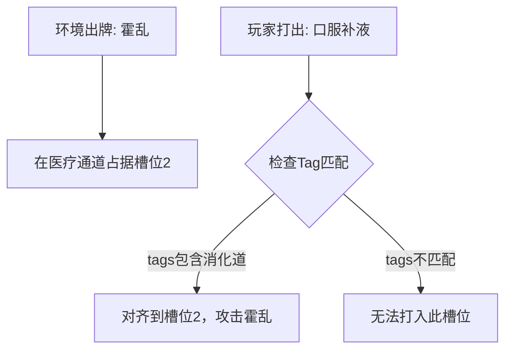

# LM-Game 设计总文档 v0.4

**合并自**: c_game_v0.1 / v0.2 / v0.3卡牌转换 / v0.3游戏设计
**整理日期**: 2026-02-14
**项目**: LifeMatters Game (LM-Game)
**文档类型**: 核心设计决策记录（合并版）

## ADD

我需要都是卡牌模式，血糖体温可能每次改变常值。但紧张的累计可能造成掉血增加。战争也可能是触发式掉血，比如抽到概率牌，掉很多血这样，等等。所以一次卡牌游戏可能是多重计算模式的复合，但是又不能复杂，而且要根据实际的动力学公式自适应判断，比如零阶方程是第一类掉血，二阶可能是累加掉血，概率可能触发式掉大血，等等。

## 项目定位与哲学

### 顶层定位

| 概念层级 | Sim侧 (LM-Research)                        | Game侧 (LM-Game)                           |
| -------- | ------------------------------------------ | ------------------------------------------ |
| 整体定位 | 科研仿真平台：追求数值精确、可复现、可优化 | 卡牌游戏：追求体验冲击、策略博弈、情感共鸣 |
| 时间单位 | 连续时间步(dt=days/hours)，精确微分方程    | 离散回合(turn)，玩家节奏控制               |
| 输入方式 | YAML配置文件，滑杆UI，优化器自动搜索       | 卡牌选择，出牌决策                         |
| 输出方式 | 时间序列曲线，统计指标，CSV数据            | 红条/蓝条实时反馈，结算页面，成就解锁      |
| 核心循环 | 加载YAML→仿真→优化→输出结果             | 环境出牌→玩家出牌→结算→检查胜负         |

### 游戏哲学

- 基础模式：历史真实压迫感
  - **历史环境 = 单向施压的命运机器，玩家 = 挣扎求生的渺小个体**
  - 不是"赢"，是"**体验绝望并理解历史**"。系统性压迫 > 个人失败，让玩家感受结构性不公，而非个人能力不足。
- Rogue扩展模式：改变历史的爽感
  - **引入反事实道具（赛博义体、提前发明的青霉素、未来知识）打破历史枷锁**
  - 提供游戏粘滞力。历史真实事件作为Boss事件，幻想/改变历史的道具作为机遇牌。

### 关键设计原则

1. **Sim→Game是有损映射**：连续→离散，精确→近似，但保留核心趋势
2. **Game应感性化Sim数据**：`RR=2.7` 玩家看不懂，但能体验到"吸烟后肺癌牌频繁出现"
3. **Opt是双向工具**：Sim用Opt找最优策略→Game提供攻略提示；Game收集玩家数据→Sim校准模型
4. **Convert需可逆验证**：Game结果应能转回Sim进行数值验证
5. **变量越少越好**（炉石教训）
6. **上升难，下降易**（历史真相）
7. **锁定配对 > 自由攻击**（降低门槛）

### 与其他卡牌游戏的差异

| 对比对象 | 对方               | LM-Game                |
| -------- | ------------------ | ---------------------- |
| 炉石传说 | 随从对战，斩杀对手 | 与命运对抗，理解历史   |
| 杀戮尖塔 | 纯Roguelike构建    | 基于真实历史和科学数据 |

## game 核心机制

### 游戏形式

**最终选型**：炉石减法版 + 万智牌持续结界

- ✅ 保留炉石：手牌管理、费用系统、出牌手感
- ✅ 借鉴万智牌：持续政策牌改变全局规则
- ❌ 删除：对抗性AI、随从互殴、三国杀、昆特牌心理博弈（无对手）、游戏王过度连锁

### 双维度核心结构

| 维度                     | 定义         | 对应卡牌        | 通用性      |
| ------------------------ | ------------ | --------------- | ----------- |
| 目标推进 (Why I live)    | 实现人生使命 | 目标牌 [goal]   | ✅ 全部角色 |
| 工作谋生 (How I survive) | 日常生存资源 | 工作牌 [work]   | ✅ 全部角色 |
| 生命维度                 | HP管理与回复 | 回复牌 [health] | ✅ 全部角色 |

**核心矛盾**：时间/资源有限，三个维度相互竞争

### 多结局评分系统

| 等级 | 条件                         | 称号       |
| ---- | ---------------------------- | ---------- |
| S级  | SP≥100 且 HP≥50 且 回合<40 | 完美人生   |
| A级  | SP≥100 且 HP>0              | 科学殉道者 |
| B级  | SP≥70 且 HP>0               | 未竟的事业 |
| C级  | HP>0 且 回合=50              | 平凡的一生 |
| D级  | HP≤0 且 SP<50               | 英年早逝   |
| F级  | HP≤0 且 SP<20               | 一事无成   |

### 游戏循环

```
回合开始
  → 环境阶段（被动承受，玩家无法阻止）
  → 玩家阶段（手牌决策，行动点消耗）
  → 结算（检查HP/SP/回合数，评定结局）
  → 下一回合
```

### 手牌与行动点

- **手牌数量**：可变（根据角色特性，如辛德勒6张，卖火柴小女孩4张）
  - 体现资源不平等的历史真实
- **行动点**：标准3点/回合（特定角色可调整）

---

## game 体系设计

### 玩家牌分类（Tags体系）

| 类型   | Tag        | 核心效果           | 示例                       |
| ------ | ---------- | ------------------ | -------------------------- |
| 工作牌 | `work`   | +金钱，-少量HP     | [授课] +5金 -1HP           |
| 目标牌 | `goal`   | +目标进度SP，-资源 | [镭提纯] +10SP -10金 +辐射 |
| 回复牌 | `health` | +HP，-金钱         | [休息] +8HP -5金           |
| 风险牌 | `risk`   | 高收益高代价       | [救人] +1SP -10金 +风险%   |

**Tags原则**：4个为最小必需集合，越少越好。Tags为可选辅助标注，Converter提供下拉菜单辅助分类（非强制）。

### 通用牌（自动注入所有关卡）

通用牌保证策略深度基线，关卡设计者可通过配置决定注入哪些。

| 通用牌     | 效果                         | 流派/用途                |
| ---------- | ---------------------------- | ------------------------ |
| [双倍效果] | 下张牌效果×2（正负都×2）   | Combo流                  |
| [连击准备] | 本回合停工，下回合+1行动点   | 连击流（三国杀式忍耐）   |
| [保险]     | 本回合HP不低于10             | 生存流（激进策略的保底） |
| [打断]     | 阻止1张环境牌（消耗2行动点） | 控制流                   |
| [重置]     | 悔棋，-10HP，每局1次         | 容错机制                 |
| [苦力]     | +2金 -3HP                    | 补全缺失work牌           |
| [休息]     | +8HP 本回合停工              | 补全缺失health牌         |

### 战术应对牌（主动改变局势）

| 卡牌   | 效果                                                       | 策略要点             |
| ------ | ---------------------------------------------------------- | -------------------- |
| [打断] | 阻止对面下一张环境牌，消耗2行动点                          | 预判对面会出高伤害牌 |
| [窃取] | 本回合环境牌的负面效果转为正面（如[经费短缺-10金]→+10金） | 等对面出大数值牌再用 |
| [超载] | 所有资源转换牌本回合效果×3，代价：下回合无法出牌          | 最后冲刺或背水一战   |
| [重置] | 将本回合退回开始，-10HP，每局只能用1次                     | 悔棋机制，容错率     |

### 策略组合牌（核心策略深度来源）

| 卡牌       | 效果                                                 | 策略要点                                     |
| ---------- | ---------------------------------------------------- | -------------------------------------------- |
| [连击准备] | 本回合不出牌，下回合可出3张牌（正常每回合1张）       | 忍耐1回合换取爆发，风险：多承受1回合环境伤害 |
| [双倍效果] | 下一张牌效果×2（正负都×2）                         | 配合不同牌产生不同收益，需权衡风险           |
| [保险]     | 本回合HP不会降到10以下（HP=15遇到-20伤害→只降到10） | 激进策略的保底                               |
| [牺牲]     | HP归零，但目标进度+50，只能使用1次且SP≥50           | 以死换胜，达成A级"科学殉道者"结局            |
| [终结]     | 移除环境牌堆中所有持续性伤害卡，代价：-20金或-20HP   | 等debuff堆积3-4个再用，清场快感              |

### 卡牌数值变量规范

威胁卡（疾病/战争/饥饿）

| 变量            | 含义          | 对接仿真来源          |
| --------------- | ------------- | --------------------- |
| `attack`      | 攻击力        | RR值/Effect Size      |
| `health`      | 威胁血量/耐久 | 病程长度/持续时间     |
| `duration`    | 站场持续回合  | 时间窗口              |
| `probability` | 抽到概率      | P值/发病率            |
| `tags`        | 威胁类型标签  | 疾病分类/社会事件类型 |

威胁卡Tag示例：

```yaml
霍乱:   tags: [消化道, 传染, 急性]   attack: 3   health: 5
肺结核:  tags: [呼吸道, 慢性, 传染]   attack: 2   health: 8
饥荒:   tags: [营养, 持续]           attack: 2   health: 12
战争流弹: tags: [社会, 瞬发]          attack: 20  health: 0   # 即时法术，无血量
```

应对卡（治疗/食物/庇护）

| 变量                | 含义             | 对接仿真来源 |
| ------------------- | ---------------- | ------------ |
| `attack`          | 治疗/清除能力    | 干预效果量   |
| `health`          | 防线血量         | 持续防御能力 |
| `cost`            | 费用             | 资源消耗     |
| `duration`        | 生效回合数       | 持续时间     |
| `tags`            | 可对应的威胁类型 | 干预适用范围 |
| `requires_status` | 需要的最低Status | 可及性门槛   |

### 环境(敌人)牌类型

**负面事件（基础，占约40-70%）**：

```yaml
[辐射暴露] (居里夫人):
  辐射+5层, -层数×0.1 HP

[饥饿] (通用):
  -5 HP

[性别歧视] (特定角色):
  下回合资源获取-30%
```

**Boss事件（基于历史真实事件）**：

```yaml
[巴黎科学院演讲] (居里夫人):
  挑战: 3回合内SP+30
  成功: 获得[国际声望]持续牌
  失败: -10SP

[辐射病危机] (居里夫人):
  条件: 辐射≥50层
  选择:
    - 接受手术(-30金, 辐射归零, 2回合停工)
    - 拒绝(继续带病, 伤害×2)
```

**正面机遇牌（基础模式：历史真实；Rogue模式：改变历史的道具）**：

```yaml
[诺贝尔奖提名]:
  +20金 +10SP Status+1

[意外发现]:
  辐射层数-10
  抽1张稀有强化牌

[学术会议]:
  选择:
    - 参加(-5金): 获得永久强化牌
    - 拒绝: 无事发生
```

> **注**：Boss事件与机遇牌系统为**待细化模块**，此处为框架设计。Rogue模式的幻想道具（青霉素提前发明、赛博义体等）属于机遇牌扩展，详见第十节。

环境牌配比（参考）

| 类型                 | 基础模式占比 | Rogue模式占比 |
| -------------------- | ------------ | ------------- |
| 负面事件             | ~70%         | ~50%          |
| Boss事件（历史真实） | ~10%         | ~10%          |
| 正面机遇（历史真实） | ~20%         | ~15%          |
| 机遇牌（改变历史）   | 0%           | ~25%          |

## game 变量方法

### 玩家状态变量

| 变量                | 含义                   | 初始值          |
| ------------------- | ---------------------- | --------------- |
| `health_points`   | 生命值                 | 100（场景决定） |
| `money`           | 金钱（可累计，有上限） | Status依赖      |
| `status`          | 阶层等级(1-3)          | 场景决定        |
| `income_per_turn` | 每回合收入             | Status函数      |
| `money_cap`       | 存钱上限               | Status × 10    |

Status详细参数

```yaml
Status 1（赤贫）:
  每回合收入: +2
  存钱上限: 10
  可用牌池: 仅基础卡（粗粮/草药）

Status 2（平民）:
  每回合收入: +4
  存钱上限: 20
  可用牌池: 解锁中级卡（医生/食物储备）

Status 3（中产/资本家）:
  每回合收入: +5
  存钱上限: 30
  可用牌池: 解锁高级卡（疫苗/政治庇护）
```

**Money机制**：可以累计，但有上限（Status × 10）。超出上限的收入浪费，体现穷人无储蓄能力的系统性约束。

Status提升与下降

**提升**：慢、有条件、可被锁死

```
Status 1→2: 需要存满上限3次
Status 2→3: 需要存满上限5次 + 特定社会条件牌在场
某些场景直接锁死：例如黑奴场景 → Status永远≤1
```

**下降**：快、无条件、可能瞬间

| 触发来源             | 效果            | 语义     |
| -------------------- | --------------- | -------- |
| 社会通道：经济崩溃牌 | Status -1       | 大萧条   |
| 社会通道：政策压迫牌 | Status锁定N回合 | 制度剥夺 |
| 医疗通道：重病未治   | Status -1       | 因病返贫 |
| Health降至20%以下    | Status强制→1   | 无法劳动 |

### 牌堆/卡组变量

| 变量              | 含义                             |
| ----------------- | -------------------------------- |
| `deck_size`     | 卡组总牌数（场景时间跨度）       |
| `card_count[x]` | 某张牌的绝对数量（事件发生次数） |
| `card_ratio[x]` | 某张牌占牌堆比例（概率/发生率）  |
| `hand_size`     | 手牌上限                         |
| `draw_per_turn` | 每回合抽牌数                     |

### 变量行为方法清单

- card_ratio[x] 的方法
  - 静态固定值 → 概率全程不变
  - 随回合线性增加 → 疾病扩散期
  - 随回合线性减少 → 医学进步
  - 阶段性突变 → 历史事件触发
  - 受Status调节 → 穷人×2，富人×0.5
  - 受Health调节 → 虚弱时更易患病
  - 条件触发修改 → 疫苗后永久-50%
- attack（威胁）的方法
  - 固定值 / 随回合递增（慢性病恶化）/ 受Health调节（虚弱时受创更重）
  - 穿透 → 无视防线直打Health
  - 溅射 → 攻击相邻槽位
  - 持续毒伤 → 每回合额外扣Health
- health（威胁血量）的方法
  - 固定值 / 受回合数增加（拖延越久越难治）/ 被动回复（每回合自愈1点）
  - 分阶段变形 → 血量50%时攻击模式改变
  - 免疫某类攻击 → 某些药物无效
- cost 的方法
  - 固定值 / 受Status折扣 / 受Money惩罚（借贷利息×2）
  - 随回合递增（通货膨胀）/ 条件免费（政策牌在场时归零）
  - 分期付款 → 打出后每回合扣Money
- health_points 的方法
  - 被攻击扣减 / 每回合被动流失（慢性消耗）/ 被防线卡恢复
  - 超过阈值触发 → Health<30濒死规则
  - 瞬间归零 → 屠城/流弹
- status 的方法
  - 消耗Money主动提升 / 被威胁牌击落（因病返贫）
  - 被场景锁定上限（制度天花板）/ 临时加成（事件牌回合内+1）
  - 永久锁死 → 黑奴Status≤1
- env_draw_per_turn 的方法
  - 固定值 / 阶段性激增（战争/瘟疫爆发）
  - 受Status影响（穷人区威胁更密）
  - 条件触发（政策牌打出后减半）

## game 示范举例

### 场地布局

```
┌─────────────────────────────────────────────┐
│  🌍 环境区：历史政策牌（持续规则效果）            │
├──────────────────────┬──────────────────────┤
│  🏥 医疗通道          │  ⚔️ 社会通道           │
│                      │                      │
│  [疾病A] [饥饿B] ... │  [战争X] [政策Y] ... │
│     ↕Tag对齐          │     ↕Tag对齐          │
│  [药a] [食b] [疫苗c] │  [庇护x] [逃离y] ... │
│                      │                      │
├──────────────────────┴──────────────────────┤
│  🃏 手牌  Health ██████░  Money 12  Status 2 │
└─────────────────────────────────────────────┘
```

**布局说明**：

- Money改为Status驱动的被动收入（类比炉石法力水晶）
- 食物并入医疗（营养是医疗子类）
- 仅保留两纵列：医疗（个人可控）+ 社会（不可抗力）
- **Tag对齐机制**：一药对一病，非自由攻击
- **动态槽位**：威胁同时出现多个，玩家必须取舍

### 场地对齐tag机制



**槽位规则**：

- 威胁与防线Tag匹配 → 威胁攻击防线
- 槽位空置 → 威胁直接攻击Health
- 手牌/Money不够 → 被迫放弃槽位（核心取舍）

### 角色横向对比

| 角色         | 生命维度 (HP/特殊资源)    | 目标维度            | 工作维度       |
| ------------ | ------------------------- | ------------------- | -------------- |
| 居里夫人     | HP=100，辐射累积(debuff)  | 镭提纯研究 SP=100   | 授课 +金钱     |
| 辛德勒       | HP=100，风险%（秒杀线）   | 救犹太人 SP=1200    | 工厂盈利 +金钱 |
| 卖火柴小女孩 | HP=60，体温（第三资源）   | 熬过冬天 SP=365     | 卖火柴 +金钱   |
| 南丁格尔     | HP=80，过劳累积           | 推广护理 SP=100     | 护理工作 +金钱 |
| 马丁路德金   | HP=100，仇恨累积          | 民权运动 SP=100     | 牧师 +金钱     |
| 梵高         | HP=70，精神值（第三资源） | 艺术创作 SP=150     | 弟弟资助 +金钱 |
| 曼德拉       | HP=100，囚禁年限          | 废除种族隔离 SP=100 | 监狱劳动 +金钱 |
| 特蕾莎修女   | HP=90，信仰值（加成）     | 救助穷人 SP=1000    | 募捐 +金钱     |

**共性规律**：

- 维度1（目标）永远是资源负收益
- 维度2（工作）永远是资源正收益
- 所有角色都有：累积威胁 + 阈值死线 + 正面机遇

## from Sim 映射框架 (逻辑设计)

### 核心组件映射

| Opt（优化匹配）                        | Sim组件                                     | Convert（转换规则）                                 | Game组件                        |
| -------------------------------------- | ------------------------------------------- | --------------------------------------------------- | ------------------------------- |
| 外环优化：搜索最优input组合            | variables(type=input)                       | input变量 → 手牌Cost消耗                           | 玩家手牌 (Player Cards)         |
| 内环校准：调整parameter使state符合数据 | variables(type=state, io_role=intermediate) | 如 blood_glucose → 不直接显示，影响事件概率        | 内部隐藏变量 (Hidden States)    |
| —                                     | variables(type=state, io_role=output)       | health_score → 红条HP；research_progress → 蓝条SP | 红条/蓝条 (Health/Purpose Bars) |
| 内环优化：校准RR/OR值                  | variables(type=parameter)                   | RR值 → 环境牌权重系数                              | 角色属性/算子配置               |
| —                                     | formulas(dynamics)                          | dx/dt公式 → 每回合概率抽卡                         | 环境牌堆生成规则                |
| —                                     | simulation.duration                         | 50 years → 50 turns；300 days → 300 turns         | 最大回合数                      |
| —                                     | simulation.time_step(dt)                    | 居里夫人=1year/turn，童工=1month/turn               | 回合粒度                        |
| —                                     | imports(models)                             | 导入的model → 叠加的算子（如女权/资本）            | 算子库                          |

### 输入映射

| Opt                  | Sim: Input Variables    | Convert                                             | Game: Player Cards |
| -------------------- | ----------------------- | --------------------------------------------------- | ------------------ |
| 外环：找最优饮食组合 | meal_carbs (type=input) | meal_carbs=50g → [-2金, +10HP, +5血糖风险]         | [进食卡]           |
| 外环：优化运动时长   | exercise_duration       | 30min → [-1金, -5HP短期, +10HP长期, -糖尿病风险]   | [运动卡]           |
| 外环：找最优剂量     | daily_dose(metformin)   | 1000mg → [-8金, +降糖效果, +副作用概率]            | [服药卡]           |
| 外环：选择是否手术   | surgery_type            | 袖状胃 → [-50金一次性, -30HP, +大幅降低糖尿病风险] | [手术卡]           |
| 外环：优化工作时长   | work_hours              | 10h/day → [+5金, -3HP, +压力, -Status提升概率]     | [劳作卡]           |
| 外环：优化教育投入   | education_investment    | 1000 → [-10金, +Status等级, 解锁高级手牌池]        | [教育卡]           |

### 输出映射

| Opt                          | Sim: Output Variables | Convert                                  | Game: Events/Indicators |
| ---------------------------- | --------------------- | ---------------------------------------- | ----------------------- |
| —                           | diabetes_risk         | 0.3 → 环境牌堆中30%概率抽到[糖尿病]     | [糖尿病发作]环境牌      |
| 外环目标：最大化health_score | health_score          | 60 → 红条显示60/100                     | 红条                    |
| 外环目标：达到100            | research_progress     | 40 → 蓝条40/100                         | 蓝条                    |
| —                           | side_effect_risk      | 0.15 → 15%概率触发[恶心呕吐-5HP]        | [副作用]环境牌          |
| —                           | lung_cancer_incidence | 0.05/year → 每回合5%抽到[肺癌诊断-50HP] | [肺癌]死亡牌            |
| 外环目标：最小化cost         | cost_benefit_ratio    | 结算页显示"你花费了XX金，获得了YY寿命"   | 金钱效率显示            |

### 参数映射

| Opt                  | Sim: Parameters  | Convert                                       | Game: Card Weights   |
| -------------------- | ---------------- | --------------------------------------------- | -------------------- |
| 内环：校准RR         | RR（相对危险度） | RR_smoking_lung_cancer=14 → [肺癌]牌权重×14 | 环境牌权重系数       |
| 内环：校准吸收率     | absorption_rate  | 0.6 → 服药卡效果延迟1回合生效                | 药效延迟回合数       |
| 内环：校准基础死亡率 | base_mortality   | 0.01/year → 环境牌堆中1%是[意外死亡]         | 环境牌堆基础负面密度 |
| 内环：校准成本       | cost_per_unit    | cost_per_meal=2 → 每餐消耗2金                | 卡牌Cost系数         |
| —                   | status_threshold | [0,10,30,60] → Status<10=贫民牌池            | Status分层边界       |

### 状态变量映射

| Opt                     | Sim: State Variables  | Convert                                                            | Game                   |
| ----------------------- | --------------------- | ------------------------------------------------------------------ | ---------------------- |
| 内环：调整glucose动力学 | blood_glucose         | glucose>180 → [并发症]权重×3；glucose<70 → [低血糖昏迷]即刻触发 | 不直接显示，影响环境牌 |
| 内环：校准胰岛素模型    | insulin_level         | insulin>20 → [降糖药]效果减半                                     | 影响药物卡效果         |
| —                      | body_weight           | weight>100kg → Status-1                                           | 影响Status分层         |
| —                      | stress_level          | stress>70 → 每回合额外-2HP                                        | 影响HP损耗速率         |
| —                      | education_level       | high_school → 解锁[投稿论文]卡；PhD → 解锁[申请基金]卡           | 决定可用卡牌种类       |
| —                      | social_status         | 直接映射为Status等级，决定抽牌池质量                               | Status等级(0-5)        |
| 内环：校准辐射累积模型  | accumulated_radiation | 每+10辐射 → Max_HP永久-5（不可逆）                                | 红条上限动态削减       |

### Optimizer集成策略

| 优化类型        | Sim侧（内/外环）                    | Game侧应用                        | 转换方式                 |
| --------------- | ----------------------------------- | --------------------------------- | ------------------------ |
| 外环优化(Input) | 搜索最优input组合使health最大化     | Roguelike解锁："最优出牌策略提示" | 优化结果→推荐手牌序列   |
| 内环校准(Param) | 调整RR/parameter使仿真匹配文献      | 平衡性调整：校准环境牌权重        | 校准结果→更新牌堆配置   |
| 多目标优化      | 同时最大化health和research_progress | 成就系统：双目标达成解锁奖励      | Pareto前沿→多种通关路线 |

---

## from YAML 自动转换 (具体实施)

### YAML元素 → 卡牌元素映射

| YAML路径                       | 提取内容   | 卡牌属性      | 处理方式               |
| ------------------------------ | ---------- | ------------- | ---------------------- |
| `story_meta.name`            | 场景名     | 关卡标题      | 直接映射               |
| `story_meta.goal_value`      | 目标值     | 胜利条件      | 直接映射               |
| `initial_state.health/money` | 初始资源   | 起始状态      | 直接映射               |
| `initial_state.*`（其他）    | 特殊资源   | 第三维度      | 自动识别为debuff/buff  |
| `params.*`                   | 数值常量   | 卡牌张数+数值 | 参数替换               |
| `inputs[i].tags`             | 分类标签   | 卡牌类型      | 查表映射（可下拉选择） |
| `inputs[i].effects`          | 资源变化   | 卡牌效果      | 解析+/-符号            |
| `inputs[i].reference`        | 文献引用   | 卡牌描述      | 直接映射               |
| `outputs[i].formula`         | 公式表达式 | 环境牌效果    | 模式识别（见9.2）      |

### 公式识别 → 环境牌类型（6种保留模式）

| 模式 | 数学表达                    | 识别特征   | 环境牌类型 | 权重    | 状态                  |
| ---- | --------------------------- | ---------- | ---------- | ------- | --------------------- |
| P1   | `hp -= C`                 | 常数减法   | 固定伤害   | 100     | ✅ 必需               |
| P2   | `x = x + C`               | 变量自增   | 累积debuff | 100     | ✅ 必需               |
| P3   | `hp -= x * k`             | 变量×系数 | 累积伤害   | 100     | ✅ 必需               |
| P4   | `if x > T: damage`        | 条件判断   | 阈值触发   | 动态    | ✅ 核心机制           |
| P5   | `if random() < p: damage` | 概率函数   | 概率触发   | p×1000 | ✅ 核心机制           |
| P6   | `hp -= hp * r`            | 百分比自伤 | 百分比伤害 | 100     | ❓ 待定（可用P3表达） |

### 自动转换流程

```
Story YAML
  ↓
【步骤1】解析 initial_state → 识别资源类型（HP/金钱/特殊资源/目标）
  ↓
【步骤2】遍历 inputs → 根据tags（或下拉选择）生成玩家牌
  ├─ work → 工作牌
  ├─ goal → 目标牌
  └─ health → 回复牌
  ↓
【步骤3】替换 params.* 引用 → 填充具体数值（含卡牌张数）
  ↓
【步骤4】遍历 outputs → 根据公式模式识别环境牌（P1-P6）
  ↓
【步骤5】检查缺失 → 补全通用牌（苦力/休息/双倍/保险等）
  ↓
【步骤6】计算权重 → 环境牌抽取概率配置
  ↓
【输出】完整卡牌JSON（玩家牌组 + 环境牌堆）
```

### 全自动可行性评估

| 转换步骤  | 自动化难度  | 人工干预            | 结论        |
| --------- | ----------- | ------------------- | ----------- |
| 资源识别  | ⭐ 简单     | 无                  | ✅ 全自动   |
| Input分类 | ⭐⭐ 中等   | 下拉菜单辅助选择    | ⚠️ 半自动 |
| 效果提取  | ⭐ 简单     | 无                  | ✅ 全自动   |
| 公式识别  | ⭐⭐⭐ 困难 | 可选手动标注pattern | ⚠️ 半自动 |
| 权重计算  | ⭐⭐ 中等   | 默认规则            | ✅ 全自动   |
| 缺失补全  | ⭐ 简单     | 无                  | ✅ 全自动   |

**结论**：约80%可全自动，20%需标准化辅助（tags标注 + 公式规范）

### 最小Story YAML模板

```yaml
# 基础信息
story_meta:
  name: "Marie Curie"
  goal_value: 100

# 初始状态
initial_state:
  health: 100
  money: 20
  radiation: 0         # 自动识别为特殊资源(debuff)
  research_progress: 0 # 自动识别为目标资源

# 参数表（控制卡牌张数和数值）
params:
  teaching_income: 5
  research_cost: 10
  radiation_increment: 5
  chronic_damage_rate: 0.1

# 玩家可控行为
inputs:
  teaching:
    tags: [work]
    effects:
      "+money": "params.teaching_income"
      "-health": 1
    reference: "Curie taught at École Normale Supérieure (1900-1906)"

  research:
    tags: [goal, risk]
    effects:
      "+research_progress": 10
      "-money": "params.research_cost"
      "+radiation": "params.radiation_increment"
    reference: "Isolated radium in 1902, exposed to massive radiation"

  rest:
    tags: [health]
    effects:
      "+health": 8
      "-money": 5

# 环境事件
outputs:
  chronic_damage:
    pattern: "P3"
    formula: "health -= radiation * params.chronic_damage_rate"

  radiation_sickness:
    pattern: "P4+P5"
    condition: "radiation > 50"
    probability: 0.3
    effect: "health -= 30"
```

### R-G Converter对接优先级

**高优先级（仿真直接输出）**：

- `card_ratio` ← P值直接映射
- `attack` ← RR/Effect Size映射
- `health` ← 病程长度映射
- `probability` ← 发病率映射
- `total_rounds` ← 时间跨度映射

**中优先级（需人工校准）**：

- `cost` ← 需要经济数据+专家判断
- `duration` ← 可从时间窗口推导
- `status_cap` ← 场景历史研究确定
- `tag_pool` ← 需要疾病分类知识

**低优先级（无法自动化，创意层）**：

- 穿透/溅射/瞬杀机制
- 变形/分阶段方法
- 场景锁定逻辑
- 特殊政策牌效果

### YAML Schema草案

```yaml
# 威胁卡
threat_card:
  name: 霍乱
  type: disease
  channel: medical
  tags: [消化道, 传染, 急性]
  attack: 3
  health: 5
  probability: 0.15
  special_effects:
    penetrate: false
    splash: false
    poison_per_turn: 0
  # R-G Converter自动填充
  source_rr: 2.5
  source_p_value: 0.001
  source_duration: 7

# 应对卡
response_card:
  name: 口服补液
  type: treatment
  channel: medical
  tags: [消化道]
  attack: 3
  health: 3
  cost: 2
  requires_status: 1
  special_effects:
    kill_heal: 0
    aoe: false
  # R-G Converter自动填充
  source_efficacy: 0.85
  source_cost_usd: 0.5

# 场景定义
scenario:
  name: 1918流感
  time_span: 24   # 月
  total_rounds: 24
  starting_state:
    health: 80
    money: 5
    status: 2
  constraints:
    status_cap: 2
    env_draw_per_turn: 2
  threat_pool:
    - 流感病毒:
        base_ratio: 0.3
        evolution:
          - round: 6
            ratio: 0.5
    - 饥荒:
        base_ratio: 0.1
        受status调节: true
  response_pool:
    - 草药茶:
        available_from_status: 1
    - 疫苗:
        unlock_round: 18
```

### 技术挑战记录

| 挑战           | 问题描述                                                 | 当前方案                                                  |
| -------------- | -------------------------------------------------------- | --------------------------------------------------------- |
| 复杂公式识别   | 研究者可能写任意Python表达式                             | 阶段1只支持P1-P5标准模式；阶段2提供公式简化工具           |
| 多变量耦合拆分 | radiation影响probability_sick等链式依赖                  | 定义全局链式触发规则（跨story兼容），避免单一对象高复杂化 |
| 数值平衡       | 不同story数值量级差异大（辛德勒SP=1200 vs 小女孩SP=365） | 游戏内归一化算法（待设计）                                |

## 附录

### 已确认的决策

| 编号 | 问题         | 选择                                            | 理由                      |
| ---- | ------------ | ----------------------------------------------- | ------------------------- |
| D-01 | 卡牌设计路线 | Sim→Game自动转换                               | 保持科学性，支持双轨发展  |
| D-02 | 胜负机制     | 多结局评分(S/A/B/C/D/F)                         | 避免二元输赢，增加重玩性  |
| D-03 | 手牌数量     | 可变（角色差异化）                              | 体现资源不平等的历史真实  |
| D-04 | Tags数量     | 4个最小集合(work/goal/health/risk)              | 越少越好原则              |
| D-05 | Tags必需性   | 非必需，Converter提供下拉菜单辅助               | 降低研究者标注负担        |
| D-06 | 公式标注     | 可选，支持自动识别也支持手动标注                | 灵活性                    |
| D-07 | 通用牌注入   | 全部注入，后续细化配置                          | 保证策略深度基线          |
| D-08 | Params作用   | 控制卡牌张数和游戏数值计算                      | 仿真参数与游戏参数统一    |
| D-09 | 游戏哲学     | 双模式：基础=无力感历史教育，Rogue=改变历史爽感 | 兼顾教育意义与游戏粘滞力  |
| D-10 | 卡牌命名体系 | 采用v0.3的goal/work/health命名                  | 更工程化，与YAML tags对应 |

### 待定的决策

| 问题             | 现状       | 后续方向                             |
| ---------------- | ---------- | ------------------------------------ |
| 手牌刷新机制     | 待定       | 倾向固定（更稳定可规划）vs 随机抽5张 |
| 行动点细节       | 待定       | 每张牌的点数分配，是否允许超支       |
| 环境牌抽取数量   | 待定       | 每回合2张 vs 3张，是否动态调整       |
| 多变量耦合处理   | 待定       | 倾向定义全局链式触发规则             |
| P6百分比伤害     | 待定       | 倾向保留（可用P3替代但语义不同）     |
| 通用牌选择性注入 | 目前全注入 | 后续可按关卡特征筛选                 |
| 特色牌获取时机   | 待定       | 局前固定 vs 局内解锁                 |

### 避坑清单决策

- ❌ 不要像游戏王那样复杂连锁
- ❌ 不要给玩家"优化压迫"的空间
- ❌ 不要让Money不能累计（违背现实）
- ❌ 不要设置过多纵列（3列已是极限）
- ❌ 不要解释"为什么穷人存不了钱"（让系统说话）
- ❌ 不要过度特化，严格减法设计

### 相关文档

- `Architecture_v3.md` — LifeMatters 整体架构
- `c_gamer_proj_v3.md` — LM-Game 项目主旨
- `c_matter_proj_v3.md` — LM-Research 项目主旨

**版本历史**：

- v0.1 (2026-01-26): 映射框架表，糖尿病/癌症场景
- v0.2 (2026-01-26): 卡牌系统设计，居里夫人场景
- v0.3 (2026-02-10/13): 游戏设计变量字典 + 卡牌转换规范
- v0.4 (2026-02-14): 合并版，整合四份文档，统一命名体系，确认双模式哲学
